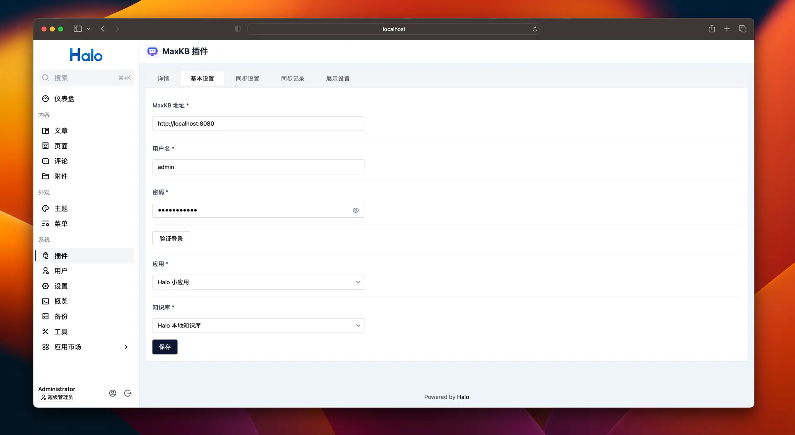

# Интеграция помощника MaxKB в Halo

!!! Abstract ""
    [Halo](https://github.com/halo-dev/halo) [ˈheɪloʊ] — мощный и удобный open‑source инструмент для создания сайтов. С помощью плагина помощника MaxKB можно синхронизировать статьи в базу знаний MaxKB и добавить на сайт умный Q&A через плавающий виджет.
    Инструкции по использованию плагина помощника MaxKB см. в [официальной документации](https://www.halo.run/store/apps/app-aWHcE).

