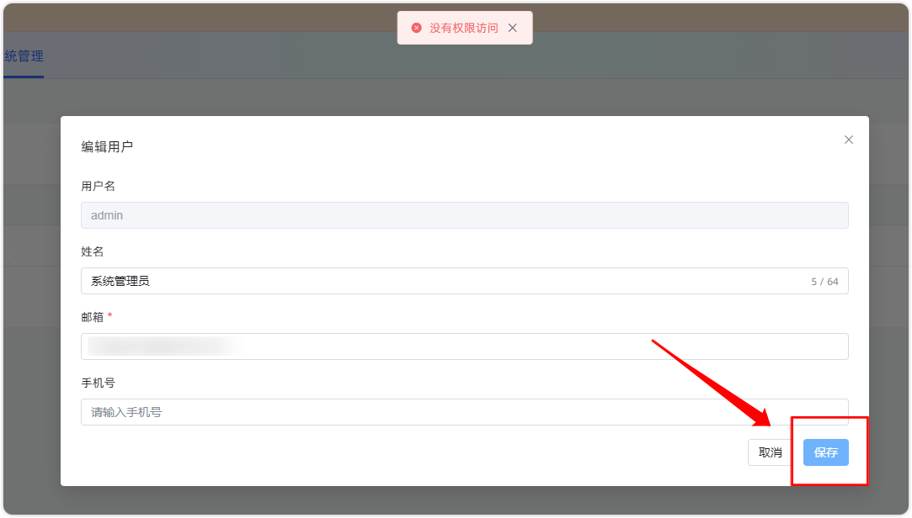
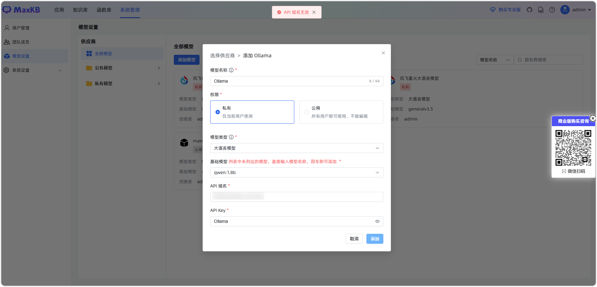
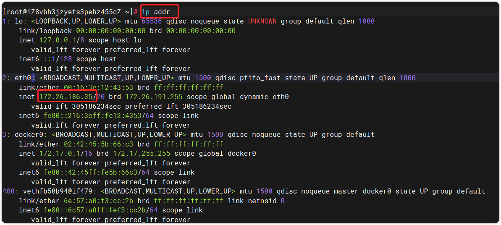
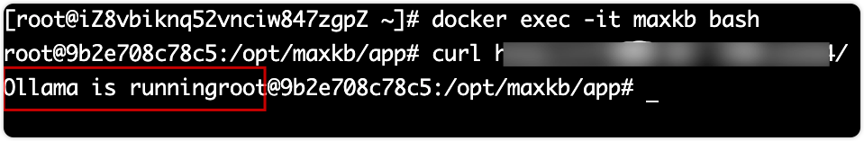
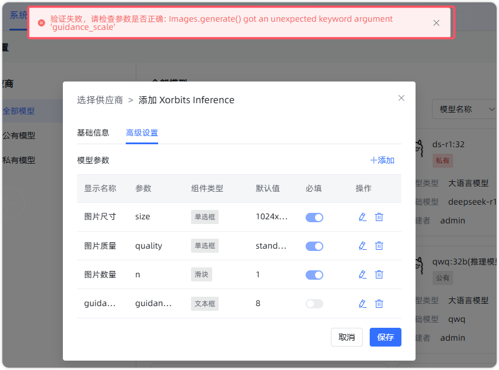
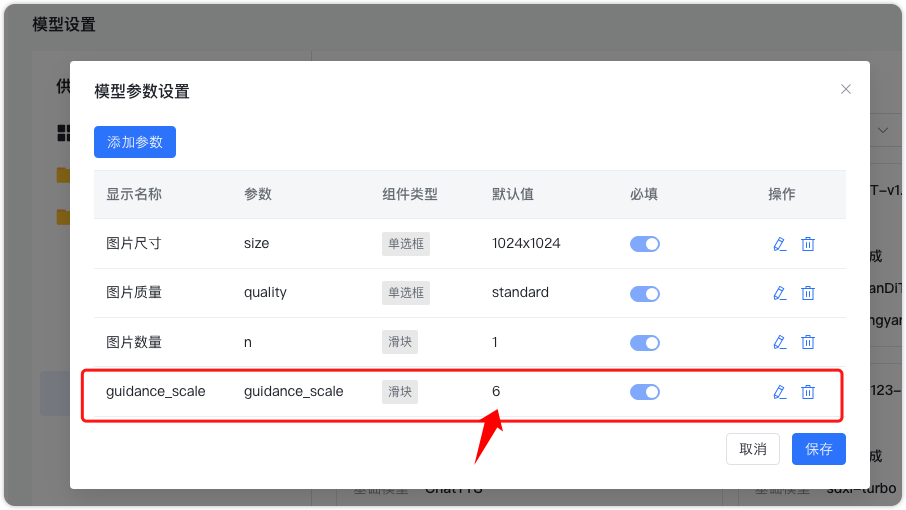
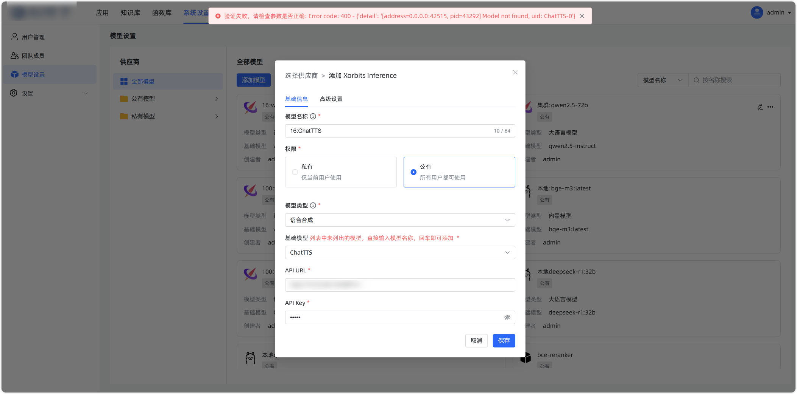

# Системное администрирование

## 1 Управление пользователями

### 1.1 Забыл пароль входа — что делать

**Если пароль забыл не‑admin пользователь:**

- Привязана почта: на странице «Личные данные» можно изменить и восстановить пароль через функцию «Сменить пароль».
- Почта не привязана: администратор (admin) входит в систему, на странице «Управление пользователями» находит нужного пользователя и меняет ему пароль.

**Если пароль забыл пользователь admin:**  
Если настроена почта, используйте «Забыли пароль?» на странице входа. Если почта не настроена — сбросьте пароль на значение по умолчанию через базу данных. Шаги:  
При онлайн‑установке войдите в контейнер MaxKB (для офлайн‑пакета — войдите в контейнер pgsql):

```
docker exec -it maxkb bash
```

Войти в PgSQL
```
psql -Uroot
```
Переключиться на базу данных MaxKB
```
\c maxkb;
```
Выполните SQL ниже, чтобы сбросить пароль пользователя admin на MaxKB@123..
```
update  "public"."user" set password='d880e722c47a34d8e9fce789fc62389d' where username='admin';
```

**Важно:** после восстановления пароля admin сразу настройте почту, чтобы далее пользоваться «Забыли пароль?»


### 1.2 Нет прав при редактировании пользователя

В настройке шлюза не разрешён метод PUT, из‑за чего проверка прав не проходит.

{width="900px"}
    

## 2 Подключение моделей

### 2.1 Подключение к Ollama: «API‑домен недействителен»



**О домене API:** 

- Формат: http://IP_сервера_с_Ollama:порт/ 

**Важно:** не используйте 127.0.0.1 или localhost.

**Как узнать IP сервиса Ollama:**   
На сервере с Ollama выполните: ip addr, чтобы получить IP. Если IP сервера — 172.26.186.35, то домен API: http://172.26.186.53:11434

{width="900px"}

**Убедитесь, что сервис доступен:**   
Контейнер MaxKB должен иметь доступ к Ollama. Проверьте домен API из контейнера MaxKB — должен вернуться статус «Ollama is running».

{width="900px"}

**Изменение конфигурации Ollama:**  
Отредактируйте /etc/systemd/system/ollama, задав прослушивание на 0.0.0.0: добавьте Environment="OLLAMA_HOST=0.0.0.0".

**После этих проверок добавьте модель Ollama в MaxKB.  
Для среды Windows см. также: [Локальная установка Ollama + MaxKB на Windows](https://kb.fit2cloud.com/?p=349d848b-7a0a-421b-8029-38e0440f35d4).**


### 2.2 Сбой проверки при подключении модели генерации изображений
{width="900px"}

Причина — неверный тип компонента параметра. В частности, у параметра «guidance_scale» задан неверный тип. Решение: измените тип «guidance_scale» на «ползунок» и задайте шаг 1.

{width="900px"}

### 2.3 Сбой проверки при подключении TTS‑модели XInference


Ошибка: Error code: 400 - {'detail': '[address=0.0.0.0:4215, pid=41292] Model not found, uid: XXX'}  
Возможные причины — неверное имя или версия модели. Шаги решения:  

- Проверьте имя модели: выполните curl в контейнере и убедитесь, что нужная модель возвращается.
- Проверьте версию XInference. Версия v1.3.0.post2 — тестовая и может быть нестабильной. Рекомендуется перейти на стабильный релиз.


### 2.4 Ошибка добавления модели: Connection error

Чаще всего связано с сетевыми проблемами. Проверьте:  

- Настройки файрвола: убедитесь, что нужные порты не заблокированы, откройте их для доступа контейнера в сеть.

- Сетевую конфигурацию контейнера: проверьте доступность сети внутри контейнера (ping/curl и т.п.).

### 2.5 Ошибка добавления модели: сообщения о балансе

Проверьте доступность модели у провайдера и наличие достаточного баланса.

### 2.6 Ошибка добавления модели: 'str' object has no attribute 'model_dump' или Invalid API-key provided

Проверьте домен API и ключ: убедитесь, что домен доступен и корректно настроен, а API Key действителен и имеет права. Если используете сторонний прокси‑сервис, уточните у провайдера статус и требования конфигурации.