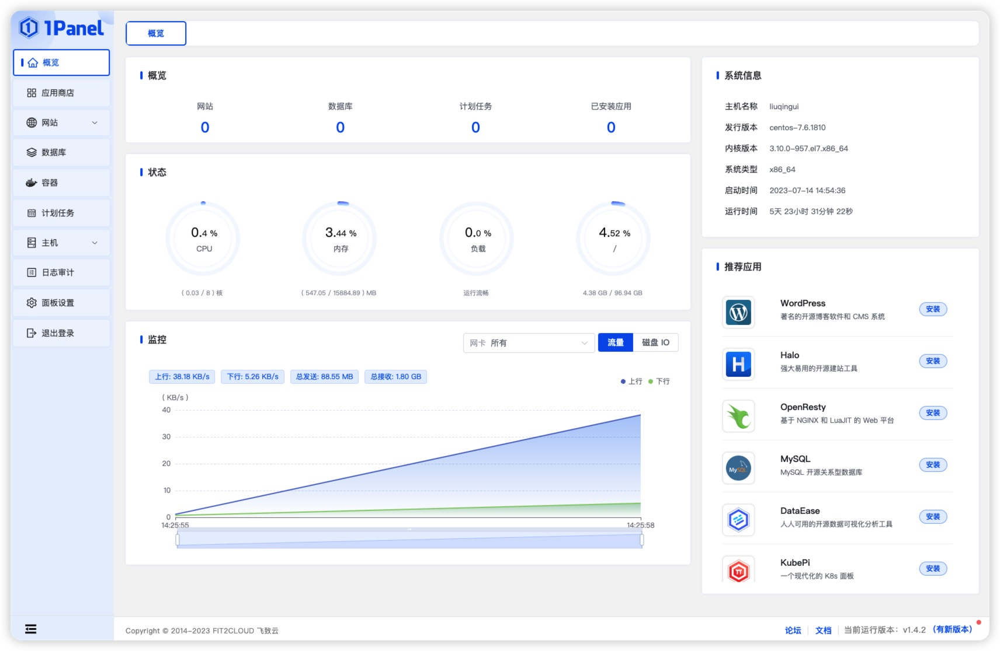
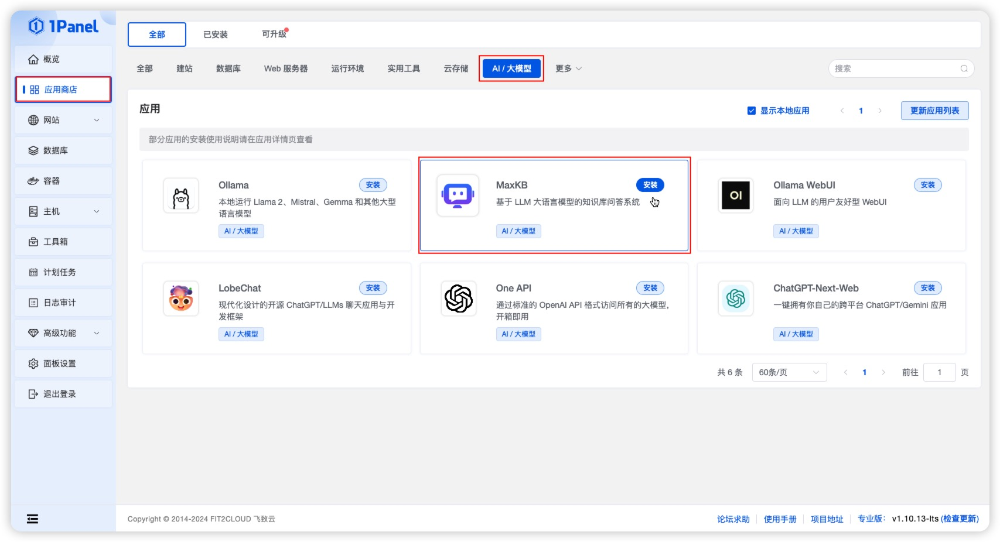
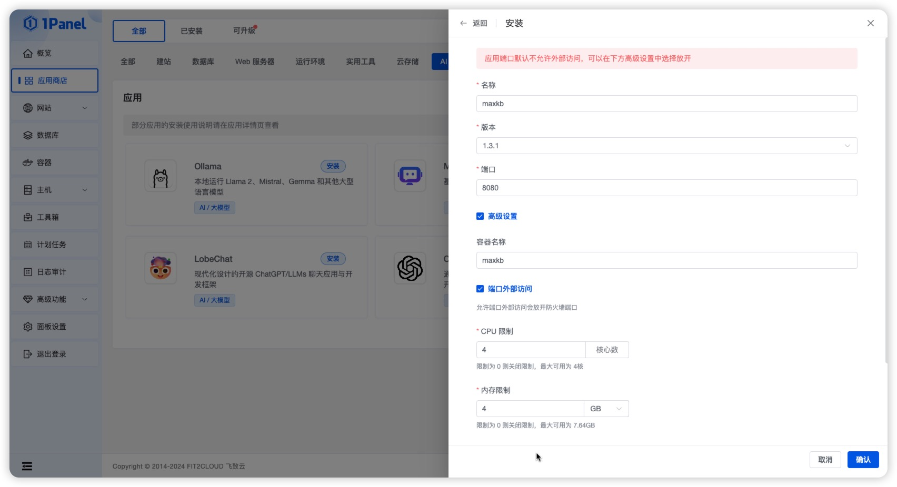
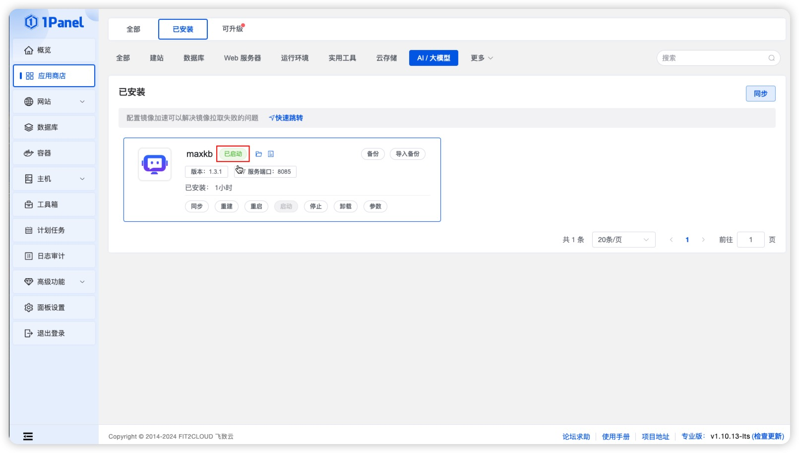

## 1 Установка 1Panel

!!! Abstract ""

    Об установке, развертывании и базовых возможностях 1Panel см. [официальную документацию 1Panel](https://1panel.cn/docs/). После установки 1Panel откройте его в браузере по адресу из подсказки.    



## 2 Установка MaxKB 

!!! Abstract "" 
    Откройте магазин приложений и в категории «AI/LLM» найдите MaxKB для установки.    

    

!!! Abstract ""  

    На странице установки задайте параметры MaxKB:

    - Имя: имя создаваемого приложения MaxKB.   
    - Версия: выбор версии MaxKB.   
    - Порт: сервисный порт приложения MaxKB.   
    - Имя контейнера: имя контейнера приложения MaxKB.    
    - Ограничение CPU: число ядер, доступных приложению.   
    - Ограничение памяти: объём памяти для приложения.    
    - Внешний доступ к порту: доступ по IP:PORT (для MaxKB обязательно включить).   



!!! Abstract "" 

    Нажмите «Подтвердить» для начала установки. Страница переключится на список установленных приложений. Дождитесь статуса «запущено».   

    

## 3 Доступ к MaxKB 

!!! Abstract "" 

    После успешной установки войдите в MaxKB по адресу:   

    ```
    Адрес: http://IP_сервера:порт_сервиса (по умолчанию 8080)     
    Имя пользователя: admin    
    Пароль: MaxKB@123..
    ``` 

    В целях безопасности при первом входе под admin потребуется сменить пароль. После смены войдите снова и используйте MaxKB.   


