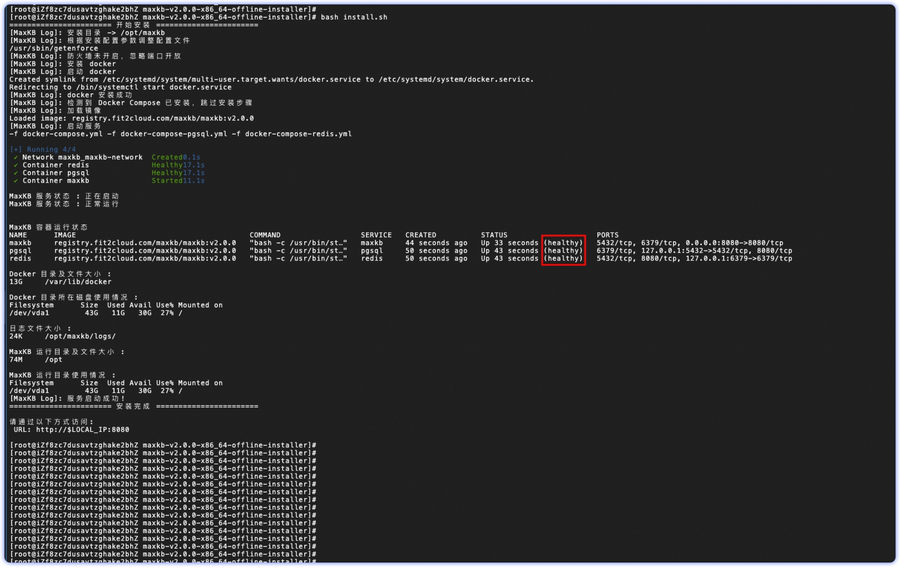

## 1 Требования к развертыванию

!!! Abstract ""
    Для продакшена рекомендуем офлайн‑установку.

    **Внимание: прямое обновление с v1.10.x на v2.0.x не поддерживается. Инструмент миграции планируется к сентябрю 2025.**

### 1.1 Конфигурация сервера

!!! Abstract ""

    **Требования к серверу:**

    * ОС: Ubuntu 22.04 / CentOS 7 (ядро ≥ 3.10)
    * CPU/Память: от 4C/8GB
    * Диск: 100GB

### 1.2 Требуемые порты

!!! Abstract ""
    Для офлайн‑развертывания MaxKB откройте порты:

| Порт     | Назначение       | Описание                        |
|--------|:---------|:--------------------------|
| 22     | SSH      | Установка, обновление, администрирование                |
| 8080   | Веб‑порт | Порт доступа к Web‑сервису (по умолчанию) |


## 2 Загрузка установочного пакета

!!! Abstract ""
    Перейдите на страницу [Загрузки MaxKB в сообществе FIT2CLOUD](https://community.fit2cloud.com/#/products/maxkb/downloads), скачайте последний установочный пакет и загрузите его на сервер (ниже пример для v2.0.0).

## 3 Установка и развертывание

### 3.1 Распаковка пакета

!!! Abstract ""

    Войдите по ssh под root на сервер и распакуйте пакет:
    ```
    tar -zxvf maxkb-v2.0.0-x86_64-offline-installer.tar.gz
    ```

### 3.2 Конфигурация (опционально)

!!! Abstract ""
    
    Каталог установки, порт сервиса, настройки БД и др. задаются в файле install.conf после распаковки.

    ```
    # Базовая конфигурация
    ## Каталог установки
    MAXKB_BASE=/opt
    ## Порт сервиса
    MAXKB_PORT=8080
    ## Подсеть docker
    MAXKB_DOCKER_SUBNET=172.31.250.192/26

    # Настройки БД
    ## Использовать внешнюю БД
    MAXKB_EXTERNAL_PGSQL=false
    ## Адрес БД
    MAXKB_PGSQL_HOST=pgsql
    ## Порт БД
    MAXKB_PGSQL_PORT=5432
    ## Имя БД
    MAXKB_PGSQL_DB=maxkb
    ## Пользователь БД
    MAXKB_PGSQL_USER=root
    ## Пароль БД
    MAXKB_PGSQL_PASSWORD=Password123@postgres

    # Настройки Redis
    ## Использовать внешний Redis
    MAXKB_EXTERNAL_REDIS=false
    ## Адрес Redis
    REDIS_HOST=redis
    ## Порт Redis
    REDIS_PORT=6379
    ## База Redis
    REDIS_DB=0
    ## Пароль Redis
    REDIS_PASSWORD=Password123@redis

    # Настройки образов
    ## Репозиторий
    MAXKB_IMAGE_REPOSITORY=registry.fit2cloud.com/maxkb
    ## Имя образа
    MAXKB_IMAGE=maxkb
    ## Версия
    MAXKB_VERSION=v2.0.0
    ```

    **Важно**:

    - Перед первой установкой параметры меняются в install.conf и используются при установке. После установки изменяйте их в ${MAXKB_BASE}/maxkb/.env (по умолчанию /opt/maxkb/.env) и выполняйте `mkctl reload`.
    - MAXKB_PGSQL_PORT, REDIS_PORT актуальны только при использовании внешних БД. Для встроенных — не меняйте.


### 3.3 Выполнение установочного скрипта

!!! Abstract ""

    ```
    # Перейдите в каталог после распаковки  
    cd maxkb-v2.0.0-x86_64-offline-installer

    # Выполните установку
    bash install.sh
    ```



## 4 Доступ и вход

!!! Abstract ""
    
    Когда все контейнеры будут в статусе `healthy`, откройте в браузере `http://IP_сервера:8080` и войдите с данными администратора по умолчанию.

    ```
    Имя пользователя: admin
    Пароль по умолчанию: MaxKB@123..
    ```


## 5 Офлайн‑обновление 

!!! Abstract ""
    
    Офлайн‑обновление аналогично установке: скачайте новый пакет, загрузите и распакуйте, затем выполните установочный скрипт.

    ```
    # Перейти в каталог новой версии
    cd maxkb-v2.x.y-offline

    # Запустить установочный скрипт
    bash install.sh

    # Проверить статус MaxKB
    mkctl status
    ```

    **Важно:** перед обновлением сделайте бэкап базы данных.
