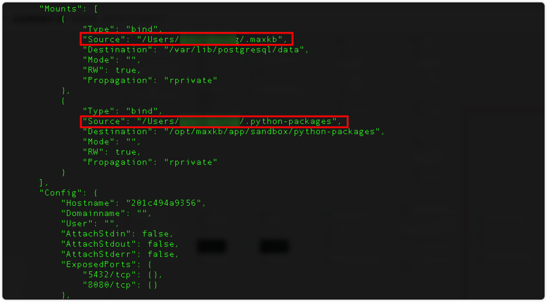

## 1 Требования к развертыванию

### 1.1 Конфигурация сервера

!!! Abstract ""

    **Требования к серверу:**

    * ОС: Ubuntu 22.04 / CentOS 7 (ядро ≥ 3.10)
    * CPU/Память: от 4C/8GB
    * Диск: 100GB

    **Внимание: прямое обновление с v1.10.x на v2.0.x не поддерживается. Инструмент миграции планируется к сентябрю 2025.**

### 1.2 Требуемые порты

!!! Abstract ""

    Для онлайн‑развертывания MaxKB откройте следующие порты:

| Порт     | Назначение       | Описание                        |
|--------|:---------|:--------------------------|
| 22     | SSH      | Установка, обновление, администрирование                |
| 8080   | Веб‑порт | Порт доступа к Web‑сервису (по умолчанию), можно изменить |    


## 2 Быстрое онлайн‑развертывание

!!! Abstract ""

    В ОС с установленным Docker выполните команду для установки MaxKB:
    ```
    # Linux
    docker run -d --name=maxkb --restart=always -p 8080:8080 -v ~/.maxkb:/opt/maxkb registry.fit2cloud.com/maxkb/maxkb

    # Windows
    docker run -d --name=maxkb --restart=always -p 8080:8080 -v C:/maxkb:/opt/maxkb registry.fit2cloud.com/maxkb/maxkb
    ```
     
    Когда все контейнеры перейдут в статус `healthy`, откройте MaxKB в браузере:
    ```
    http://IP_сервера:8080

    Данные входа по умолчанию
    Имя пользователя: admin
    Пароль: MaxKB@123..
    ```

## 3 Онлайн‑обновление

!!! Abstract ""

    Выполните шаги для обновления:

    (1) Загрузите последний образ
    ```
    docker pull registry.fit2cloud.com/maxkb/maxkb
    ```
    (2) Проверьте каталог хранения данных предыдущего запуска и сохраните путь
    ```
    docker inspect maxkb
    ```



!!! Abstract ""

    (3) Удалите запущенный контейнер старой версии MaxKB

    ```
    docker rm -f maxkb 
    ```

    (4) Запустите новую версию контейнера MaxKB

    **Важно:** убедитесь, что каталог монтирования данных (после -v) совпадает с пунктом (2), иначе система запустится без данных.

    ```
     docker run -d --name=maxkb --restart=always -p 8080:8080 -v ~/.maxkb:/opt/maxkb registry.fit2cloud.com/maxkb/maxkb
    ```
