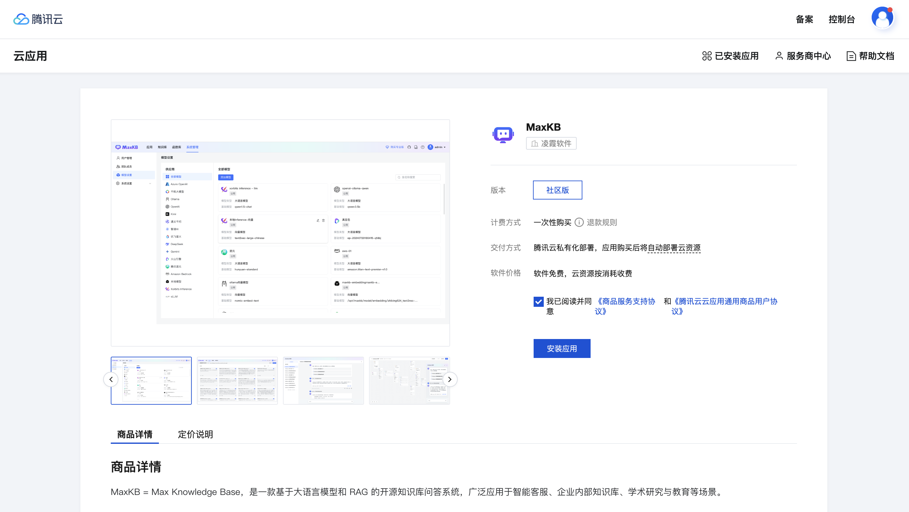
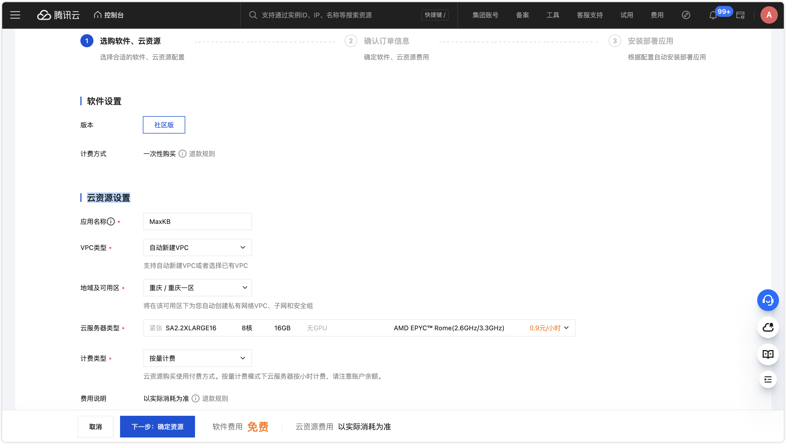
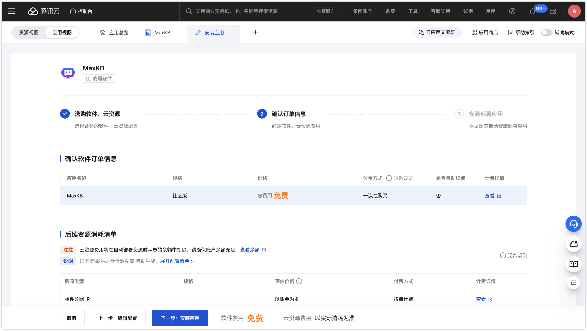
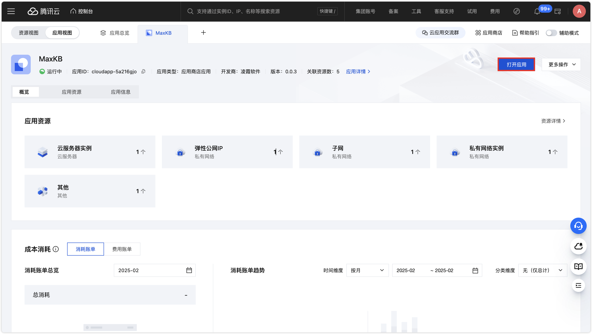

# Руководство по развертыванию облачного приложения


Это руководство описывает, как быстро развернуть облачное приложение **MaxKB** в облаке Tencent Cloud.

## 1 Установка приложения

Сообщественная версия MaxKB доступна как облачное приложение в Tencent Cloud и может быть быстро установлена на ваши серверы в облаке.

Шаг 1: Свяжите ваш аккаунт с нашим партнёрским аккаунтом Tencent Cloud, чтобы получить дополнительные привилегии и скидки: [перейти по ссылке](https://partner.cloud.tencent.com/invitation/10002820907763620ace838b1?inviteType=2)

Шаг 2: Откройте страницу [облачного приложения MaxKB](https://app.cloud.tencent.com/detail/SPU_BHDJDDBHBE5864).




Шаг 3: Выберите конфигурацию облачных ресурсов. После нажатия «Установить приложение» настройте параметры ресурсов. Рекомендуемая минимальная конфигурация — 4C/8GB и выше.





Шаг 4: Установка и запуск. Нажмите «Установить приложение» и дождитесь завершения установки и старта сервисов. После запуска нажмите «Открыть приложение» и войдите в MaxKB с учётными данными администратора по умолчанию.

```
Имя пользователя: admin
Пароль по умолчанию: MaxKB@123..
```


