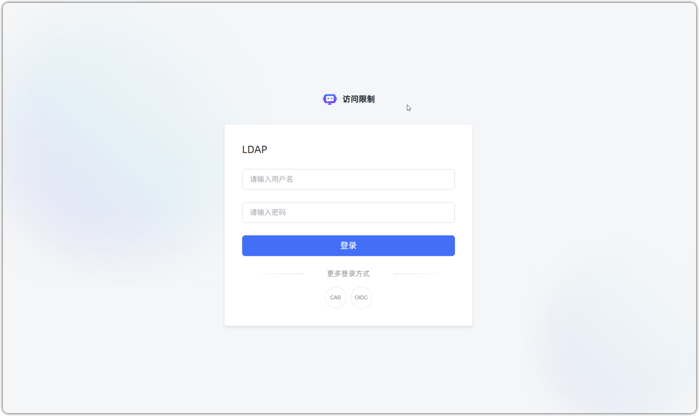

# Ограничение доступа

!!! Abstract "" 
    Поддерживается ограничение доступа к приложению через аутентификацию для повышения безопасности. Доступны варианты: «Парольная проверка» или «Логин‑аутентификация».

    При выборе «Логин‑аутентификация» необходимо включить хотя бы один способ входа.

    - «Пользователи диалога»: администратор управляет группами и пользователями в «Системные настройки» → «Пользователи диалога»/«Группы».
    - «Способы входа»: администратор настраивает «Аутентификацию входа» в «Системные настройки», а также включает SSO и вход по QR в «Пользователи диалога».

!!! Abstract "" 
    После включения аутентификации при переходе по публичной ссылке (включая виджет) потребуется ввести пароль, чтобы попасть на страницу Q&A.    
    **Примечание:** при включённой аутентификации пароль требуется для любых публичных ссылок, включая демо и встраивание (полноэкранный/виджет‑режим). Интеграции с WeCom, WeChat Public, DingTalk и Feishu не затрагиваются.

    

!!! Abstract ""
    Если выбран вход по QR (например, DingTalk, Feishu или WeCom), при обращении к помощнику автоматически откроется окно сканирования. После сканирования пользователь войдёт и сможет начать диалог.

