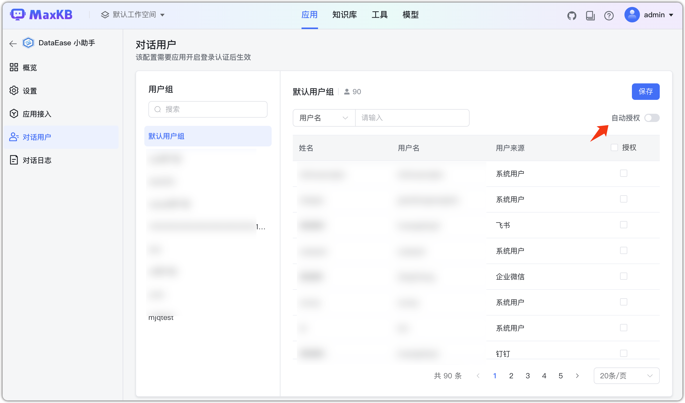

# Пользователи диалога

!!! Abstract "" 
    Настройте группы и пользователей, которым разрешён доступ к Q&A текущего приложения.

!!! Abstract ""
    Если пользователь состоит в нескольких группах, достаточно авторизации хотя бы одной группы. При удалении из группы соответствующие права снимаются.  
    Правила автоавторизации:

    - Включено: текущая группа и новые участники авторизуются автоматически.
    - Выключено: требуется ручная авторизация; новые участники по умолчанию без доступа.

    **Важно**:

    - В приложении доступны только просмотр и авторизация групп. Управление группами и участниками выполняют администраторы (рабочего пространства/системы) в «Системные настройки».
    - Если в «Аутентификации» не включён логин, все связанные БЗ доступны для поиска любому пользователю.

