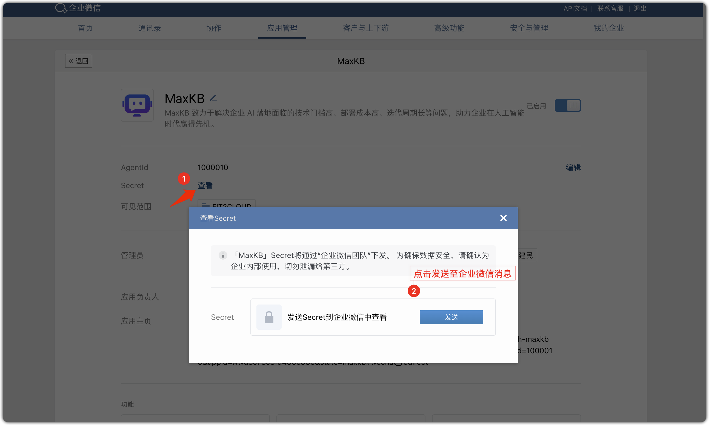
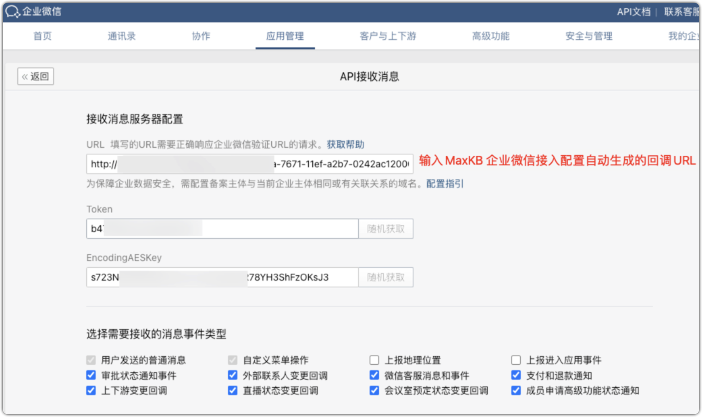

# Интеграция приложения


!!! Abstract "" 
    Поддерживается подключение созданного приложения к WeCom (приложения/客服), WeChat Public (Service/Subscription), DingTalk и Feishu — для диалогов с сотрудниками и внешними пользователями.
    
### 1 Интеграция с WeCom (приложение)

!!! Abstract ""
    В «Интеграции приложения» нажмите «WeCom приложение» → «Настроить». Будет сгенерирован callback URL — скопируйте его в настройки приёма API WeCom. Остальные параметры берутся из консоли WeCom. 


!!! Abstract ""
    Получить ID организации: в [консоли WeCom](https://work.weixin.qq.com/wework_admin/frame#apps) → «Моя компания» (внизу отображается ID).


!!! Abstract "" 
    Создать приложение WeCom: «Управление приложениями» → «Создать приложение», затем логотип, имя, описание и область видимости.


!!! Abstract ""
    Получить AgentId и Secret: в созданном приложении откройте «Сертификаты и базовая информация».



!!! Abstract ""
    Получить Token и EncodingAESKey: в настройках WeCom «Приём сообщений» → «Настроить приём API».
    
    Введите параметры в настройках WeCom‑интеграции в MaxKB и сохраните. Затем вернитесь в WeCom и укажите callback URL из MaxKB. Сохраните.
    
    **Важно:** прежде чем сохранять конфигурацию приёма API в WeCom, завершите настройку в MaxKB, иначе возникнет ошибка `openapi回调地址请求不通过`.


!!! Abstract ""
    **注意：** 在企业微信应用API接收消息配置保存之前，一定要在 MaxKB 中完成企业微信应用配置并保存，不然保存时将报错`openapi回调地址请求不通过`。




!!! Abstract ""
    配置企业可信 IP：进入企业微信应用设置的【企业可信 IP】中，把 MaxKB 服务的 IP 地址设置为可信 IP。


!!! Abstract "" 

    以上步骤配置完成后，并在企业微信应用接入配置中输入企业微信应用信息后保存，便可在企业微信应用中找到机器人进行对话了。


### 2 Интеграция с WeCom Customer Service
    
!!! Abstract ""
    После интеграции WeCom приложение можно подключить к WeCom Customer Service для внешних пользователей.   
    Создание аккаунта: в консоли WeCom → «Управление приложениями» → «WeChat Customer Service», создайте аккаунт. Режим обслуживания: бот + оператор.


!!! Abstract ""
    客服账号与应用关联：在微信客服中配置【可调用接口的应用】，并配置客服账号。


!!! Abstract ""
    Включите «Ассистент поддержки» во внешней группе — сервис подключится к группе. Любой участник может упомянуть ассистента для индивидуального диалога.

{ width="500px" }

{ width="500px" }

### 3 Интеграция с WeChat Public (Official Account)

!!! Abstract "" 
    В «Интеграции» нажмите «Official Account» → «Настроить». Используйте callback URL из MaxKB в «WeChat Public Platform → Settings & Development → Basic Config → Server Config». Остальные параметры берутся из платформы.


!!! Abstract "" 
    Получите APP ID/APP Secret/Token/Encoding AES Key: на странице Basic Config включите серверную конфигурацию.


!!! Abstract "" 
    Введите APP ID/APP Secret/Token/Encoding AES Key в настройках интеграции MaxKB и сохраните.


!!! Abstract ""
    将【公众号-基本配置-服务器配置】中的 URL 设置为 MaxKB 公众号配置窗口中的回调地址 URL，然后提交，并启用服务器配置。


!!! Abstract "" 
    Включите права интерфейса поддержки (Customer Service API).


!!! Abstract "" 
    设置 IP 白名单：进入公众号基本配置的【IP 白名单】中，添加 MaxKB 服务器的 IP 地址。


!!! Abstract "" 
    根据以上步骤完成配置后，即可在公众号中发送消息进行对话。

{ width="500px" }


### 4 Интеграция с DingTalk

!!! Abstract ""
    В «Интеграции» нажмите «DingTalk» → «Настроить». Используйте callback URL в настройках бота DingTalk. Остальные параметры берите из консоли DingTalk.


!!! Abstract ""
    Создайте бота: в [DingTalk Open Platform](https://open-dev.dingtalk.com/) → «App Development» → «DingTalk App» → «Create App».


!!! Abstract ""
    Получите Client ID/Client Secret на странице «Credentials & Basic Info» приложения.


!!! Abstract ""
    Введите Client ID/Client Secret в настройках DingTalk‑интеграции MaxKB и сохраните.


!!! Abstract ""
    Добавьте «способности» бота, установите режим «HTTP», укажите callback URL из MaxKB и опубликуйте приложение.


!!! Abstract ""
    根据以上步骤完成配置后，就可以群里@机器人中进行对话，或与机器人应用一对一对话。

{ width="500px" }

### 5 Интеграция с Feishu

!!! Abstract ""
    В «Интеграции» нажмите «Feishu» → «Настроить». Используйте callback URL из MaxKB в «Feishu Open Platform → Events & Callbacks → Subscription». Остальные параметры берутся из платформы.


!!! Abstract ""
    Создайте бота Feishu: в [Feishu Developer Platform](https://open.feishu.cn/app/) → «Self‑Built App» → «Create».


!!! Abstract ""
    Добавьте способность «Бот».


!!! Abstract ""
    Добавьте права: откройте «Управление правами», вставьте конфигурацию ниже в «API Permissions», выделите все и откройте оптом, затем подтвердите.

    ```
     m:message,im:message.group_at_msg:readonly,im:message.p2p_msg:readonly,im:message:send_as_bot,im:resource, contact:contact.base:readonly，contact:user.base:readonly
    ```


!!! Abstract ""
    Получите APP ID/APP Secret на странице «Credentials & Basic Info».


!!! Abstract ""
    В «Events & Callbacks → Encryption Strategy» получите Verification Token.


!!! Abstract ""
    Введите параметры в настройках Feishu‑интеграции MaxKB и сохраните.


!!! Abstract ""
    Укажите callback URL: в Feishu Open Platform → «Events & Callbacks → Callback Config» вставьте адрес из MaxKB в «Request URL».


!!! Abstract ""
    Опубликуйте приложение: «Создать версию», заполните и сохраните.


!!! Abstract ""
    После публикации статус станет «Включено».


!!! Abstract ""
    По завершении настроек найдите в клиенте Feishu «MaxKB小助手», нажмите «Добавить» и начните 1‑на‑1 диалог.

{width="500px"}   {width="500px"}
