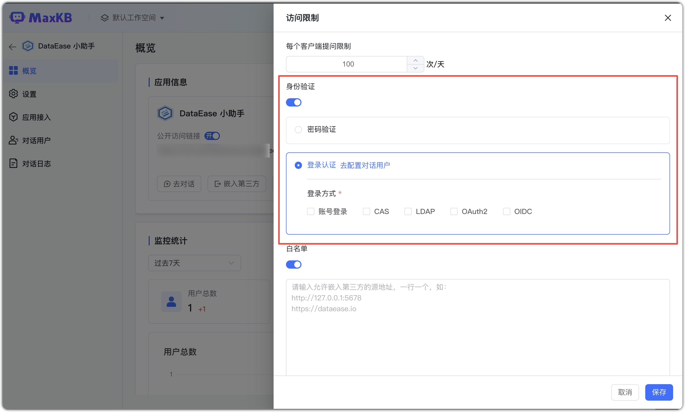
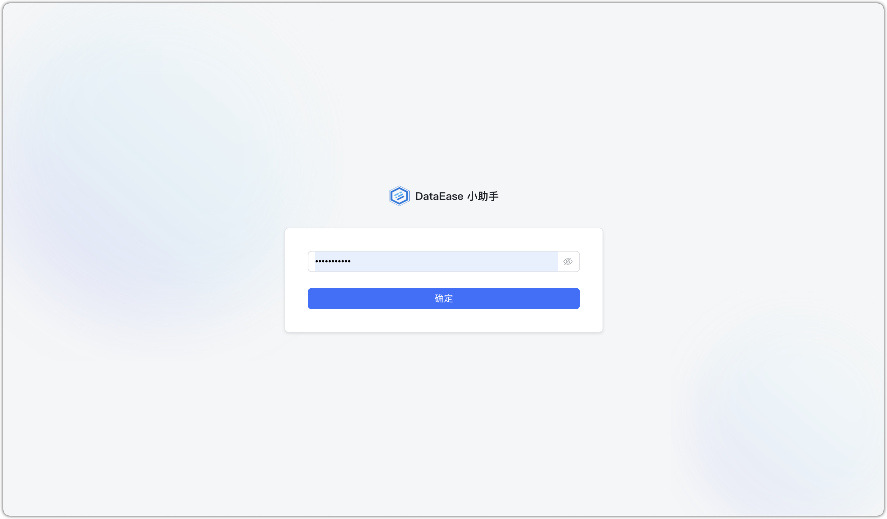
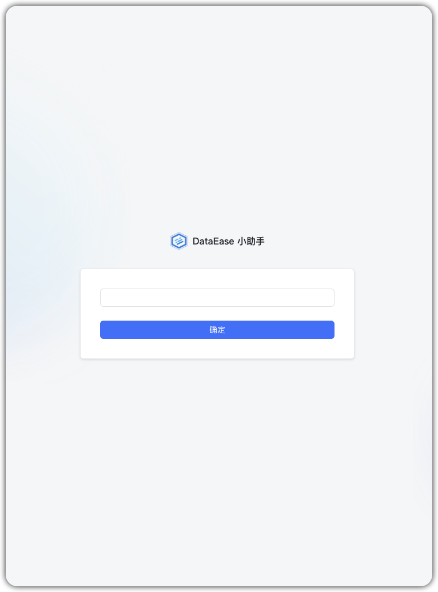

# Аутентификация доступа к приложению

Можно ограничить доступ к приложению через аутентификацию: «Парольная проверка» или «Логин‑аутентификация».

При выборе «Логин‑аутентификация» включите минимум один способ входа.

- «Пользователи диалога»: администратор управляет группами/пользователями в «Системные настройки».
- «Способы входа»: настраиваются в «Системные настройки → Аутентификация входа», вход по QR/SSO включается в «Пользователи диалога».

При включённой аутентификации для публичной ссылки (включая виджет) требуется пароль для входа на страницу Q&A.    
**Примечание:** это относится ко всем публичным ссылкам (демо, полноэкранный/виджет), но не влияет на интеграции WeCom/WeChat Public/DingTalk/Feishu.

    
{width="500px"}
