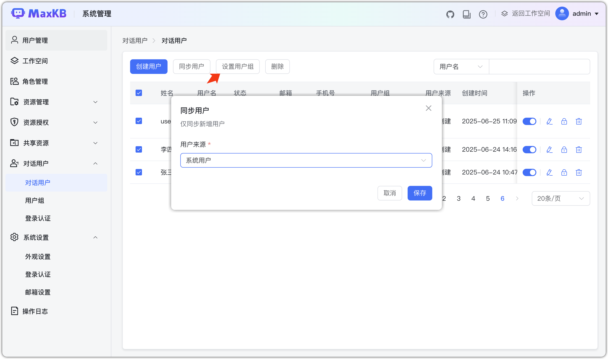

# Пользователи диалога

!!! Abstract ""
    Пользователи диалога — это аутентифицированные пользователи, которые могут задавать вопросы на странице Q&A. Администратор через управление группами в «Приложения» и «База знаний» гибко контролирует доступ и права по группам.   
    Права:

    - **Системный администратор**: управление пользователями диалога, группами, аутентификацией входа.
    - **Администратор пространства**: управление пользователями диалога и группами.

## 1 Управление пользователями

### 1.1 Создание пользователя
!!! Abstract ""
    Администратор может создавать и удалять пользователей диалога. Поля:

    - Имя пользователя: 4–20 символов, обязательно и уникально.
    - Имя: 1–20 символов, обязательно и уникально.
    - Статус: активен/отключён.
    - Email, телефон: опционально.
    - Пароль: обязателен; правила как у системных пользователей. Для внешних по умолчанию — пароль из профиля (напр. MaxKB@123).
    - Группы: можно установить несколько или ни одной.
    - Источник: локально создан.
    - Время создания: фиксируется автоматически.

!!! Abstract ""
    Кроме имени пользователя все поля можно редактировать.

!!! Abstract ""
    Администратор может изменить пароль; правила как у системных пользователей.

### 1.2 Настройка групп
!!! Abstract ""
    Массовая настройка групп для нескольких пользователей диалога.

    - Отметьте нужных пользователей.
    - Нажмите «Настроить группы».
    - Способ:
        - Добавить: добавить новые группы к текущим.
        - Заменить: удалить старые группы и назначить новые.

### 1.3 Синхронизация пользователей
!!! Abstract ""
    Доступно только системному администратору. При синхронизации:

    - Источник: поддерживается синхронизация системных пользователей.
    - Поля: имя пользователя, имя, email, телефон, статус, пароль, тип.
    - Группы: синхронизируемые пользователи назначаются в группу по умолчанию.
    - Тип: соответствует системному пользователю.
    - Логика: существующие пользователи не создаются/не обновляются повторно.

## 2 Управление группами

!!! Abstract ""
    Группы используются для классификации и управления пользователями диалога. Системный админ и админ пространства могут:

    - Добавлять группы.
    - Удалять/переименовывать (встроенная группа по умолчанию не удаляется, но переименовывается).
    - Массово добавлять/удалять участников.

!!! Abstract ""
    Имя группы уникально, до 128 символов.

!!! Abstract ""
    При удалении группы требуется подтверждение; все участники будут удалены из неё.

!!! Abstract ""
    Добавляйте участников в группу.

## 3 Аутентификация входа
!!! Abstract ""
    Поддерживается гибкая конфигурация способов входа, включая QR‑вход через популярные платформы — для безопасной и единой системы управления пользователями диалога.

!!! Abstract ""
    После настройки аутентификации выбранный способ входа будет доступен в «Приложение → Обзор → Ограничение доступа».

!!! Abstract ""
    При выборе QR‑входа (DingTalk, Feishu, WeCom) при обращении к помощнику открывается окно сканирования. После сканирования пользователь входит и начинает диалог.

## 4 Сценарии использования

!!! Abstract ""
    После настройки администратором, при создании приложений и БЗ пользователи назначают группы диалога для контроля прав доступа.

