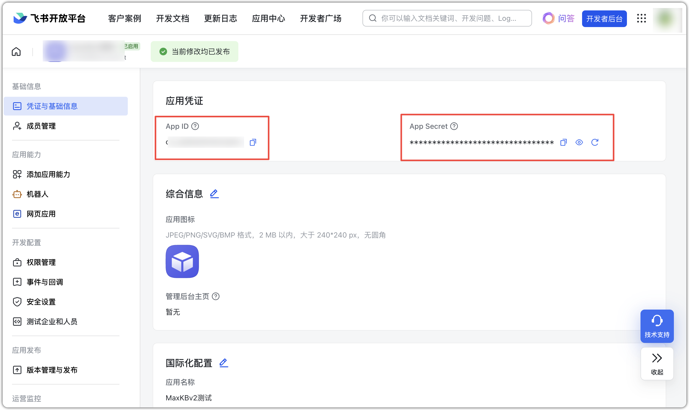

# База знаний по документам Feishu

## 1 Настройка бота Feishu

Поддерживается построение БЗ на основе документов Feishu (облако и таблицы).  
Важно: доступ к документам обеспечивается через бота Feishu с соответствующими правами; добавьте бота как коллаборатора в группе.

### 1.1 Создание бота Feishu

В [Feishu Developer Platform](https://open.feishu.cn/app/) создайте «Self‑Built App» и заполните информацию.


点击【添加应用能力】，选择 【按能力添加-机器人】，点击【添加】


### 1.2 Добавление прав

В «Управлении правами» вставьте конфигурацию ниже в «API Permissions», выделите все и включите оптом.

```
docs:document:export,docx:document:readonly,drive:drive,space:document:retrieve
```


### 1.3 Получение параметров

Получите APP ID, APP Secret и Folder Token.
APP ID и APP Secret — на странице «Credentials & Basic Info».


### 1.4 Публикация приложения

«Создать версию», заполните и сохраните. После одобрения настройте группу.


### 1.5 Настройки группы
    
Добавьте бота в внутреннюю группу.


В папке документов Feishu добавьте группу с ботом как коллаборатора.


## 2 Создание БЗ по документам Feishu
    
При создании БЗ выберите тип «Feishu» и укажите:

- App ID: идентификатор приложения Feishu.
- App Secret: ключ приложения.
- Folder Token: уникальный идентификатор папки в облаке Feishu, берётся из ссылки выбранной папки.


          


В БЗ Feishu нажмите «Импорт документов», выберите файлы в папке Feishu и начните импорт — документы будут загружены в MaxKB.


