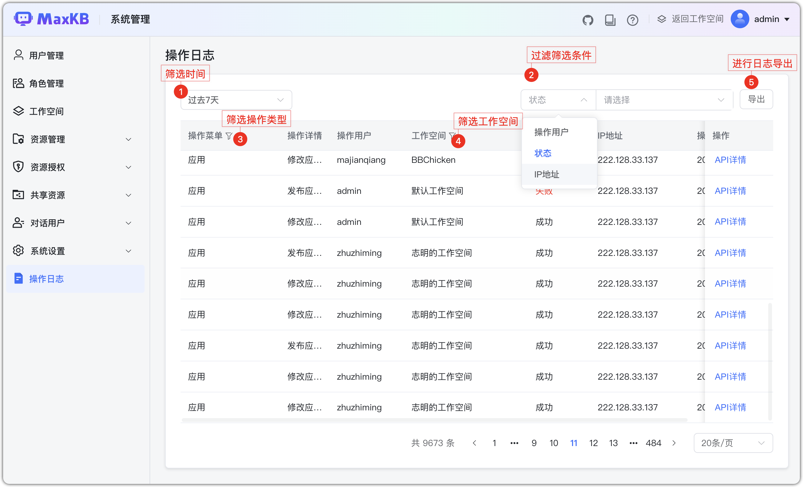

# Журнал операций 

Администратор системы в «Системные настройки → Журнал операций» видит действия всех пользователей с базами знаний, моделями, приложениями и др. Удобно для аудита и расследований.

- Фильтрация по предустановленным или произвольным периодам.

- Поиск по пользователю, статусу, IP и т.д.

  
