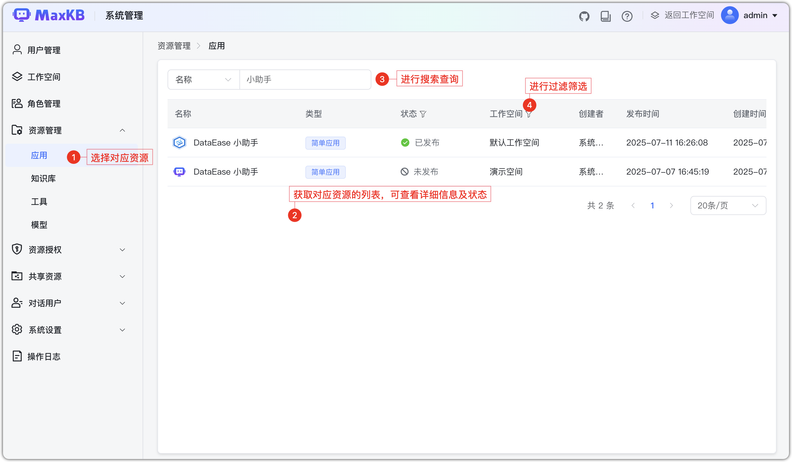
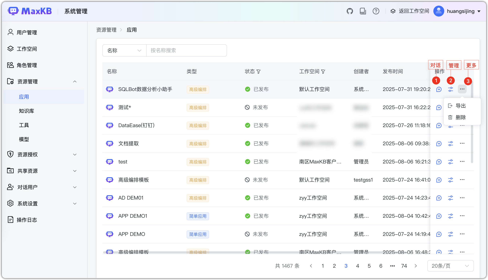

# Управление ресурсами

!!! Abstract ""
    Этот раздел предоставляет системному администратору единое и эффективное средство визуального управления ресурсами всех рабочих пространств: приложения, базы знаний, инструменты, модели и др.

## 1 Просмотр ресурсов
!!! Abstract ""

    Просмотр ресурсов по рабочим пространствам:

    - Список приложений: имя, тип, статус, пространство, автор, время публикации, время создания.
    - Поиск: по имени, пространству, автору.

    Поддерживаются поиск по ключевым словам и фильтры.

## 2 Операции
!!! Abstract ""
    Доступные операции по типам ресурсов, включая:

    - **Приложения**: диалог, управление, экспорт, удаление, переход к просмотру и др.;
    - **Базы знаний**: управление, векторизация, синхронизация, генерация вопросов, экспорт в Excel/ZIP, настройки, удаление;
    - **Инструменты**: настройка параметров, включение/выключение, экспорт;
    - **Модели**: изменение, параметры модели, удаление.

