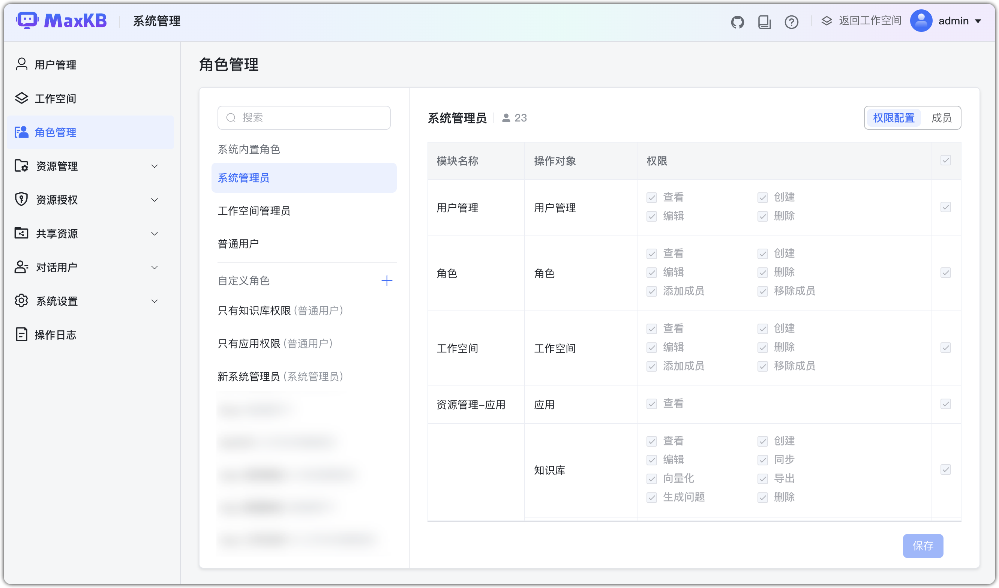
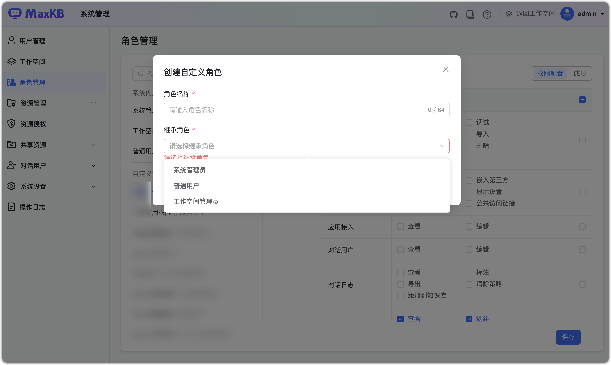
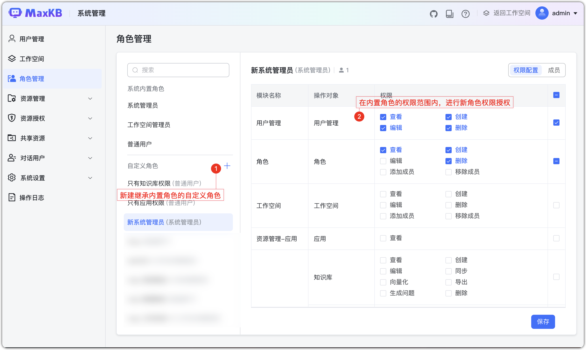
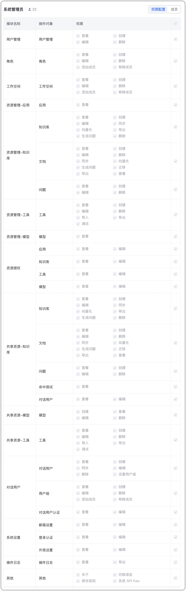
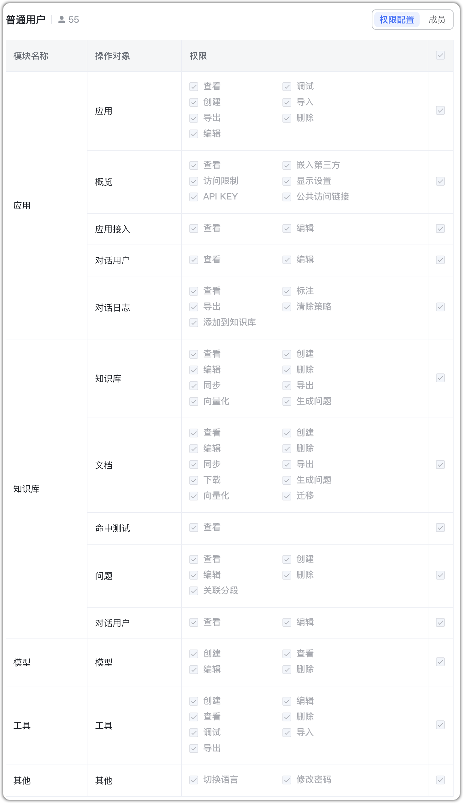
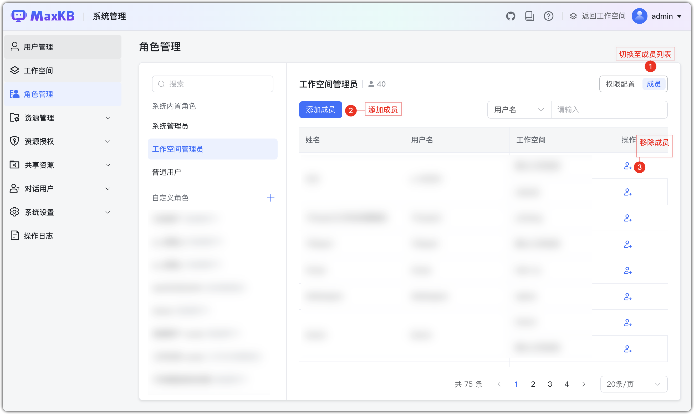
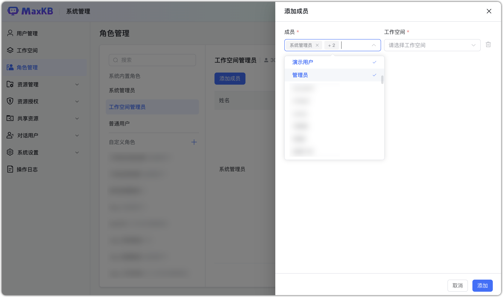

# Управление ролями

Роль определяет набор прав пользователя в системе и позволяет управлять доступом пакетно.  

Встроенные роли:

- Системный администратор: все настройки и права в «Системном управлении» и меню пользователя.
    - Видит конфигурации всех ролей (встроенных и кастомных).
    - Полный доступ: создание/изменение кастомных ролей, добавление/удаление участников.
- Администратор рабочего пространства: права управления пространством; полный доступ к приложениям, БЗ, инструментам и моделям.
    - Видит настройки ролей «обычный пользователь» и кастомных, наследующих её; без права редактирования.
- Обычный пользователь: управляет созданными и делегированными ресурсами (приложения, БЗ, инструменты, модели). 

**Важно**: права встроенных ролей не редактируются; можно только добавлять/удалять участников.

## 1 Создание роли
Создание кастомной роли:

 - Имя роли: 1–64 символа.
 - Наследование: системный админ, админ пространства или обычный пользователь.

**Важно**: доступно только системному администратору.   

## 2 Настройка прав
По умолчанию у кастомной роли отключены все унаследованные права. Вы можете наследовать права одной из 3 встроенных ролей и настраивать их в её пределах.

内置系统管理员角色权限：

内置工作空间管理员角色权限：

内置系普通用户角色权限：

## 3 Управление участниками

Управляйте участниками по ролям: «Участники» покажет список для выбранной роли.

Администратор пространства видит участников только своих пространств.

Добавление:

- Добавляйте нескольких участников сразу.
- Для ролей «админ пространства» и «обычный пользователь» выберите одно или несколько пространств.

**Важно**: администратор пространства видит только свои пространства в выпадающем списке.

Удаление:

- Если у пользователя несколько пространств, удаляйте роль отдельно по каждому.
- После удаления участник теряет права роли при следующем входе.
- Пользователь admin во встроенной роли системного администратора не может быть удалён.

