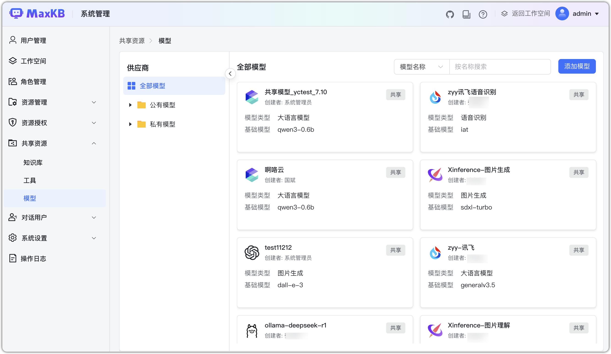

# Общие ресурсы

## 1 Обзор

!!! Abstract ""
    В enterprise‑версии системный администратор может создавать общие ресурсы (БЗ, инструменты, модели) и выдавать права выбранным рабочим пространствам.

    **Важно**: авторизованные пространства видят общие ресурсы и могут их использовать, но не редактировать/удалять.

!!! Abstract ""
    После создания ресурса задайте права пространствам:

    - Белый список: только выбранные пространства могут использовать ресурс.
    - Чёрный список: все пространства, кроме выбранных, могут использовать ресурс.  

    По умолчанию выбран белый список. Если список пуст — ресурс не виден никому. При выборе чёрного списка и пустом списке — ресурс виден всем пространствам.

## 2 База знаний

!!! Abstract ""
    Создание общей БЗ аналогично созданию БЗ в пространстве; список переключается на «Общие БЗ».  
    **Важно**: выбирать можно только векторные модели из общих моделей.

!!! Abstract ""
    Авторизованные пространства могут просматривать и использовать общую БЗ.

!!! Abstract ""
    Интерфейсы «Документы», «Вопросы», «Тест попаданий», «Диалог» и «Настройки» такие же, как у БЗ в пространстве.

## 3 Инструменты
!!! Abstract ""
    Создание общего инструмента аналогично инструментам в пространстве; список переключается на «Общие инструменты».

!!! Abstract ""
    Авторизованные пространства могут просматривать и использовать общий инструмент.

## 4 Модели

!!! Abstract ""
    Создание общей модели аналогично; список переключается на «Общие модели».

!!! Abstract ""
    Авторизованные пространства могут просматривать и использовать общую модель.

