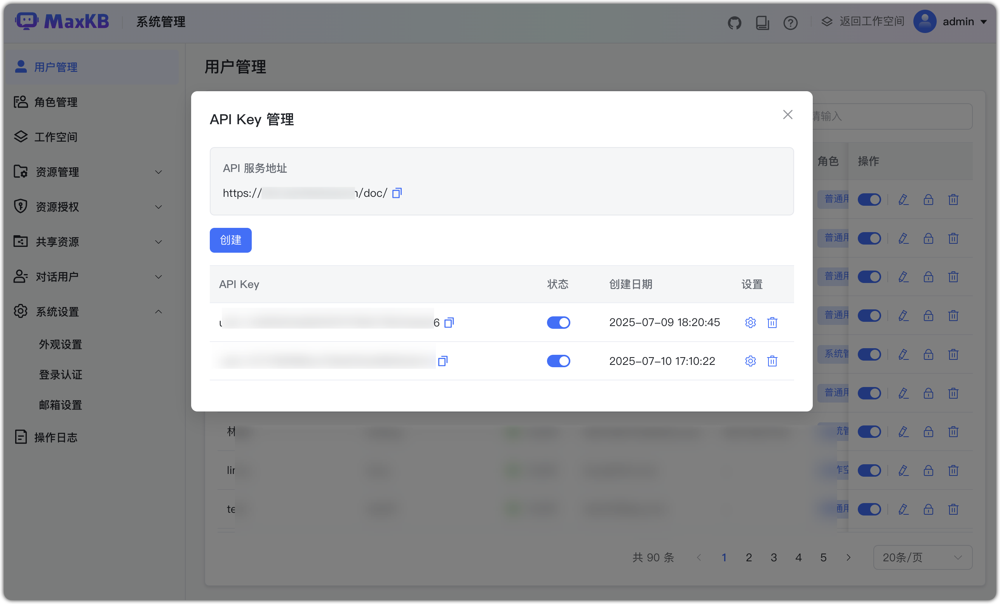
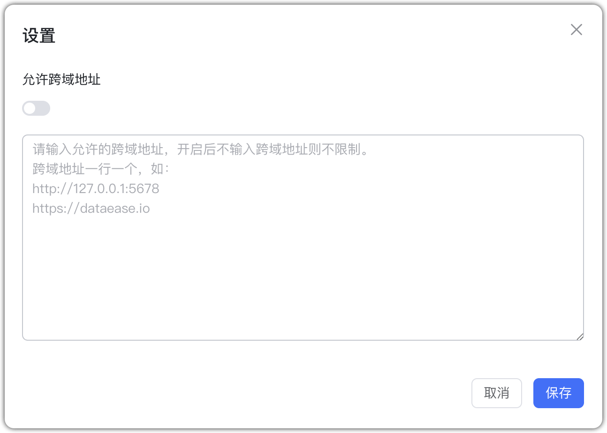
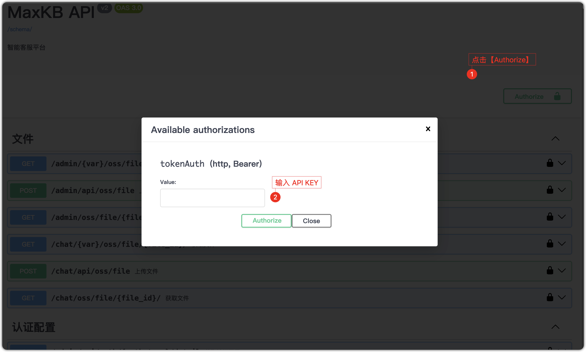

# Системный API 

## 1 Управление API Key

!!! Abstract "" 
    В выпадающем меню по иконке пользователя (справа вверху) выберите «Управление API Key», чтобы создавать, включать/отключать, удалять и настраивать ключи.

  

!!! Abstract "" 
    创建 API Key之后，点击【设置】下方可以配置是否允许跨域地址，默认不允许。

  

## 2 Тестирование API

!!! Abstract "" 
    Откройте документацию API, авторизуйтесь API‑ключом и выполняйте онлайн‑тестирование.

