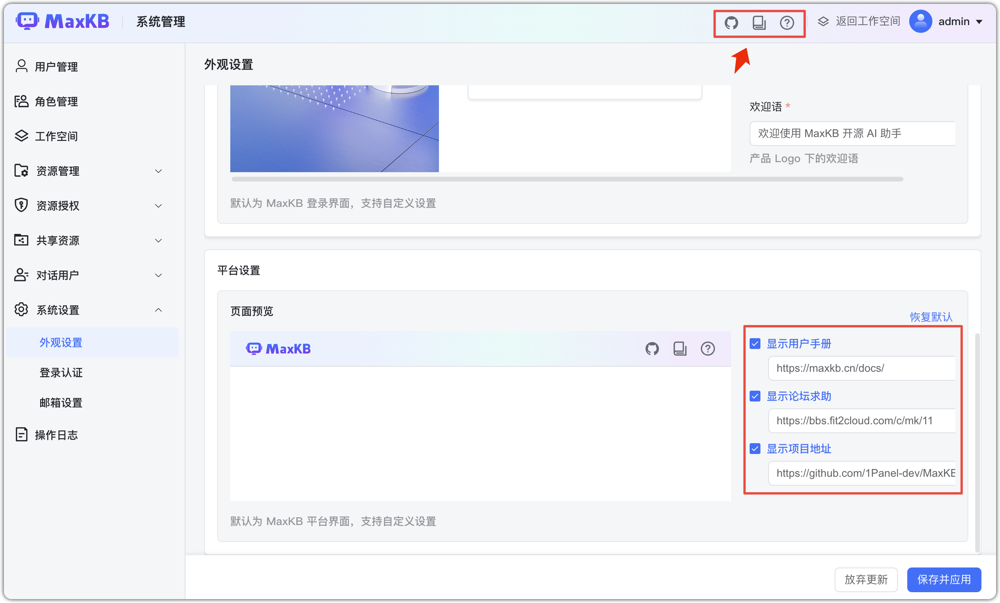

# Настройки внешнего вида

Можно настроить цвет темы, логотип сайта, логотип страницы входа, фон входа, название сайта, приветствие, а также отображение ссылок (руководство, форум, репозиторий) в правом верхнем углу главной.

