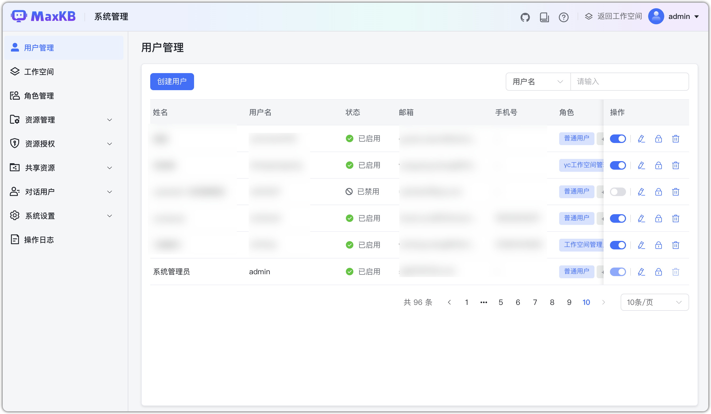
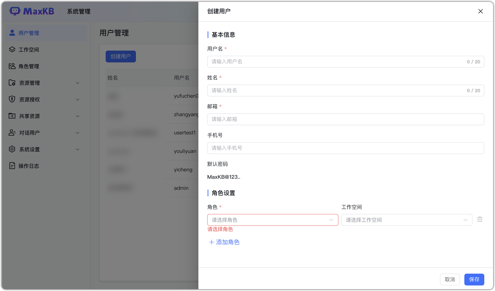
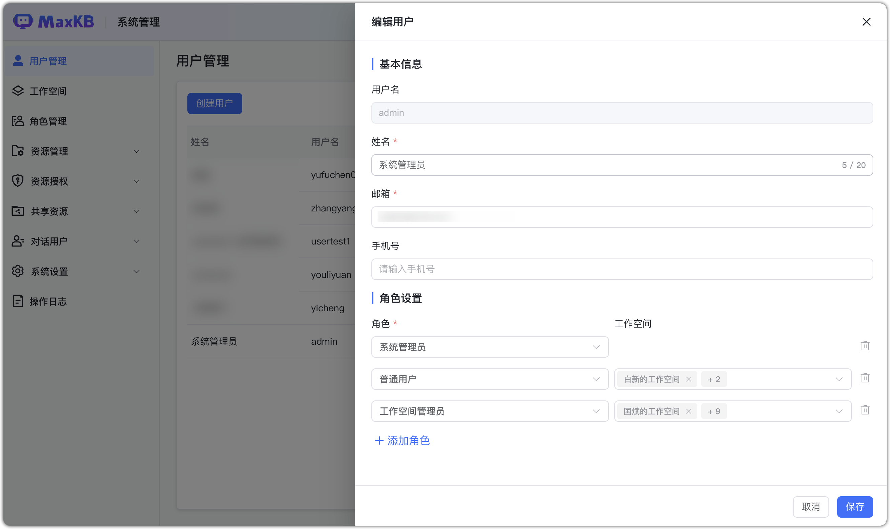
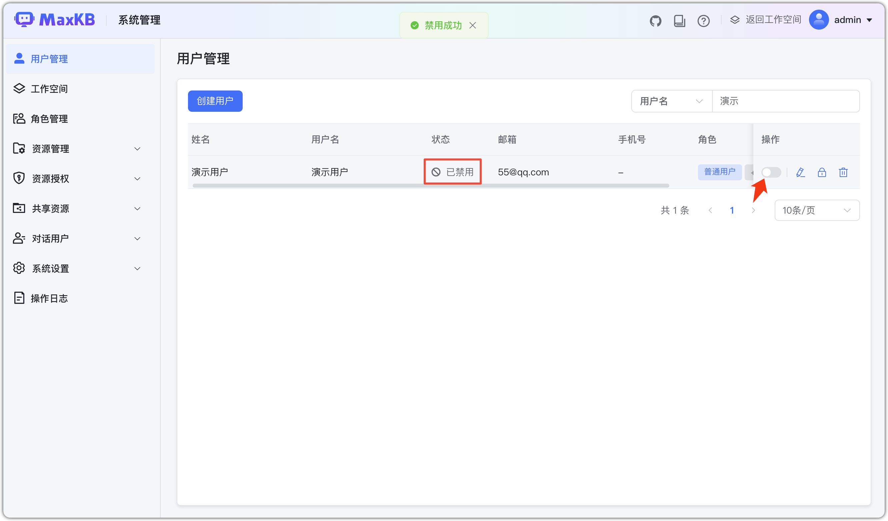
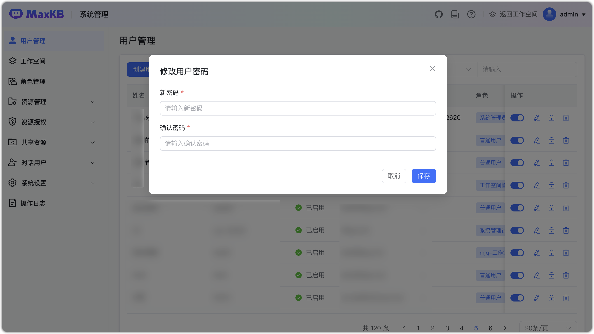
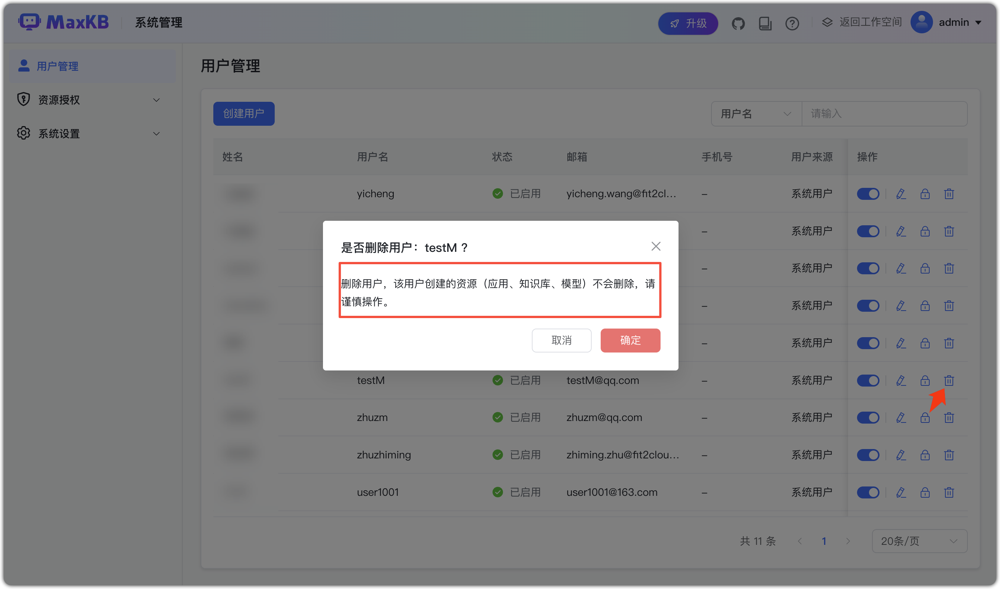
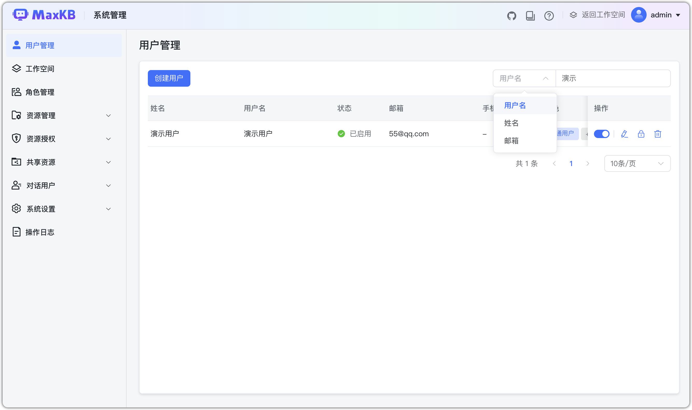

# Управление пользователями

## 1 Список пользователей

!!! Abstract ""
    Поддерживается многопользовательская модель; администратор системы создаёт и управляет пользователями.

## 2 Создание пользователя

!!! Abstract ""
    Администратор может создавать пользователей:

    - Имя пользователя: учётная запись (нельзя изменить);
    - Имя: ФИО;
    - Email: почта;
    - Телефон: номер телефона;
    - Пароль по умолчанию: `MaxKB@123..`.
    - Роли:
        - Можно назначить несколько, минимум одну;
        - Для ролей «обычный пользователь»/«админ пространства» требуется выбрать пространство;
        - Для «системного администратора» выбор пространства не требуется.

## 3 Редактирование пользователя

!!! Abstract ""
    Имя пользователя нельзя редактировать; остальные поля можно.

!!! Abstract ""
    Если пользователь отключён, вход в MaxKB невозможен.

## 4 Сброс пароля

!!! Abstract ""
    Администратор может менять пароли: в списке пользователей нажмите «Сменить пароль», сохраните изменения.

## 5 Удаление пользователя

!!! Abstract ""
    Нажмите «Удалить» и подтвердите — будет удалён только текущий пользователь; его ресурсы в пространствах не затрагиваются.  
    **Важно**: встроенный admin не может быть удалён.

## 6 Поиск пользователей

!!! Abstract ""
    Поиск по имени пользователя, ФИО, email.

