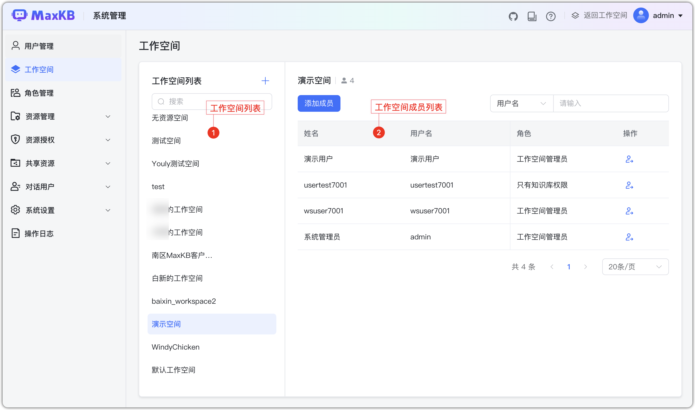
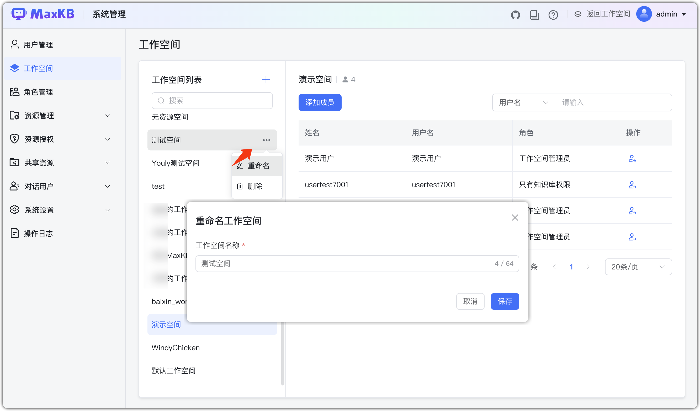
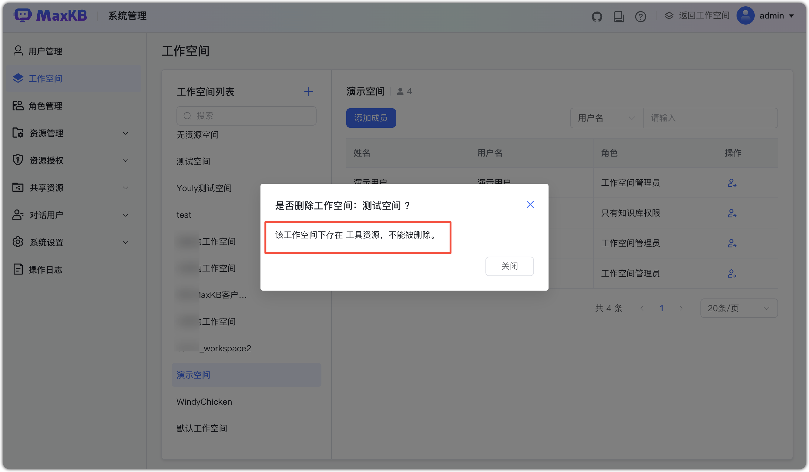
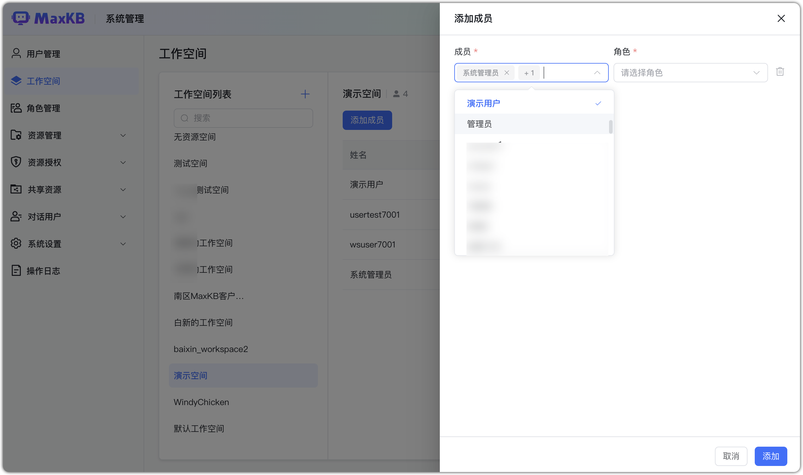
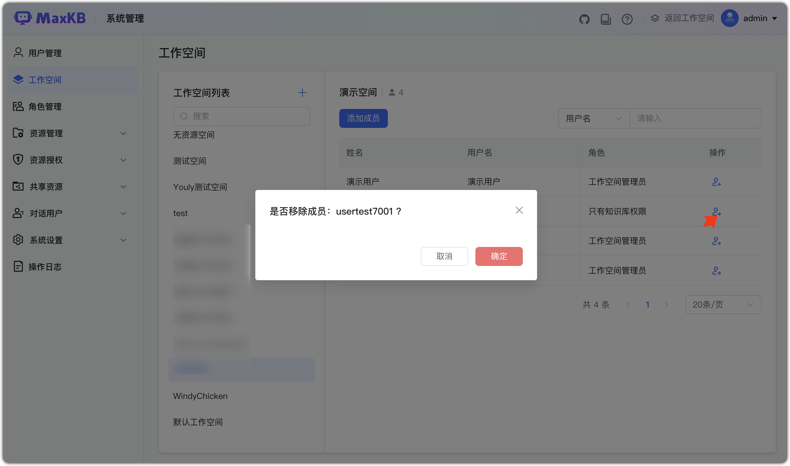

# Рабочие пространства

!!! Abstract ""
    Рабочее пространство — организационная единица MaxKB для централизованного управления людьми, ресурсами и ролями.
    
    - Пространства изолированы; общие ресурсы доступны через механизм «Общих ресурсов».
    - В enterprise‑версии число пространств не ограничено.

## 1 Управление пространствами

!!! Abstract ""
    Создание: откройте диалог, задайте имя (обязательно, 1–64 символа, уникально).

!!! Abstract ""
    Переименование: выберите пространство и нажмите «Переименовать».

!!! Abstract ""
    Удаление: выберите пространство и нажмите «Удалить». 
    
    - Если в пространстве есть ресурсы (БЗ, приложения, инструменты, модели), удаление запрещено.
    - Встроенное «пространство по умолчанию» удалить нельзя (можно переименовать).

## 2 Управление участниками

!!! Abstract ""
    При добавлении участника укажите роли; можно добавить несколько участников и ролей за раз.
    
    - Системный администратор может добавлять участников во все пространства; администратор пространства — только в свои.
    - Администратору пространства доступны роли «обычный пользователь» и кастомные роли, наследующие её.

!!! Abstract ""
    Для удаления роли участника нажмите «Удалить».

