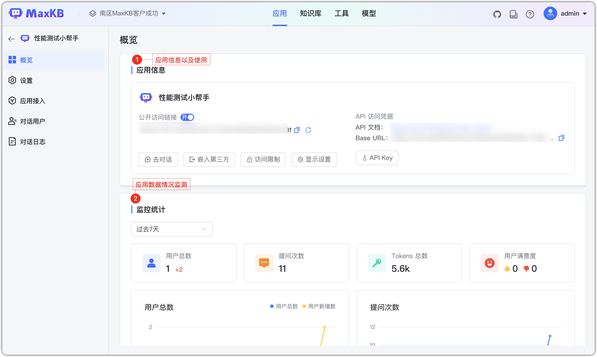
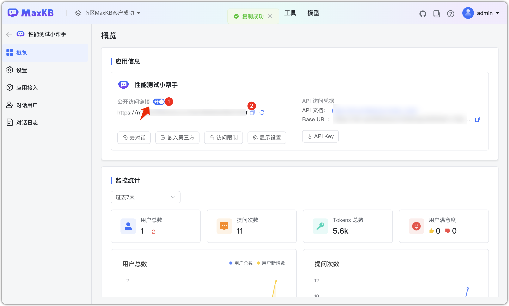
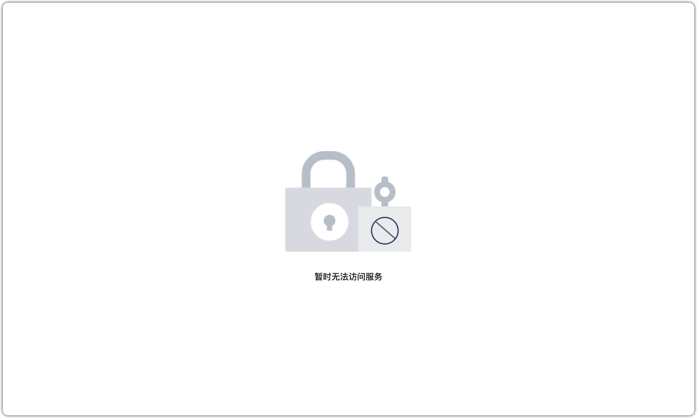
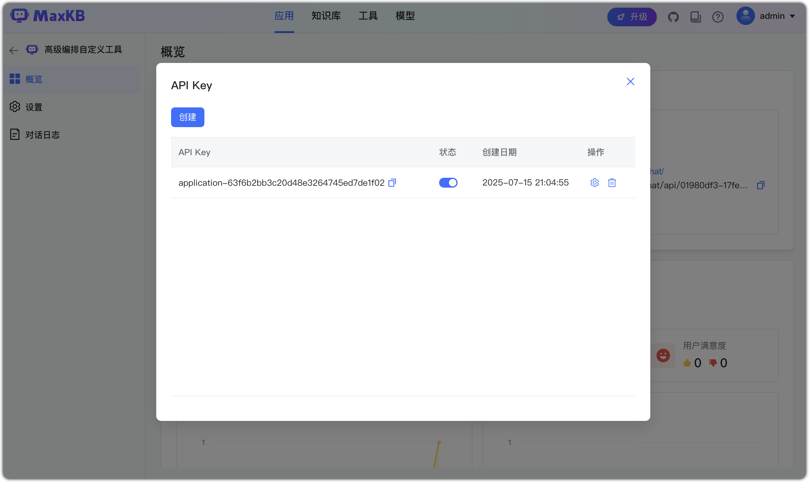

# Обзор приложения

!!! Abstract ""
    После создания приложения на странице обзора доступны включение/выключение, регенерация ссылки публичного доступа, демонстрация, встраивание в сторонние системы, ограничения доступа и управление API Key.

## 1 Публичная ссылка доступа

!!! Abstract ""
    Публичную ссылку можно включать/выключать и регенерировать. Нажмите «Демо» или откройте скопированную ссылку в браузере для Q&A.

!!! Abstract ""
    Если для уже открытой ссылки выключить доступ или сгенерировать новую, при переходе будет сообщение: «Извините, идёт обслуживание. Повторите позже!»

## 2 Встраивание в сторонние системы

!!! Abstract ""
    Приложение MaxKB можно встроить без кода в корпоративные системы.     
    На странице обзора нажмите «Встроить», скопируйте код для полноэкранного, мобильного или виджет‑режима и вставьте в стороннюю систему.

## 3 Ограничения доступа

!!! Abstract ""
    MaxKB поддерживает лимит вопросов на клиента и белый список доменов для встраивания.

    **Важно**: аутентификация — функция X‑Pack.

## 4 Настройки отображения

!!! Abstract ""
    В коммьюнити‑версии доступны язык и показ деталей выполнения. Дополнительные опции X‑Pack: см. [Отображение приложения](../X-Pack/app_logo_settting.md)

## 5 Учетные данные API

!!! Abstract ""
    Для вызовов из внешних систем потребуются документация API и API Key приложения. Нажмите «API Key», чтобы открыть управление ключами: создание, включение/выключение, удаление.

