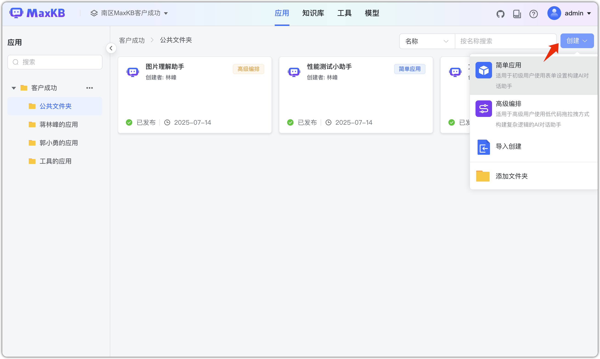
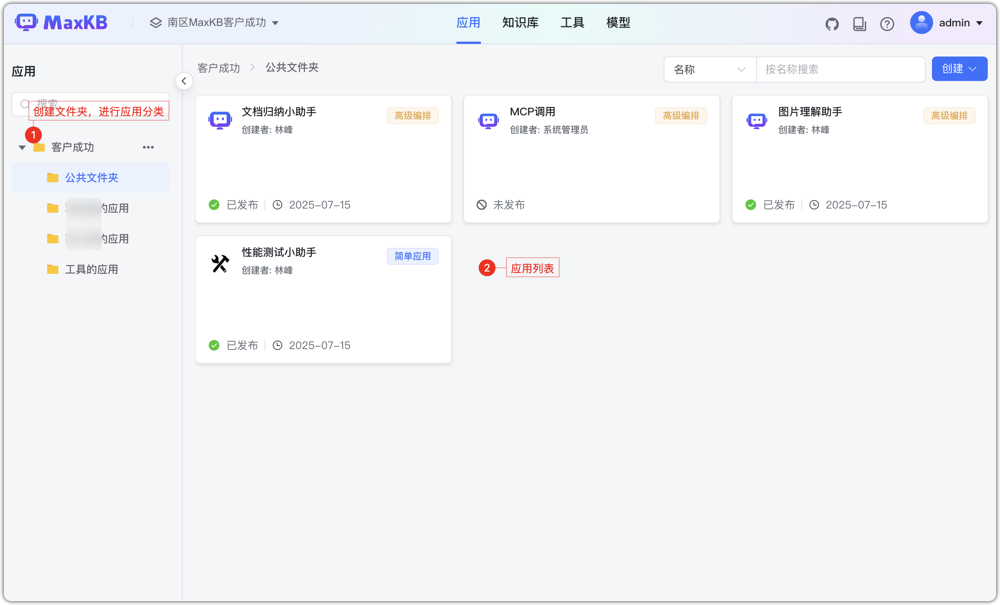
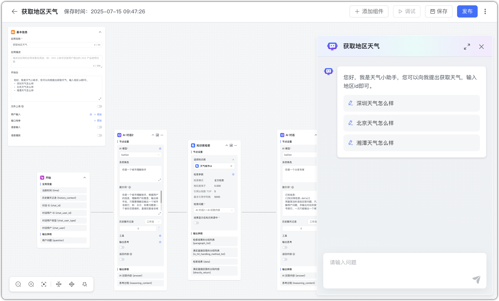
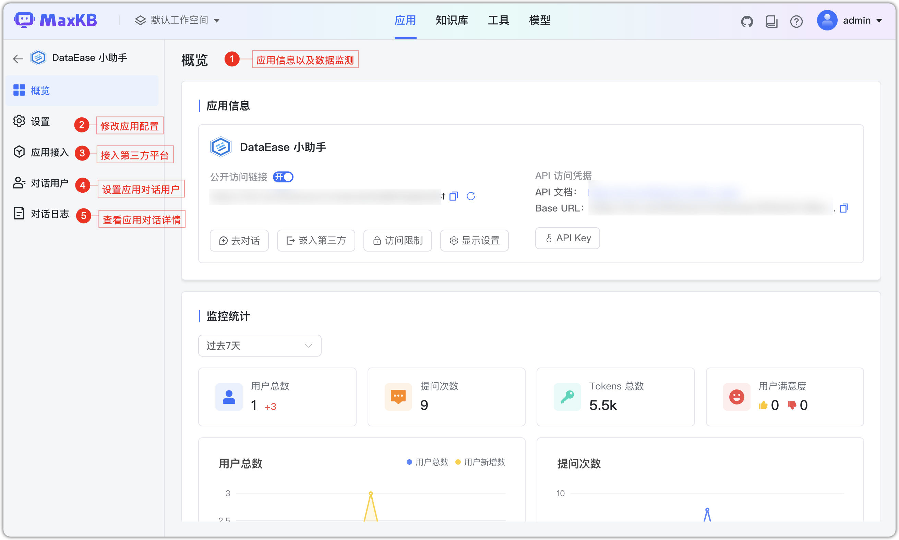

# Обзор приложений

## 1 Обзор возможностей

!!! Abstract ""
    MaxKB предоставляет преднастроенные шаблоны и компоненты для быстрого создания Q&A‑приложений, а также продвинутую оркестрацию для сложных рабочих процессов — создавайте собственного AI‑помощника.

!!! Abstract ""
    
    - Древовидный список папок: переход по клику, поиск по имени в верхней строке.
    - Статусы: «Не опубликовано»/«Опубликовано» (впервые созданное приложение сохраняется как «не опубликовано»), время публикации.

    
    

## 2 Типы приложений

!!! Abstract ""

    Простая конфигурация: базовые функции и настройки для типовых Q&A, быстрый запуск.

    Продвинутая оркестрация: рабочие процессы по бизнес‑логике, включая условия, оптимизацию вопроса, библиотеку функций, встроенные теги и др. Подходит для сложных сценариев и кастомных workflow.

## 3 Настройки приложения

!!! Abstract ""
    После создания перейдите на страницу приложения — обзор, настройки и интеграции.

!!! Abstract ""
    **Важно**: интеграции и пользователи диалога — функции X‑Pack.

!!! Abstract ""
    Доступен экспорт приложения в файл: имя_приложения.mk.
    Для приложений с оркестрацией экспортируются параметры узлов и код функций. Выбранные в узлах базы знаний и модели не экспортируются.

!!! Abstract ""
    На странице приложения нажмите «Импортировать приложение» и выберите файл (.mk).

