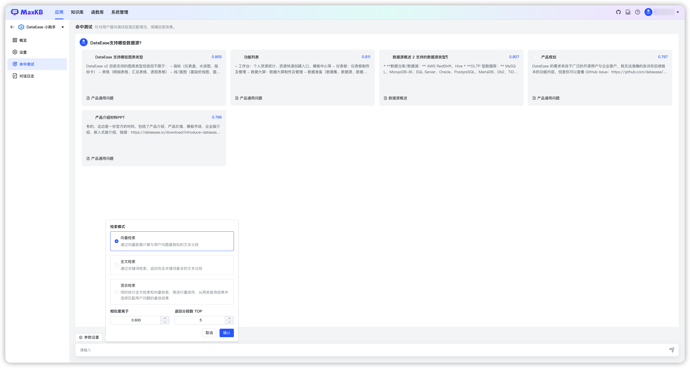

# Тест попаданий

!!! Abstract ""
    «Тест попаданий» в простых приложениях имитирует ответ на вопрос, чтобы отрегулировать сегменты и связанные вопросы, повысив точность сопоставления и качество ответа. Введите тестовый вопрос — система по выбранному режиму ищет в связанной БЗ и возвращает сегменты по схожести и Top‑N. При необходимости отредактируйте выбранные сегменты. 

