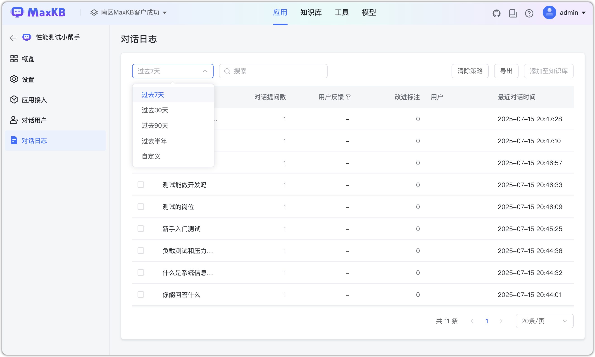
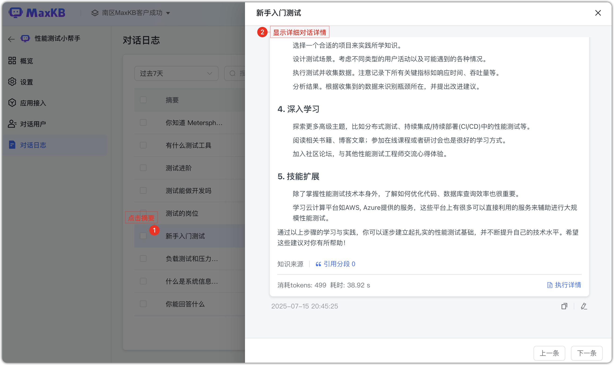
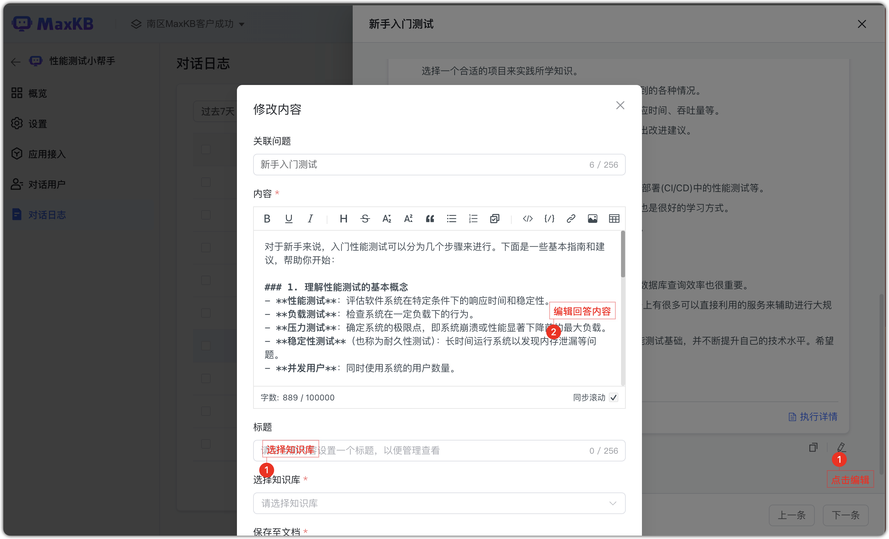
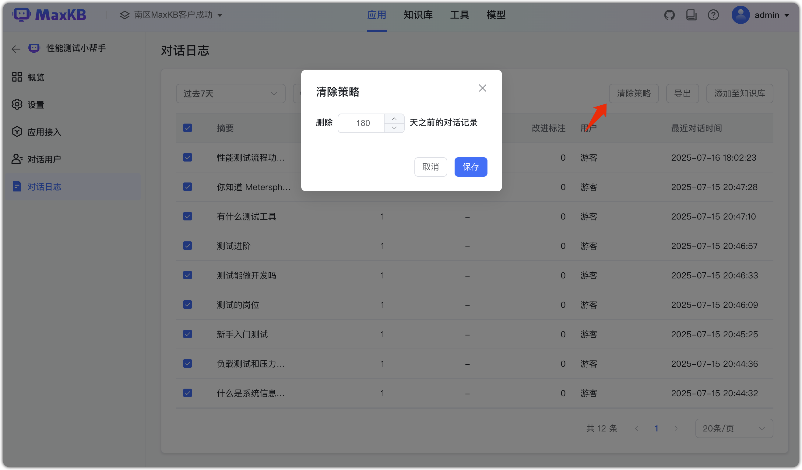

!!! Abstract ""
    Журнал диалогов фиксирует детали Q&A всех сессий, включая обратную связь пользователей по ответам AI. Это позволяет операторам корректировать ответы.       
    Доступен поиск за 7/30/90 дней и за полгода, а также фильтрация по краткому описанию и фидбеку.

## 1 Детали журнала

!!! Abstract ""
    Детали отражают реальные Q&A пользователей. Фидбек пользователя доступен только для просмотра.

!!! Abstract ""
    Нажмите на «краткое описание» в списке, чтобы открыть детали диалога.

!!! Abstract ""
    Операторы могут редактировать и размечать на основе вопросов, ответов AI и фидбека для улучшения качества.

## 2 Политика очистки
!!! Abstract ""
    По умолчанию записи диалогов хранятся 180 дней. Если нужно дольше — измените параметр. После настройки создаётся задача автоочистки, выполняется на следующий день в 00:00.

## 3 Экспорт журнала
!!! Abstract ""
    Доступен экспорт журнала для детального анализа диалогов.
