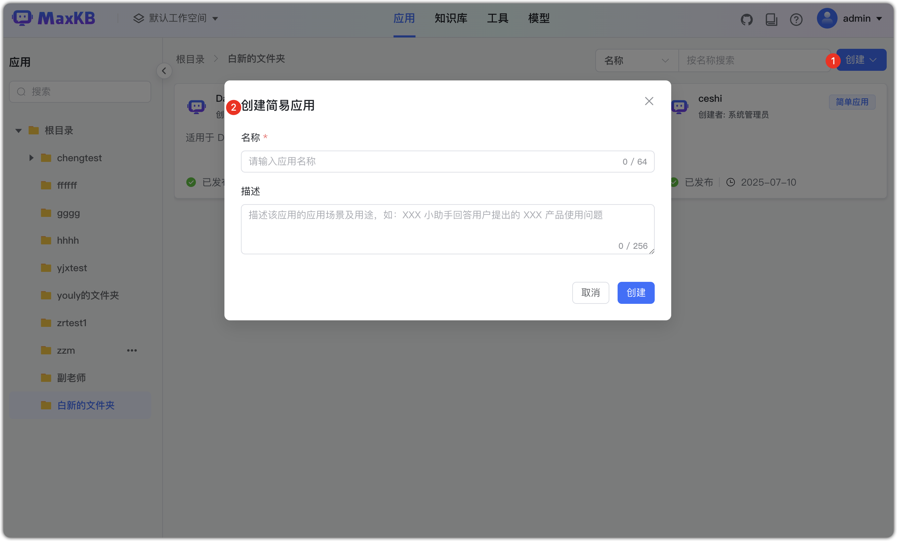
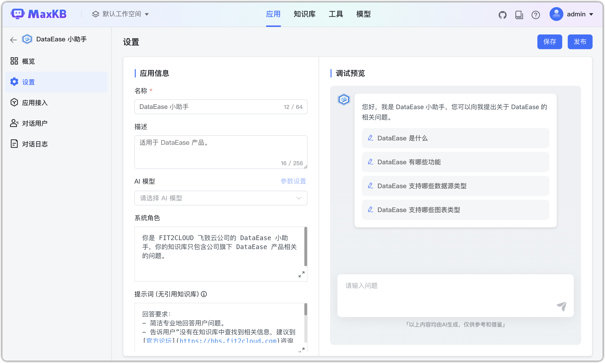
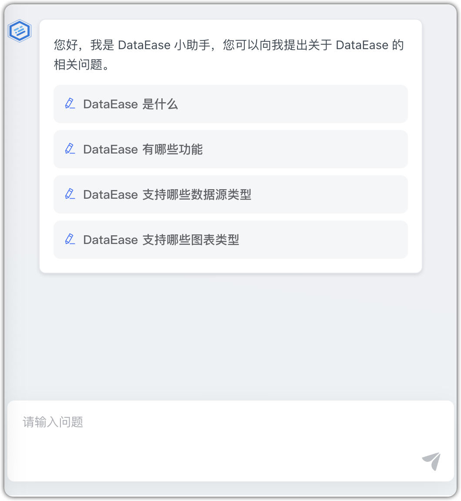
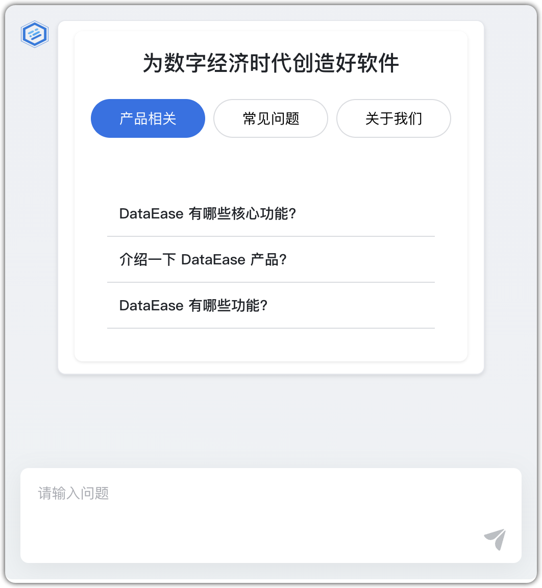
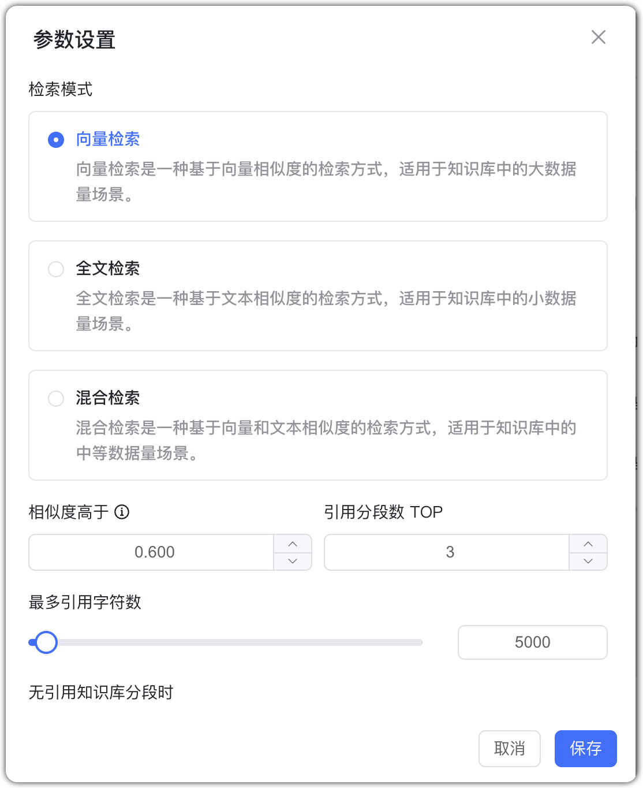
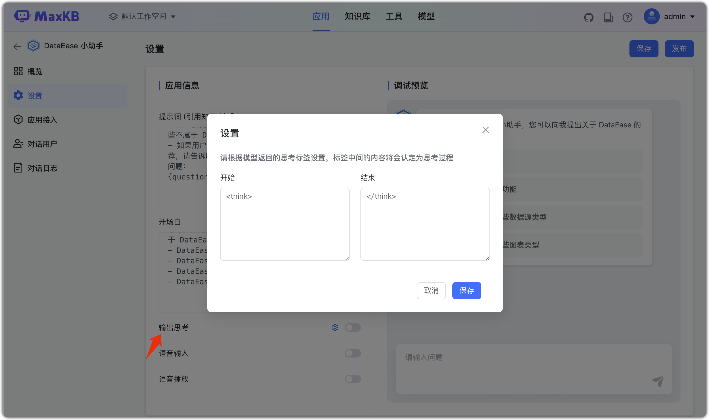

# Простое приложение

!!! Abstract ""
    Нажмите «Создать приложение», введите имя и описание, выберите «Простая конфигурация» и перейдите к настройкам.

!!! Abstract ""
    Слева — информация о приложении, справа — предпросмотр и отладка.   

    * Имя приложения: заголовок окна диалога.
    * Описание: краткое назначение и сценарии.
    * AI‑модель: можно выбрать из «Модели» или добавить новую.
    * Роль: задаёт identity/роль модели для лучшего соответствия сценарию.
    * Подсказка: предустановленная подсказка для интеллектуальной БЗ; можно настраивать, фиксируется в начале контекста.
    * История диалога: сколько последних сообщений включать; 0 — только текущий вопрос.
    * Связанная БЗ: режим поиска, порог схожести, Top‑N, лимит символов цитирования, стратегия ответа при отсутствии попаданий, оптимизация вопроса.
    * Приветствие: дефолтный гид при открытии диалога.
    * Голосовой ввод: преобразует речь в текст (требует ASR‑модель).
    * Голосовой вывод: озвучивает ответ модели (требует TTS‑модель).

    **После настройки нажмите «Сохранить и опубликовать», чтобы применить.**

!!! Abstract ""   
    Подсказка — это контекстная инструкция, внедряемая в начало каждой сессии, чтобы зафиксировать роль, тон, границы знаний и формат вывода, обеспечивая точность и единый стиль.

    - Поддержка переменных: {data} — вставка фрагментов из БЗ; {question} — вопрос пользователя. Это повышает точность и снижает «галлюцинации».
    
    - Пример настроек
        - Роль: эксперт по анализу данных, SQL (MySQL), использует mcp‑mysql для проверки/запросов, quickchart‑server для графиков, даёт интерпретацию.
        - Формат: ответ в виде таблицы Markdown + итог до 20 символов.
        - Навыки: генерация/проверка SQL, построение графиков, анализ и объяснение данных.
        - Тон: дружелюбный, лаконичный, без жаргона.
        - Ограничения: отвечать только в рамках SQL/проверки/графиков/анализа; отклонять посторонние темы.

    Грамотно настроенная подсказка позволяет быстро переключать сцены и роли без смены модели, снижая риск «галлюцинаций» и повышая UX.

!!! Abstract ""   
    Приветствие совмещает самопрезентацию и подсказки по использованию: кто я, что умею, как спрашивать. Хорошее приветствие снижает порог входа и ускоряет Q&A.
    
    - Поддерживает Markdown (жирный, ссылки, переносы).
    - Поддерживает HTML через тег <html_rander>.

    См. [Шаблон приветствия MaxKB (HTML)](https://kb.fit2cloud.com/?p=14db4420-5ed4-4e49-b500-c36c36883c2d).

{ width="500px" }{ width="500px" }

!!! Abstract ""   
    После вопроса пользователя система сперва ищет сегменты в связанной БЗ, затем вставляет найденное в подсказку и передаёт модели. Настройки позволяют контролировать поведение поиска:

    - 检索模式

        - Векторный: по векторной схожести, для больших данных и семантики.
        - Полнотекстовый: по текстовой схожести, для меньших данных и по ключевым словам.
        - Гибридный: векторный + полнотекстовый, баланс точности и полноты, для средних объёмов.
    - Порог схожести: возвращать сегменты выше порога (по умолчанию 0.60).
    - Top‑N: сколько сегментов передавать модели, чтобы не раздувать контекст.
    - Лимит символов: дополнительно обрезать суммарный текст (по умолчанию 5000 символов).
    - Стратегия при отсутствии попаданий: разрешить ответ по общим знаниям или задать фиксированный ответ (избегая выдумок).
    - Оптимизация вопросов: сначала переформулировать для улучшения поиска, затем искать.

{ width="500px" }
!!! Abstract ""
    Вывод мыслей: при включении модель перед финальным ответом выдаёт размышления в специальных тегах, затем — ответ.
    
    **Важно**: некоторые модели выдают единый тег, его нельзя отключить — требуется настройка модели (например, DeepSeek‑R1‑Distill‑Qwen‑32B).

