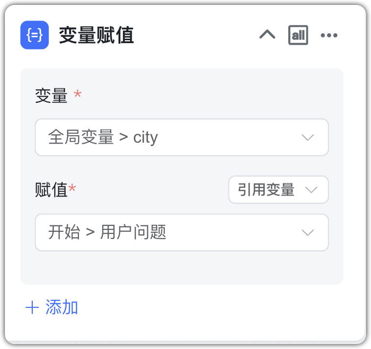

# Продвинутая оркестрация приложения

Нажмите «Создать», выберите «Продвинутая оркестрация», введите имя приложения и при необходимости выберите шаблон. Затем перейдите на страницу визуального редактора рабочего процесса.

Продвинутая оркестрация — это визуальный workflow, где узлы ИИ‑моделей, базы знаний, бизнес‑логики и внешние инструменты свободно комбинируются, отлаживаются и публикуются。

**Важно：**

- На холсте не должно быть изолированных узлов вне потока — иначе публикация не пройдёт проверку。  
- Узлы можно переименовывать двойным кликом, но имена в рамках одного workflow не должны повторяться。  
- Узлы‑потомки могут ссылаться на выходные параметры предшественников。При переименовании узла обновите ссылки вида `{{NodeName.VariableName}}`。

После проектирования используйте панель управления холстом (слева снизу) для масштабирования, сворачивания узлов и быстрой оптимизации。

## 1 Обзор компонентов

Каждый workflow содержит два базовых узла — «Основная информация» и «Старт»; их нельзя удалить или копировать。

- Основная информация: метаданные приложения (имя, описание, приветствие, голос и т.д.)。Узел один на приложение。
- Старт: точка входа выполнения。Узел один на приложение。

Нажмите «Добавить компонент» (справа сверху) и кликните/перетащите нужные узлы. Компоненты делятся на категории:

| **Категория**   | **Компоненты**                      |**Назначение**                                     |
| ---- | ----------------------- |----------------------------------------|
| **Базовые** |                         |                                        |
|  **ИИ‑возможности** | Диалог с ИИ, Оптимизация вопроса, Генерация изображений, Понимание изображений, ASR, TTS | Вызов LLM и мультимодальные функции |
|  **База знаний** | Поиск по БЗ, Многоканальный отзыв | Семантический/ключевой поиск по содержимому БЗ |
|  **Бизнес‑логика** | Условие, Сбор формы, Присвоение переменной, Заданный ответ | Ветвление, сбор данных, изменение переменных, фиксированный ответ |
|  **Прочее**  | Ввод пользователя, Параметры из URL, Вызов MCP, Извлечение из документа | Внешний ввод, вызов MCP‑инструментов, разбор файлов |
| **Инструменты** | Пользовательский инструмент | Узел‑инструмент на основе функции/скрипта/API |
| **Приложения** | Вызов дочернего приложения | Подключение опубликованных приложений как подпроцессов |

* AI 对话：与AI大模型进行对话节点。  
* 图片理解：识别并理解图片所包含的信息。
* 图片生成：根据提供的文本内容生成图片。
* 知识库检索：关联知识库，检索与问题相关分段的节点。
* 多路召回：使用重排模型对多个知识库的检索结果进行二次召回。
* 判断器：根据不同条件执行不同的节点。
* 指定回复：直接指定回复内容。
* 表单收集：通过表单的方式收集问答所需要的必要信息。
* 问题优化：AI对话的一种，设定了默认的角色和提示词，根据上下文优化问题。   
* 文档内容提取：提取文档中的内容。
* 语音转文本：将音频转换为文本。
* 文本转语音：将文本转换为语音。
* 变量赋值：更新全局变量的值。
* MCP 调用：通过 SSE 协议调用 MCP 服务中的工具。

## 2 组件使用

### 2.1 基本组件

#### 2.1.1 基本信息

节点说明：工作流的开始节点，有且唯一，不能删除和复制，问答页面输入的问题会作为该节点的输出参数 {question}， 后续节点如需引用可以复制输出参数或选择变量：`开始节点->用户问题`。

{width="500px"}

 文件上传：开启后应用将支持在对话时上传文档。

- 文档：TXT、MD、DOCX、HTML、CSV、XLSX、XLS、PDF；
- 图片：JPG、JPEG、PNG、GIF；
- 音频文件：MP3、WAV、OGG、ACC、M4A；  

每次最多上传 10 个文件，单个文件不超过 100 MB，在后续节点中可以对上传后的文件进行处理。默认 3 个文件，单个文件不超过 50 MB。

{width="500px"}

- 用户输入：在会话开始时，需要在用户端提供的必要信息，例如，岗位角色等，以便后续流程可以根据不同输入进行不同的流程设计。

{width="500px"}

- 接口传参：在通过应用公开访问链接时可配置的参数。添加接口参数后将会在公开访 URL 自动增加接口参数，在与第三方系统集成。
- 会话变量：变量在当前对话流程中全程有效，用于实现节点间数据传递与逻辑判断。
- 语音输入：开启后将支持以语音的方式进行问题的输入，需要使用语音识别模型。   
- 语音播放：开启后回答内容将以语音的方式进行播放，可以使用浏览器内置的播放，也可以使用语音合成模型进行播放。

#### 2.1.2 开始

作为流执行的起点，所有后续节点均从此节点开始流转。
全局变量：

- 当前时间 {time}：当前对话的时间。
- 历史聊天记录 {history_context}：对话的历史记录。
- 对话id {chat_id}：对话标识。

参数输出：

- 用户问题 {question}：客户端输入的提问信息。
- 文档 {document}：客户端上传的文档。

{width="500px"}

### 2.2 Компоненты ИИ

#### 2.2.1 Диалог с ИИ
  
Описание: узел для взаимодействия с LLM。

节点设置：

- Модель: имя LLM и параметры。
- Роль: задание роли/персоны。
- Подсказка: описание желаемого вывода; можно ссылаться на параметры предшествующих узлов (поиск в БЗ, вопрос из «Старт»)。
- История: число сообщений истории, включаемых в контекст。
    
    - Узел: использовать контекст текущего узла。
    - Workflow: использовать вопрос пользователя и финальный ответ。

- Инструменты: при включённой MCP‑конфигурации LLM вызывает нужные инструменты。
- Вывод мыслей: включение/теги вывода размышлений (по умолчанию `<think>`/`</think>`)。
- Возврат: выводить ли ответ узла в диалоге。

参数输出：

- Ответ {answer}。
- Размышления {reasoning_content}。

**Важно:** для MCP нужен LLM с поддержкой function‑calling。

{width="500px"}

#### 2.2.2 Понимание изображений

Описание: анализ загруженного изображения。

节点设置：

- Модель: название модели。
- Роль, Подсказка, История: аналогично диалогу с ИИ。
    
    - 选择节点：会使用当前图片理解节点的提示词信息和节点返回的内容作为上下文；
    - 选择工作流：会使用对话框中用户输入的问题和最终回复的内容做为上下文。

- Изображение: по умолчанию — загруженное пользователем。
- Возврат: вывод ответа узла。

参数输出：

- Ответ {answer}。

{width="500px"}

#### 2.2.3 Генерация изображений

Описание: генерация картинки по тексту。

节点设置：

- Модель генерации, положительная/отрицательная подсказки, вывод результата。

参数输出：

- Ответ {answer}: сгенерированная картинка。
- Изображение {image}: детали результата。

{width="500px"}

#### 2.2.4 Оптимизация вопроса

Описание: улучшение формулировки вопроса на основе истории и подсказки。

节点设置：

- AI 模型：大语言模型的名称以及参数控制。
- 角色设定：大语言模型回答的角色或身份设定。
- 提示词：引导模型生成特定输出的详细描述。
- 历史聊天记录：在当前对话中有关联的历史会话内容。例如，历史聊天记录为 1，表示当前问题以及上一次的对话内容一起输送给大模型。
- 返回内容：是否在对话中显示该节点返回的内容。

参数输出：

- Результат {answer}: улучшенная формулировка。

{width="500px"}

#### 2.2.5 Речь в текст (ASR)

Описание: конвертация аудио в текст。

节点设置：

- Модель ASR, входной файл (mp3/wav/ogg/acc), вывод результата。

参数输出：

- Результат {result}: распознанный текст。

{width="500px"}

#### 2.2.6 Текст в речь (TTS)

Описание: генерация аудио из текста。

节点设置：

- Модель TTS, текст для синтеза, вывод результата。

参数输出：

- Результат {result}: аудио‑контент。

{width="500px"}

### 2.3 База знаний

#### 2.3.1 Поиск по БЗ
  
Описание: добавьте узел поиска по БЗ, выберите БЗ, параметры поиска и вопрос。

节点设置：

- БЗ, параметры поиска (режим, порог, Top‑N, лимит символов), вопрос (обычно из «Старт»)。

参数输出：

- {paragraph_list}: список сегментов。
- {is_hit_handling_method_list}: сегменты, подходящие для прямого ответа。
- {data}: содержимое найденных сегментов。
- {directly_return}: содержимое сегментов для прямого ответа。

{width="500px"}

#### 2.3.2 Многоканальный отзыв

Описание: повторный отбор результатов из нескольких источников。

节点设置：

- Контент для rerank (обычно результаты из нескольких БЗ)。
- Параметры: порог score, Top‑N, лимит символов。
- Вопрос: исходный или оптимизированный。
- Модель rerank。

参数输出：

- 重排结果列表 {result_list}：数组类型，指根据重排后的结果列表。
- 重排结果 {result}：字符串类型，指根据检索参数后的重排结果。

{width="500px"}

### 2.4 Бизнес‑логика

#### 2.4.1 Условие

  
Описание: ветвление по условиям; за каждой веткой должен следовать узел‑исполнитель。  

判断器节点输出参数说明：

- {branch_name}: имя ветки。

{width="500px"}

#### 2.4.2 Заданный ответ
  
Описание: возвращает заданный текст; может выводить найденный фрагмент БЗ (при прямом ответе) или заранее заданный ответ при отсутствии совпадений。

指定回复节点输出参数说明：   

* {answer}: возвращаемый текст。

{width="500px"}

#### 2.4.3 Сбор формы

Описание: пошаговый сбор необходимых данных через форму — удобно для мультишаговых сценариев。

节点设置：

- Вывод формы: подсказки и поля (одно/несколько)。
- Настройка: конструирование формы из компонентов。

参数输出：

- {form_data}: агрегированный результат。

表单全部内容将作为固定的输出，对于各个表单项也都进行参数化输出。

{width="500px"}

#### 2.4.4 Присвоение переменной

Описание: обновление значения глобальной переменной。

{width="500px"}

### 2.5 Прочее

#### 2.5.1 Извлечение из документа

Описание: суммаризация загруженного документа。

节点设置：

- Документ: загруженный пользователем; включите загрузку файлов в «Основной информации»。

参数输出：

- {content}: итоговая выжимка。

{width="500px"}

#### 2.5.2 Вызов MCP

Описание: вызов инструментов MCP через SSE/streamable_http。

节点设置：

- MCP Server Config: JSON‑конфигурация。
- Инструменты: список инструментов MCP。

Параметры: аргументы запроса инструмента; поддерживаются переменные。

参数输出：

- {result}: возвращаемое значение。

{width="500px"}

#### 2.5.3 Пользовательский инструмент
В оркестрации можно создавать узлы‑инструменты на Python с параметрами для гибкой обработки сложных задач. См. подробнее: [Инструменты](../tool/tool)。

### 2.6 Добавление инструмента
Добавьте узел «Инструмент» для сложных задач. Подробнее: [Инструменты](../tool/tool)。

Настройки: входные параметры инструмента。

Выход: результат выполнения инструмента。

### 2.7 Добавление приложения

Можно подключить другое приложение (простое или оркестрацию) как узел, чтобы переиспользовать его результаты Q&A。

节点设置：

- Вопрос: передаваемый в дочернее приложение。
- Возврат: показывать ли ответ узла‑приложения。

参数输出：

- Результат: ответ дочернего приложения。

## 4 Условия выполнения

При схеме «много входов/выходов» узел‑агрегатор задаёт условие выполнения в зависимости от связей с предшественниками。

- Все: дождаться выполнения всех предшествующих узлов。
- Любой: выполнение при завершении любого из предшествующих узлов。

## 5 Отладка

Нажмите «Отладка»: сначала пройдёт проверка валидности, затем можно тестировать диалог на этой странице。

После ответа AI станет доступно «Детали выполнения»: статус узлов, время и другая информация。

## 6 Сохранение

По умолчанию сохранение вручную; можно включить автосохранение (раз в минуту локально) и синхронизацию в БД после публикации。

## 7 Публикация

При публикации выполняется проверка правил. При успехе изменения узлов начинают действовать на странице Q&A。

Можно перейти к диалогу («Перейти к диалогу») или открыть историю публикаций и восстановить версию。
