# База знаний

Частная корпоративная база знаний с разными типами данных. Поддерживает создание и управление БЗ, служит источником знаний для Q&A и улучшает ответы.

- Общая БЗ: администратор создаёт общий ресурс в «Общих ресурсах» и назначает доступ рабочим пространствам.
- Все БЗ: пользователь может создать БЗ; другие пользователи смогут просматривать/использовать/поддерживать после [**назначения прав**](../../user_manual/X-Pack/authorization_resources.md).

**Важно**: общие ресурсы — функция X‑Pack (enterprise).

## 1 Создание базы знаний

Откройте «База знаний» и нажмите «Создать базу».   
Типы БЗ:

* Универсальная: управление офлайн‑документами. Поддерживаемые форматы: Markdown, TXT, PDF, DOCX, HTML, а также QA‑пары в Excel/CSV.  
* Web‑сайт: для статического онлайн‑контента. После ввода корня сайта система синхронизирует данные с корня и потомков.
* Feishu: интеграция с облачными документами и таблицами Feishu с импортом в MaxKB.

**Важно**: Feishu — функция X‑Pack. См. [**Документация Feishu**](../../user_manual/X-Pack/feishu_doc/).
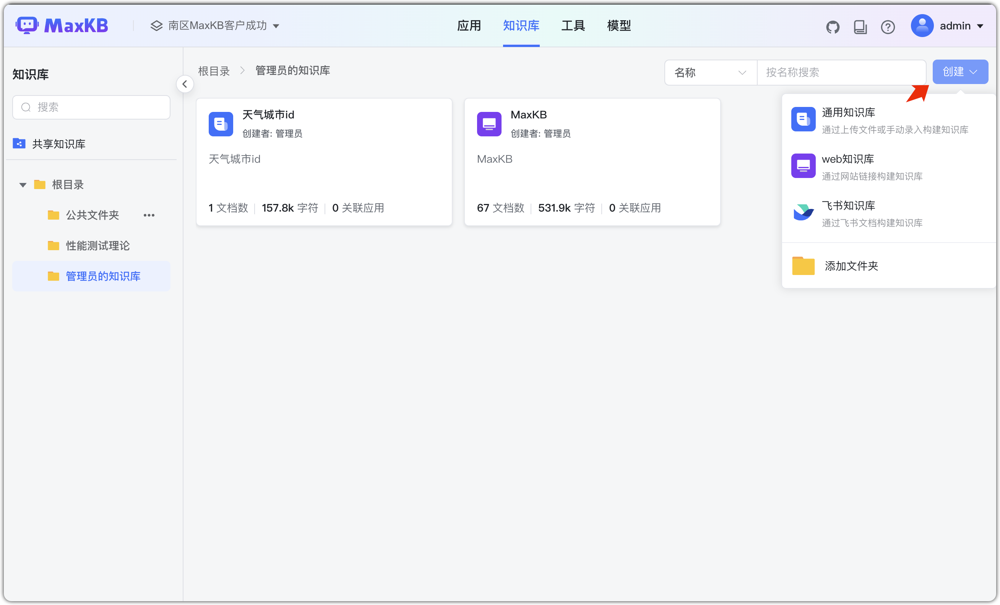

###  1.1 Универсальная БЗ

Выберите тип «Универсальная», введите имя и описание, выберите векторную модель.

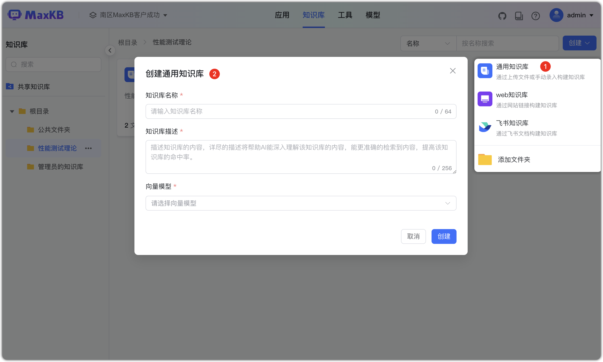

После создания можно добавлять и загружать офлайн‑документы.

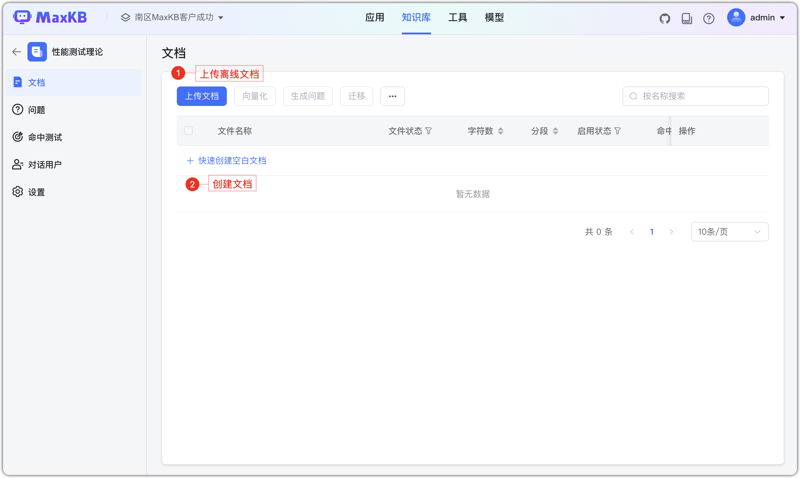

Загрузка офлайн‑документов перетаскиванием или выбором файлов. Требования:

* Текст: Markdown, TXT, PDF, DOCX, HTML, XLS, XLSX, CSV, ZIP;
* Таблицы: XLS, XLSX, CSV, ZIP;
* QA‑пары: XLS, XLSX, CSV, ZIP;  
* По умолчанию: до 50 файлов за раз, ≤ 100 MB на файл; всего до 1000 файлов; один документ ≤ 1000 MB;
* Поддерживается загрузка папок (файлы фильтруются по суффиксу).
* ZIP варианты:

    *  Markdown + изображения (ссылки на изображения внутри MD), упакованы вместе.
    *  XLS/XLSX + изображения (ссылки внутри таблиц), упакованы вместе.

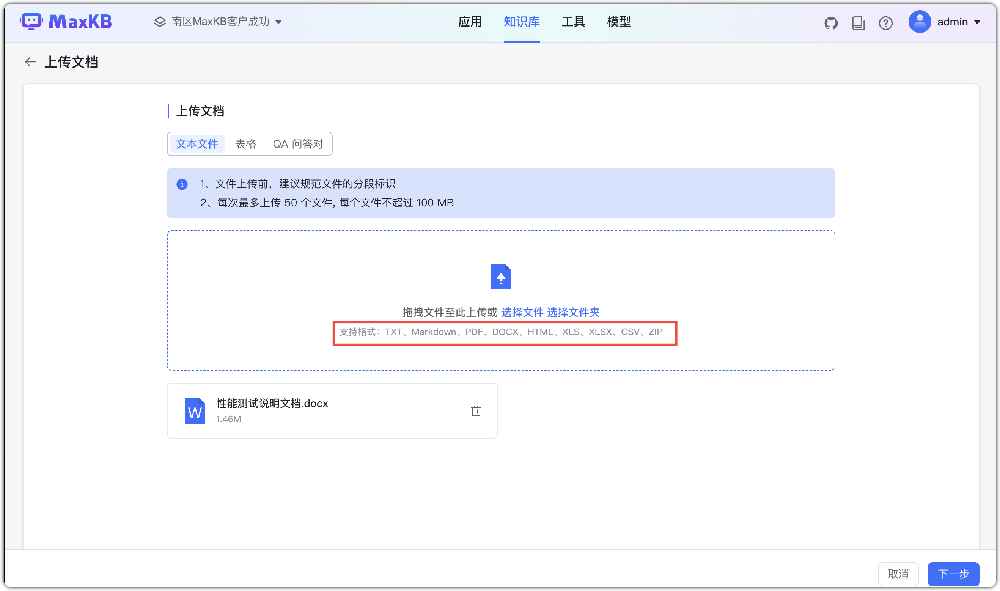

    
Сегментация документа:

- **Выбор правила сегментации**: «умная» и «расширенная»:
    - Умная: по структуре Markdown (до 6 уровней), максимум 4096 символов на сегмент;
    - Расширенная: пользовательские маркеры, длина и автоочистка; поддержка регулярных выражений для сложных документов.

- **Добавить заголовок сегмента как связанный вопрос**: заголовки станут связанными вопросами.

- **Предпросмотр**: проверьте результат по правилам.
- **Операции**: редактируйте и удаляйте нерелевантные сегменты в предпросмотре.
- **Шаги**: вернуться к загрузке или подтвердить и запустить векторизацию.

**Умная и расширенная сегментация**:

**Умная сегментация**:

- Для Markdown 

    * По заголовкам (до 6 уровней), до 4096 символов на сегмент;   
    * Если последний уровень превышает длину сегмента, обрезка по переводу строки в пределах лимита.

- Для HTML, DOCX

    * Распознавание заголовков и преобразование в формат markdown;
    * По уровням заголовков (до 6), до 4096 символов на сегмент.

- Для TXT и PDF

    * По заголовкам с #, при отсутствии — по длине 4096 символов;
    * Обрезка по переводу строки в пределах лимита.  
**Расширенная сегментация**:

 * Маркеры: #, ##, ###, ####, #####, ######, -, пустая строка, перевод строки, пробел, ; , , . Также поддерживаются свои маркеры и [**регулярные выражения**](https://kb.fit2cloud.com/?p=bfe242a4-9a77-459c-ac75-4ef078e170c9).   
 * Длина сегмента: 50–4096 символов.   
 * Автоочистка: удаление лишних пробелов, пустых строк, табов и т.п.
 * **Рекомендации по документам**:
     * Единообразные маркеры: иначе сегменты будут неровными.   
     * Цельные абзацы: один сегмент — одна завершённая мысль.

**Добавить заголовок сегмента как связанный вопрос:** заголовки станут связанными вопросами.
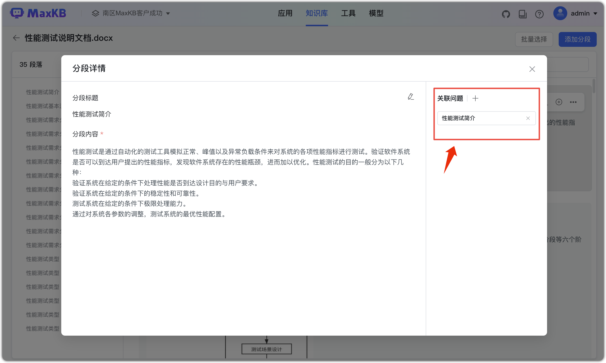
   
После «Начать импорт» система выполняет: автоматическую сегментацию → сохранение → векторизацию. По завершении статус станет «готово».
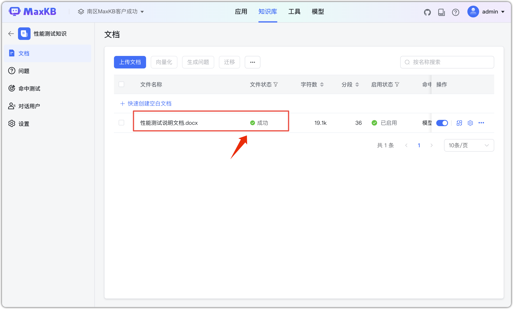

### 1.2 БЗ по Web‑сайту

Введите имя/описание, выберите векторную модель и тип «Web‑сайт».

* Корневой адрес: корень статичного сайта. Данные берутся с корня и потомков. Пример: https://dataease.io/docs/v2/ .  
* Селектор: можно ограничить область (по умолчанию body). Например, для контента внутри div с классом md-content — селектор: .md-content.

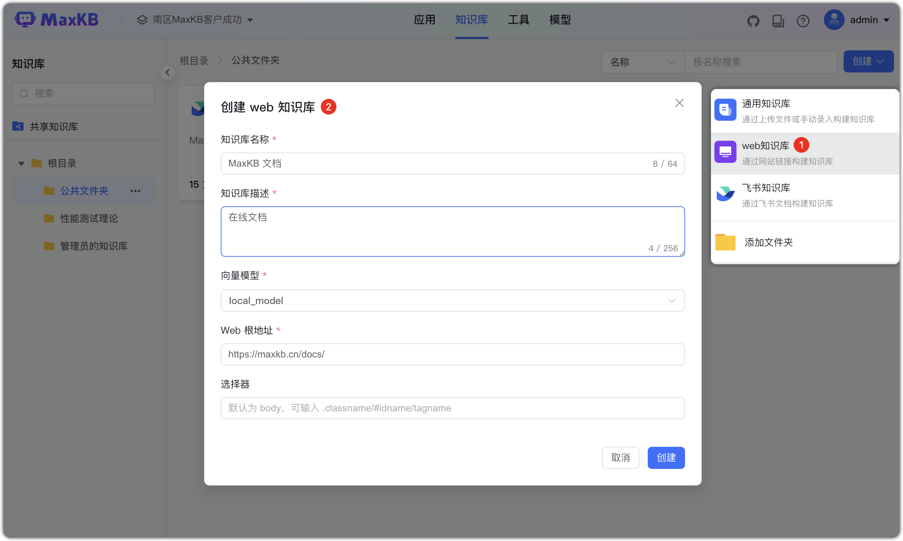

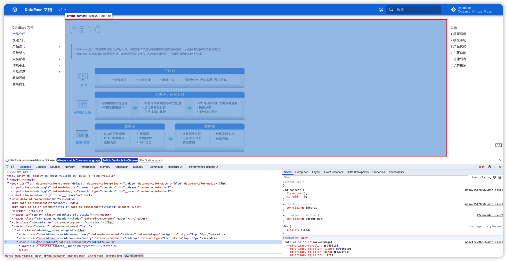
После «Создать» вы перейдёте к списку документов текущего сайта. По завершении статус файлов станет «готово».

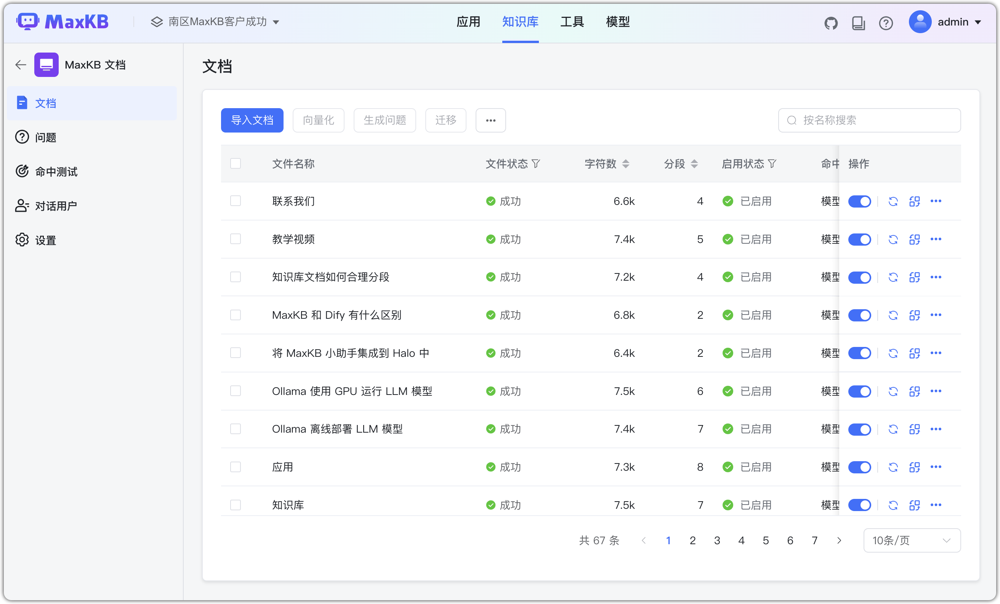

## 2 Операции с БЗ

Поддерживаются: синхронизация, повторная векторизация, генерация вопросов, перенос, настройки, экспорт и удаление.

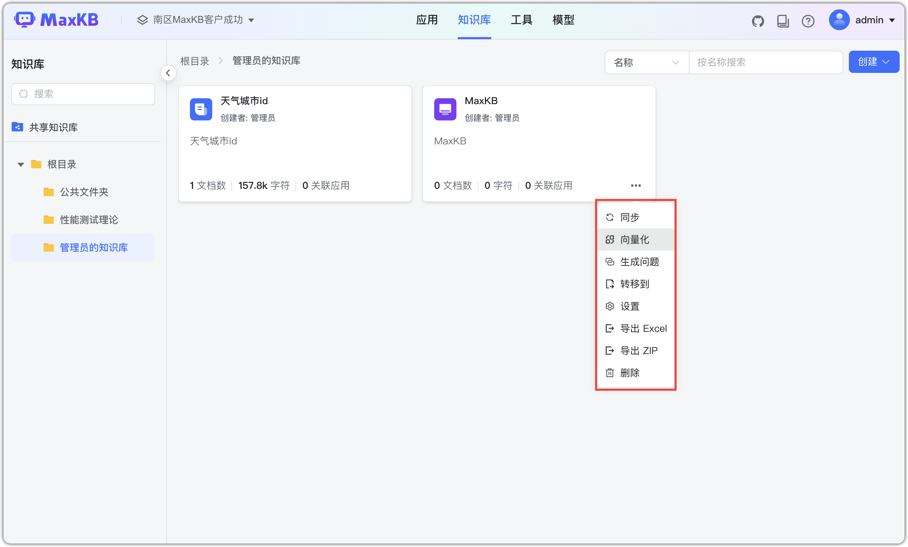

### 2.1 Синхронизация Web‑БЗ

Для БЗ типа «Web‑сайт» нажмите «Синхронизировать» на карточке БЗ для обновления контента.

* Замена: перезагрузка документов сайта с заменой локальных.  
* Полная синхронизация: удалить локальные документы и загрузить заново с сайта. 

### 2.2 Повторная векторизация

Если в настройках БЗ выбран новый векторный движок, новые документы будут векторизованы с ним. Для пере‑векторизации существующих сегментов нажмите «Пере‑векторизовать» на карточке БЗ.

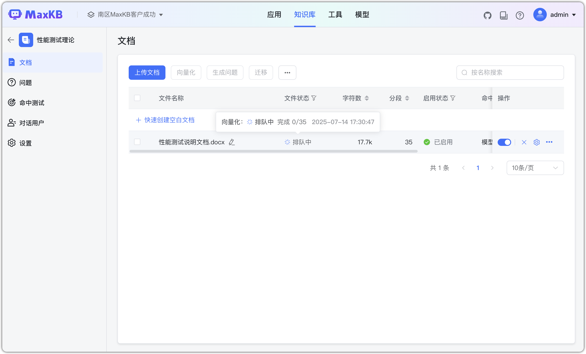

### 2.3 Настройки БЗ

В списке БЗ нажмите «Настройки» на карточке БЗ: имя, описание, векторная модель и др. Параметры вступают в силу после сохранения.
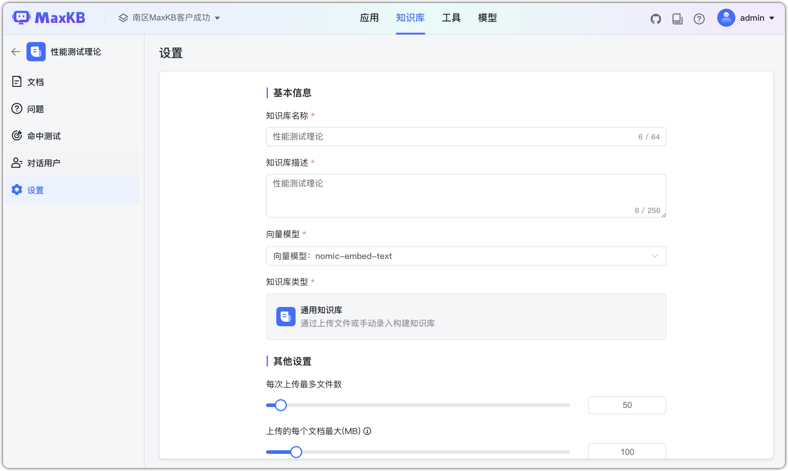

### 2.4 Экспорт БЗ

В списке БЗ нажмите «Экспорт Excel/ZIP». Сегменты будут выгружены в Excel или ZIP.  
Каждый документ — отдельный лист Excel; одна строка = один сегмент. В ZIP изображения выгружаются с именами‑GUID без расширения.

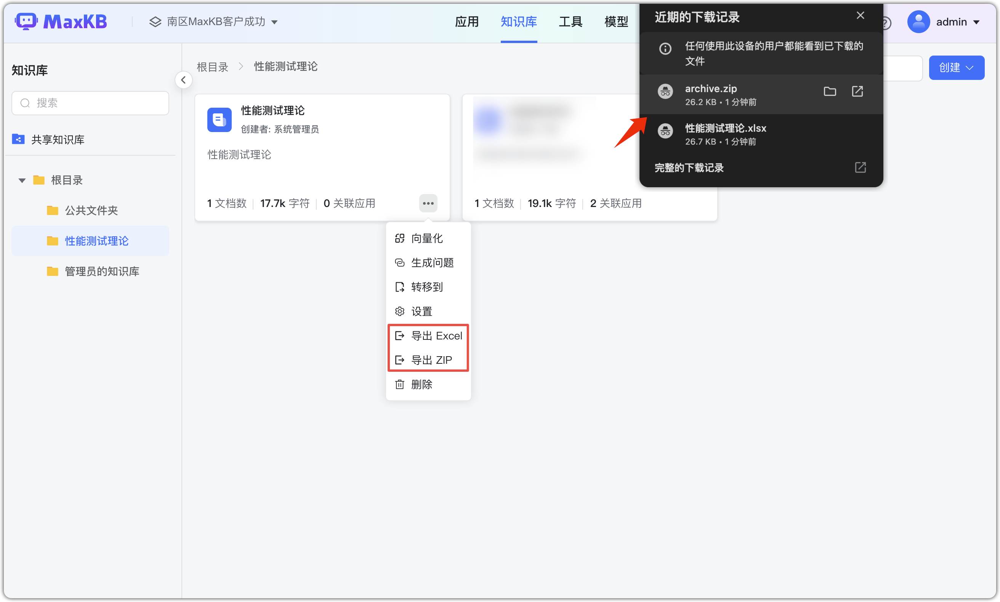
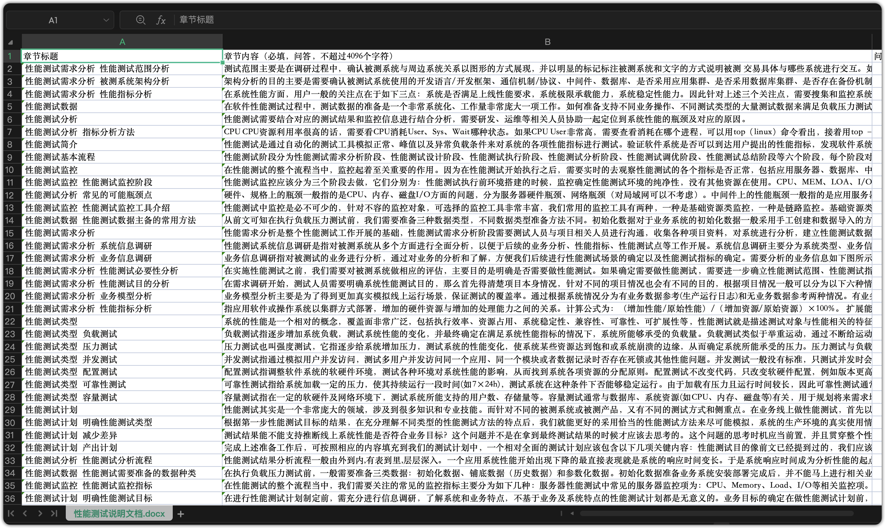

### 2.5 Удаление БЗ

В списке БЗ нажмите «Удалить» на карточке БЗ.

**Важно**: удаление необратимо — действуйте осторожно.
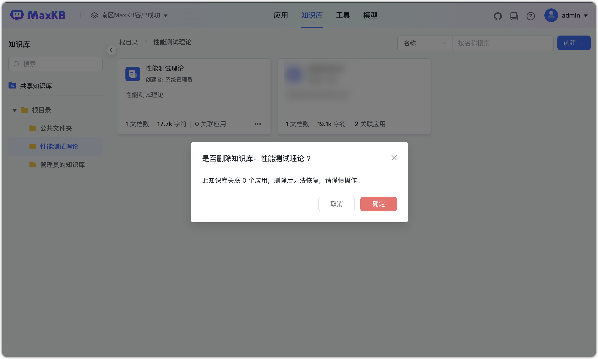

