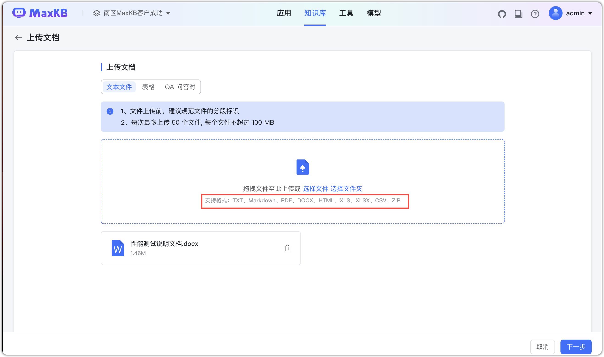
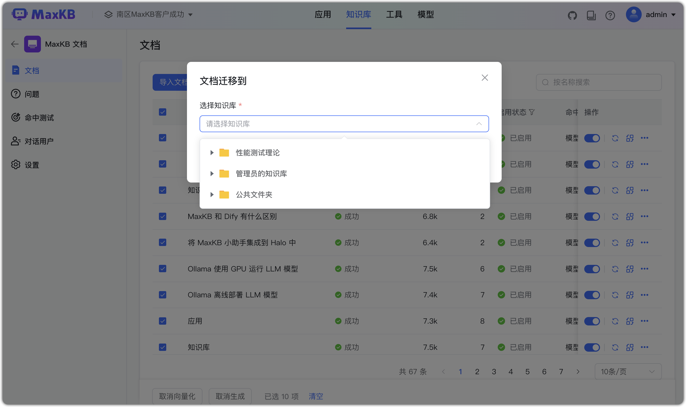

# Документы

Для документов базы знаний MaxKB доступны: синхронизация, повторная векторизация, генерация вопросов, перенос, настройки, экспорт и удаление.

## 1 Загрузка документов

Для универсальной БЗ нажмите «Загрузить документ». Перетащите файлы или выберите файл/папку.
Поддерживаемые форматы: TXT, Markdown, PDF, DOCX, HTML, XLS, XLSX, CSV, ZIP. При выборе папки файлы фильтруются по суффиксу. До 50 файлов за раз, ≤ 100 MB на файл.

Для БЗ типа «Web‑сайт» нажмите «Импортировать документ», введите URL и селектор — контент будет синхронизирован.

## 2 Синхронизация документов 

В БЗ «Web‑сайт» можно синхронизировать выбранные документы: все сегменты удаляются, затем текст загружается по адресу и сегментируется заново.   

    

## 3 Настройка обработки попаданий

Настройка обработки попаданий:

* Оптимизация моделью: при попадании сегмента формируется prompt по подсказке приложения, ответ оптимизируется моделью.
* Прямой ответ: при попадании и достаточной схожести возвращается сам сегмент. Рекомендуется, если нужно вернуть изображения, ссылки и т.п.     
   

## 4 Генерация вопросов

Выберите документ и нажмите «Сгенерировать вопросы». Модель сформирует вопросы по содержанию и свяжет их автоматически.

## 5 Перенос документа

Выберите документ, нажмите «Перенести» и укажите целевую БЗ.

## 6 Экспорт Excel/ZIP

Выполните экспорт Excel/ZIP для выгрузки документа локально.

## 7 Удаление документа

Выберите документ и удалите его.

## 8 Включение/выключение документа

В столбце «Статус» списка документов можно включать/выключать документ. При выключении сегменты документа не участвуют в поиске, пока документ снова не будет включён.  

## 9 Управление сегментами

После импорта документ сегментируется по правилам. Нажмите документ, чтобы открыть управление сегментами: добавление, редактирование, перенос, удаление, включение/выключение, добавление связанных вопросов. 

### 9.1 Добавление сегмента 

Нажмите «Добавить»: введите заголовок, содержимое (поддерживается Markdown) и связанные вопросы, затем «Отправить».           
**Совет:** чтобы точнее сопоставлять сегменты, задавайте связанные вопросы — они сопоставляются первыми, затем маппится контент сегмента.

### 9.2 Редактирование сегмента

В панели сегмента откройте детали и отредактируйте содержимое или связанные вопросы.

### 9.3 Перенос сегмента

Перенесите выбранный сегмент в документ другой БЗ.

### 9.4 Удаление сегмента

Удалите выбранный сегмент в панели сегмента.

