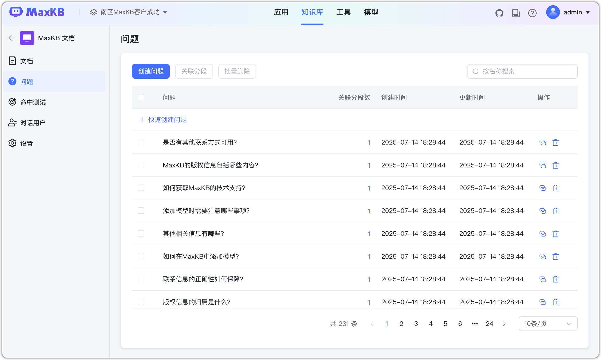
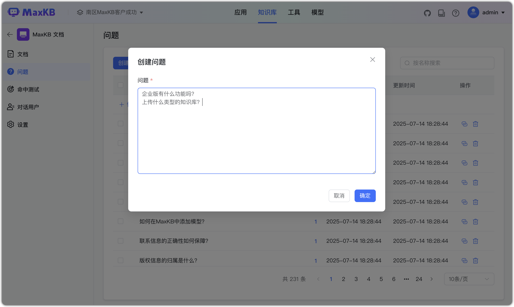
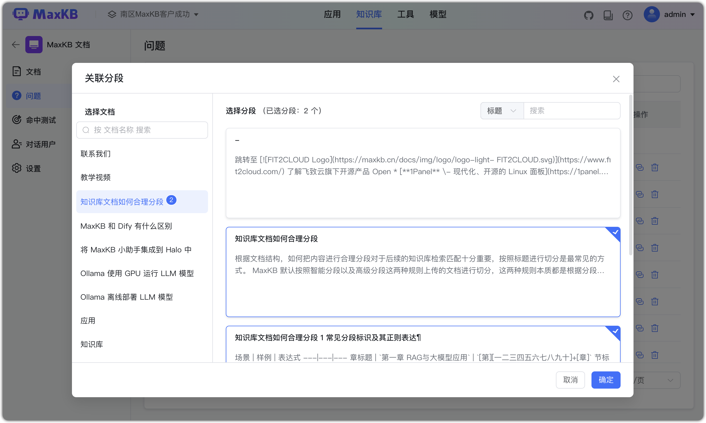
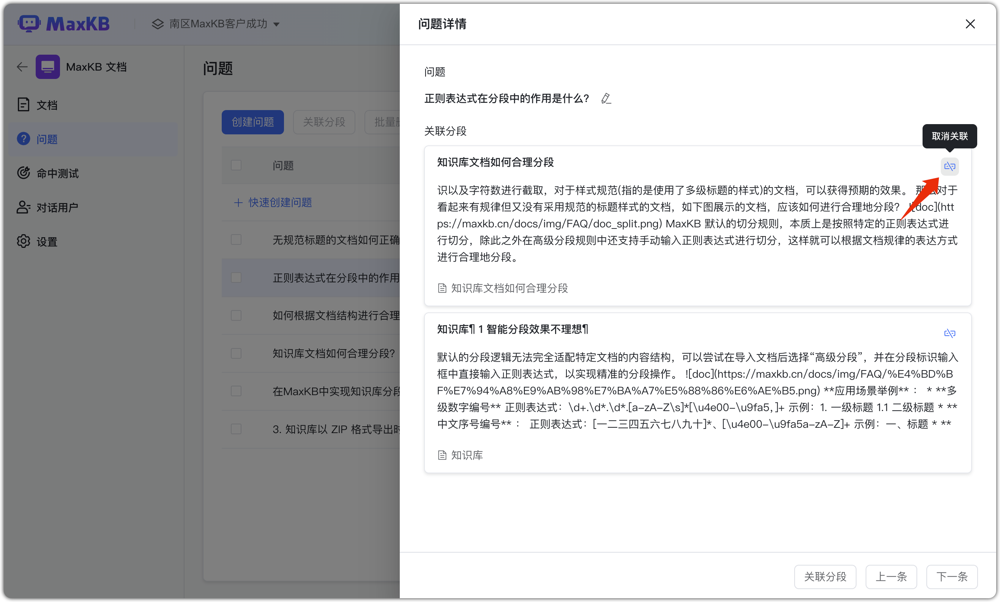

# Вопросы

!!! Abstract ""  
    Пользователь с правами управления БЗ может собирать потенциальные вопросы, создавать их и связывать с сегментами документов, формируя список FAQ для повышения точности ответов.

## 1 Создание вопроса

!!! Abstract ""  
    Нажмите «Создать вопрос» и введите список вопросов (по строкам).

## 2 Связь вопроса с сегментами

!!! Abstract ""  
    После добавления вопроса свяжите его с сегментами документа. При запросе пользователя сначала проверяется база вопросов.

## 3 Детали вопроса

!!! Abstract ""  
    Откройте вопрос, чтобы просмотреть детали, изменить сегменты или снять связь.

