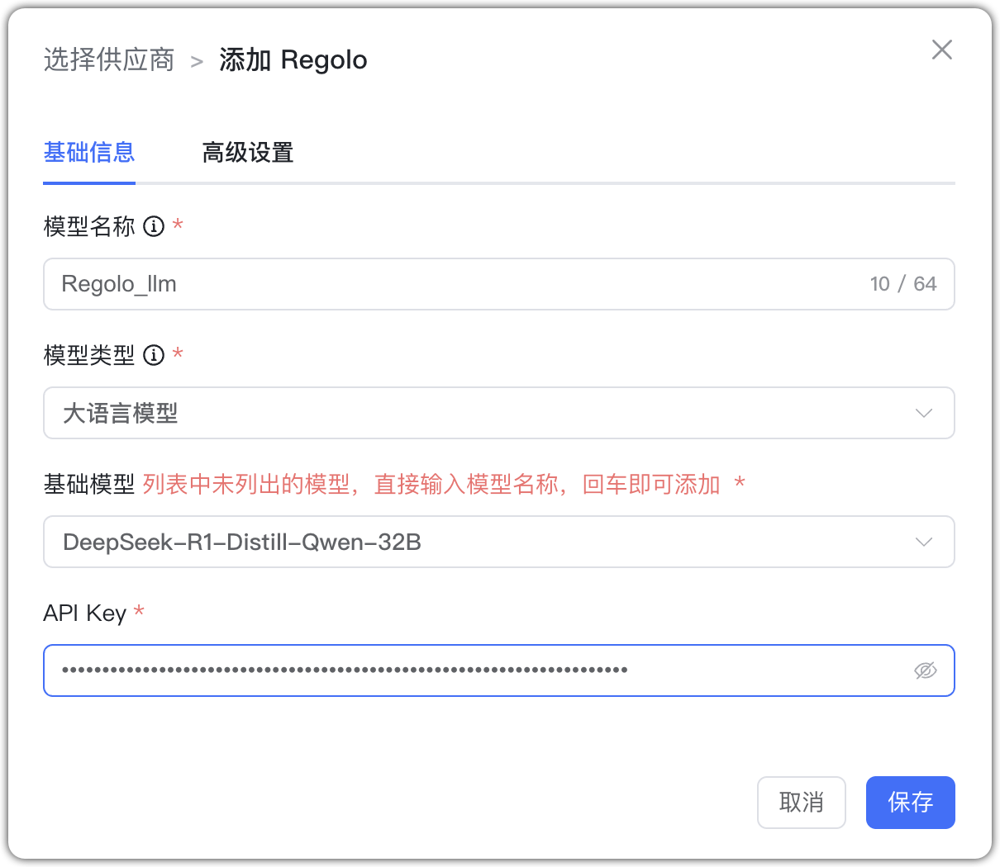

## 1 Добавление модели

Перед добавлением модели Regolo создайте API Key на [Regolo AI](https://regolo.ai/).

Выберите провайдера `Regolo` и заполните параметры:

* Имя модели: произвольное имя в MaxKB.     
* Тип модели: LLM/эмбеддинги/генерация изображений.   
* Базовая модель: имя модели (можно ввести своё).
* API Key: ваш ключ API.

## 2 Пример конфигурации

Regolo — пример LLM:

{ width="500px" }