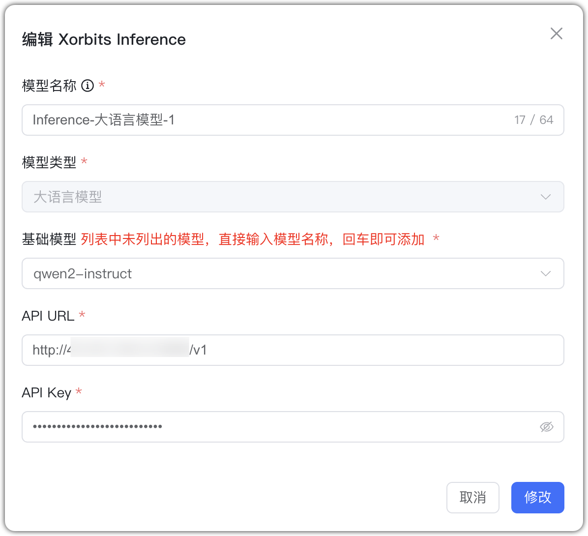
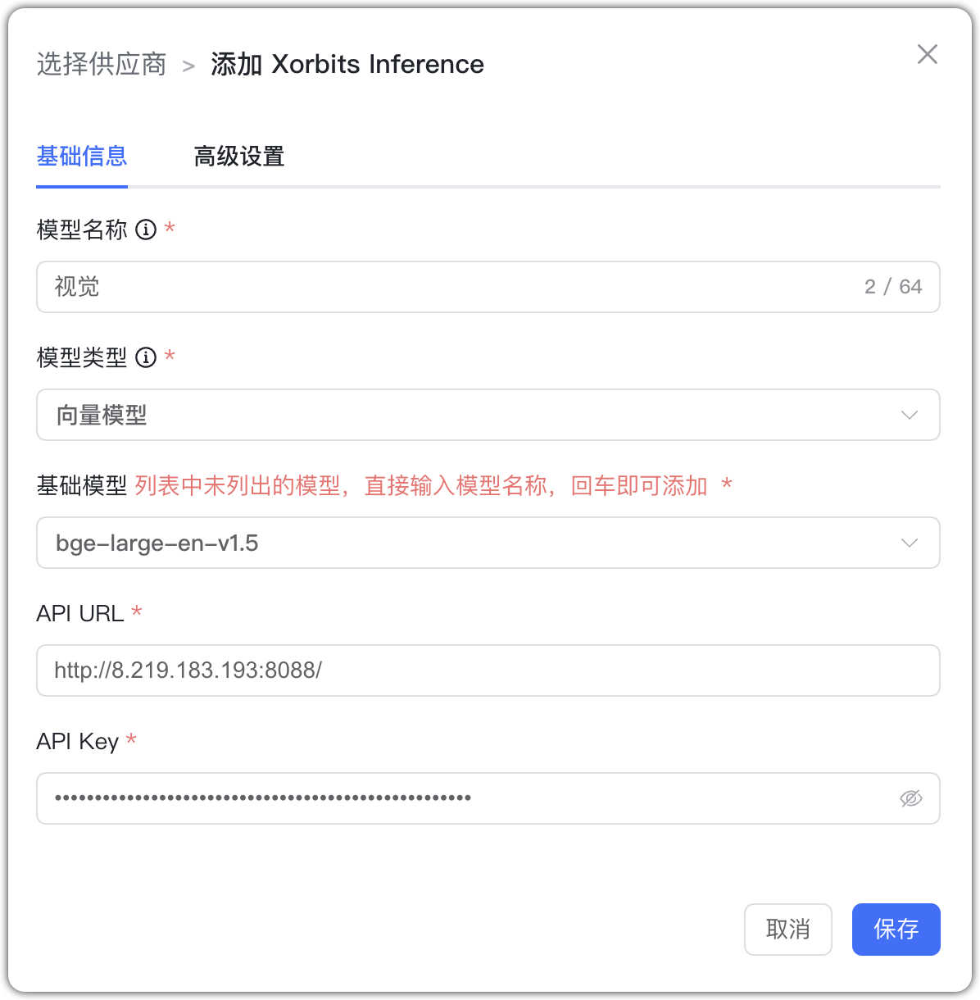
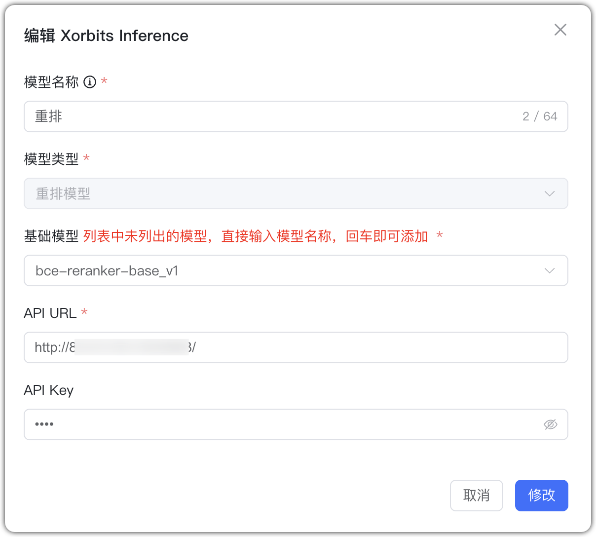
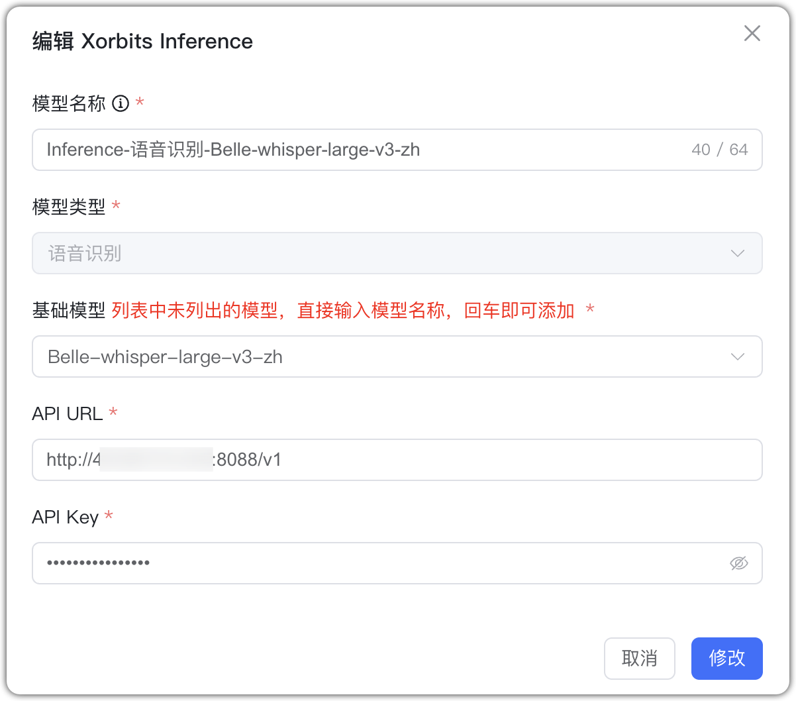
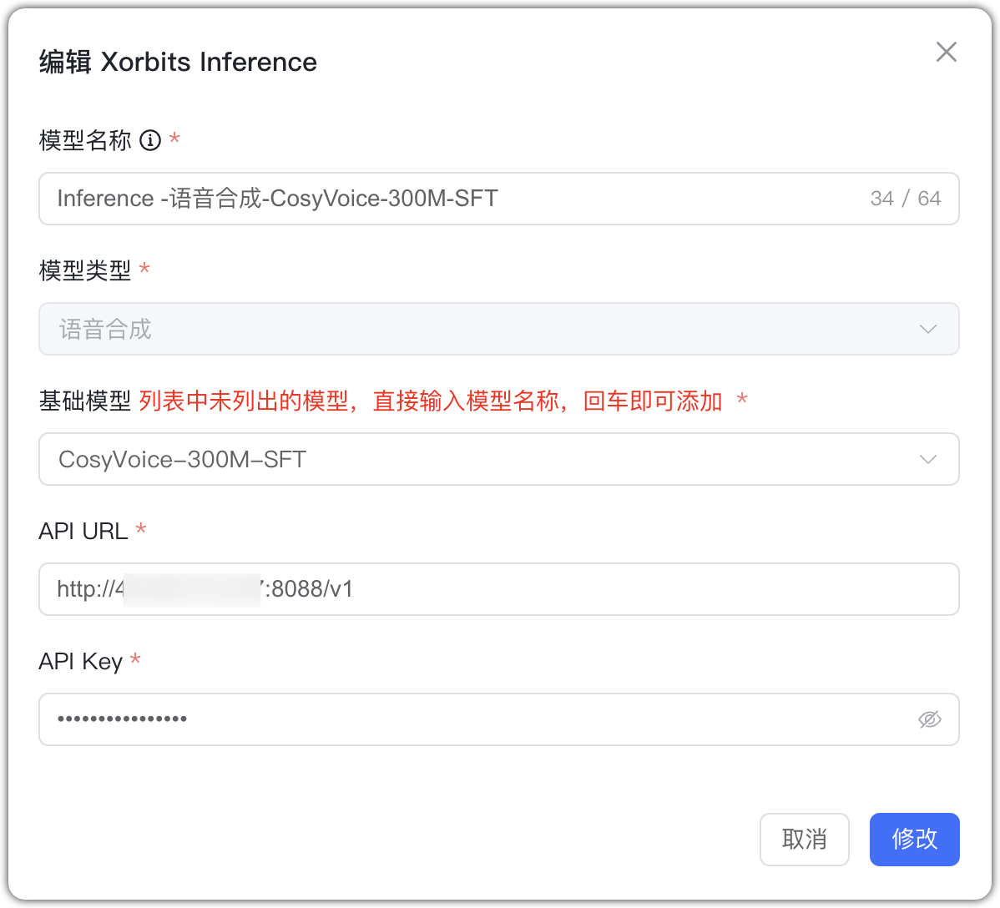
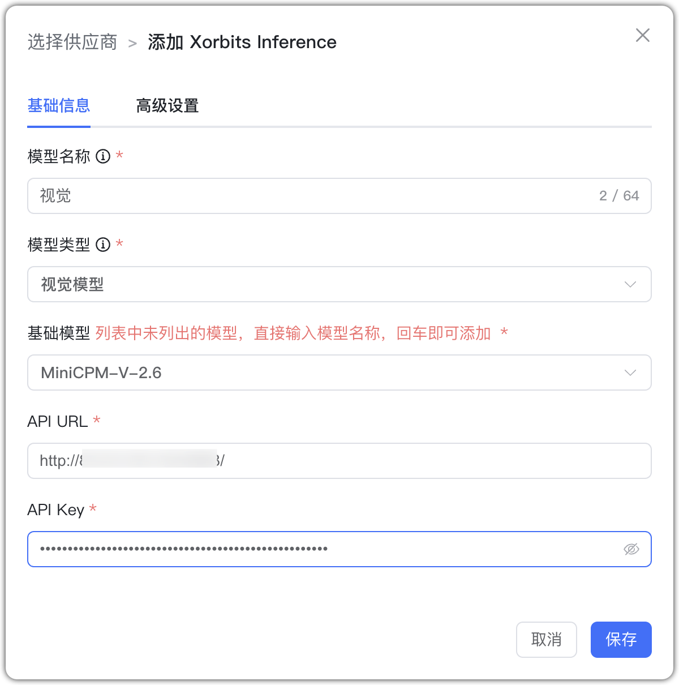
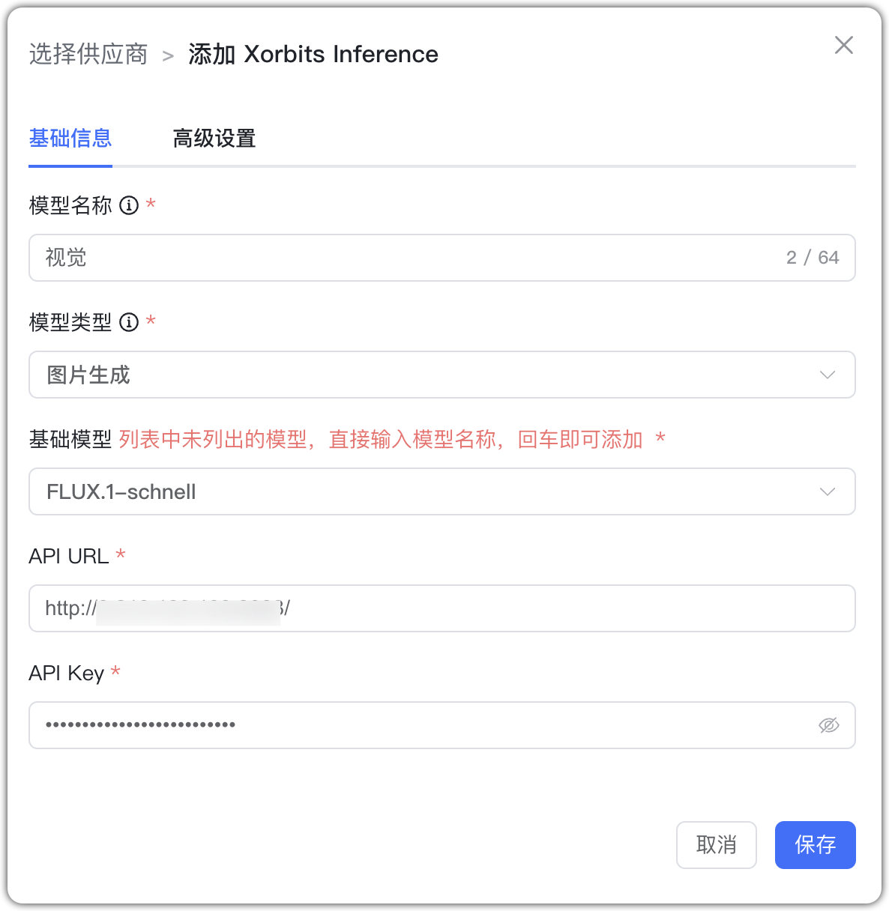

## 1 Добавление модели

Выберите провайдера `Xorbits Inference` и заполните параметры:

* Имя модели: произвольное имя в MaxKB.     
* Тип модели: LLM/эмбеддинги/rerank/ASR/TTS/визуальная/генерация изображений.   
* Базовая модель: имя модели (можно ввести своё).  

Для LLM и rerank укажите домен API и API Key; для эмбеддингов — домен API.

* Домен API: адрес сервиса Xorbits Inference, например: http://192.168.20.242:9997. 
* API Key: если ключ не требуется, можно указать любое значение.

## 2 Примеры конфигурации

Xorbits Inference — пример LLM:
{ width="500px" }

Xorbits Inference — пример эмбеддингов:
{ width="500px" }

Xorbits Inference — пример rerank:
{ width="500px" }

Xorbits Inference — пример ASR:
{ width="500px" }

Xorbits Inference — пример TTS:
{ width="500px" }

Xorbits Inference — пример визуальной модели:
{ width="500px" }

Xorbits Inference — пример генерации изображений:
{ width="500px" }
