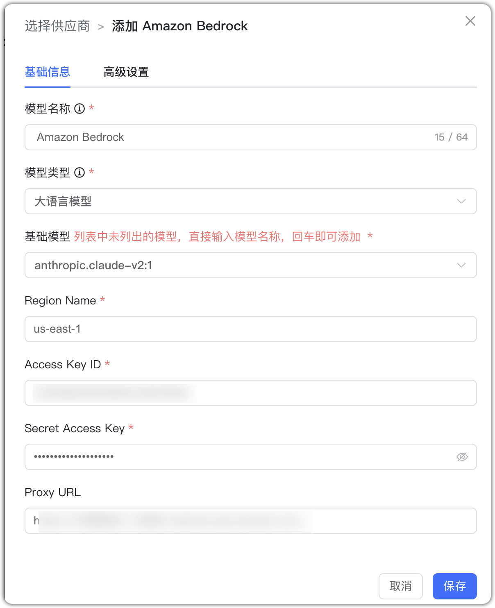

## 1 Добавление модели

!!! Abstract ""
    Выберите провайдера `Amazon Bedrock` и укажите параметры:

    * Имя модели: произвольное имя в MaxKB.    
    * Права: приватная (только текущий пользователь) или общая (видна всем; другие не могут редактировать/удалять).
    * Тип модели: LLM/эмбеддинги.   
    * Базовая модель: имя LLM, поддерживаемое Amazon Bedrock (можно ввести своё).     
    * Region Name: регион активации модели.    
    * Access Key ID/Secret Access Key: учётные данные для программного доступа к AWS (в т.ч. Bedrock).

## 2 Пример конфигурации

!!! Abstract ""
    Amazon Bedrock — пример LLM:

{ width="500px" }

