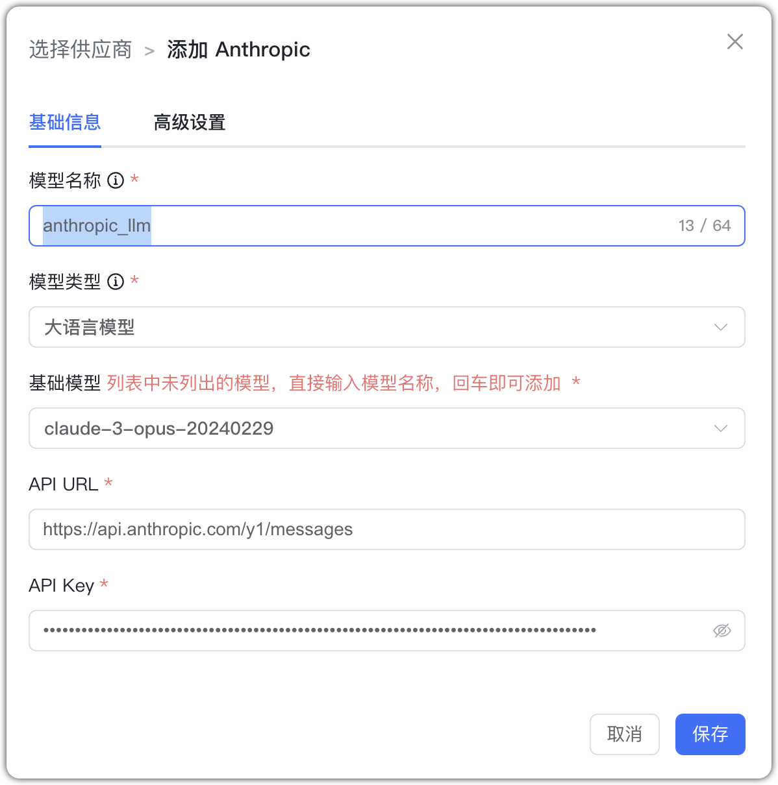

## 1 Добавление модели

Перед добавлением модели Anthropic зарегистрируйтесь и создайте API Key в консоли (Раздел «Управление аккаунтом → API ключи»).

Выберите провайдера `Anthropic` и заполните параметры:

* Имя модели: произвольное имя в MaxKB.    
* Тип модели: LLM/визуальная.    
* Базовая модель: имя модели, поддерживаемое Anthropic (можно ввести вручную; должно совпадать со списком провайдера).    
* API URL: https://api.anthropic.com/v1/messages
* API Key: ключ, созданный в консоли Anthropic.

## 2 Пример конфигурации

Anthropic — пример LLM:

{ width="500px" }

