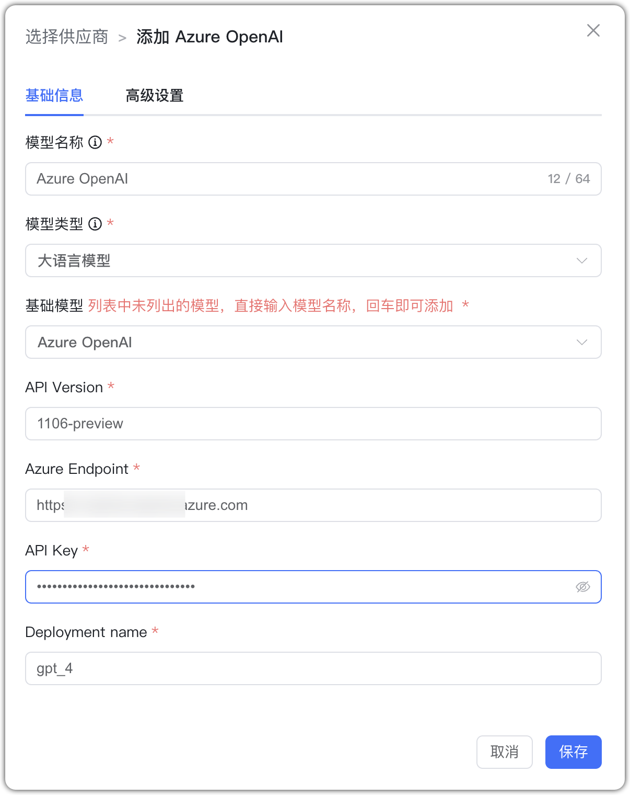

## 1 Добавление модели

!!! Abstract "" 
    Перед добавлением модели Azure OpenAI зарегистрируйтесь в [Azure AI Studio](https://ai.azure.com/) и получите домен API, API Key, сведения о деплое и т.д. См. рисунок ниже:

    Выберите провайдера `Azure OpenAI` и заполните параметры:

    * Имя модели: произвольное имя в MaxKB.    
    * Тип модели: LLM/эмбеддинги/ASR/TTS/визуальная/генерация изображений.   
    * Базовая модель: определяется именем деплоя (см. выше). 
    * Версия API: версия модели.
    * Домен API: URL сервиса Azure OpenAI (см. выше).
    * API Key: учётные данные доступа к сервису (см. выше).
    * Имя деплоя: имя деплоя модели в Azure AI Studio.

## 2 Пример конфигурации

!!! Abstract "" 
    Azure OpenAI — пример LLM:

{ width="500px" }