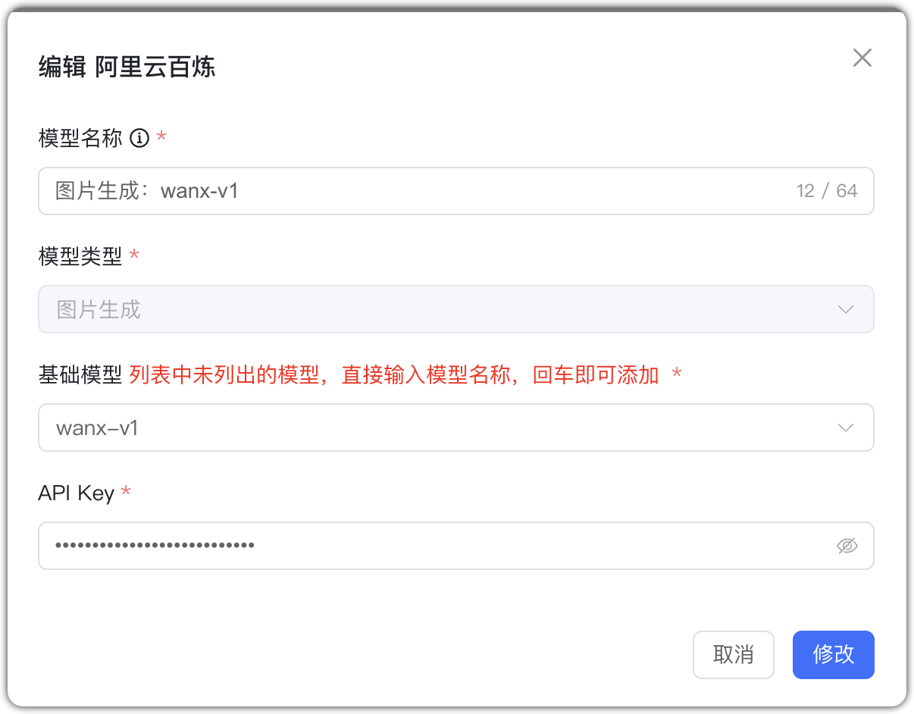

## 1 Добавление модели

Выберите провайдера `Alibaba Bailian` и заполните параметры:

* Имя модели: произвольное имя в MaxKB.
* Тип модели: LLM/эмбеддинги/rerank/ASR/TTS/визуальная/генерация изображений.   
* Базовая модель: имя модели для выбранного типа (можно ввести своё).
* Домен API: адрес API сервиса (для LLM обязателен).
* API Key: ключ доступа к сервису API.

**Важно:** домены API для разных LLM отличаются — см. примеры вызова для выбранной базовой модели.

## 2 Примеры конфигурации

Alibaba Bailian — пример LLM:

{ width="500px" }

Alibaba Bailian — пример эмбеддингов:

{ width="500px" }

Alibaba Bailian — пример rerank:
{ width="500px" }

Alibaba Bailian — пример ASR:
{ width="500px" }

Alibaba Bailian — пример TTS:
{ width="500px" }

Alibaba Bailian — пример визуальной модели:
{ width="500px" }

Alibaba Bailian — генерация изображений: по умолчанию 1024×1024, 1 изображение, стиль <auto> (случайный). Пример:
{ width="500px" }

{ width="500px" }

