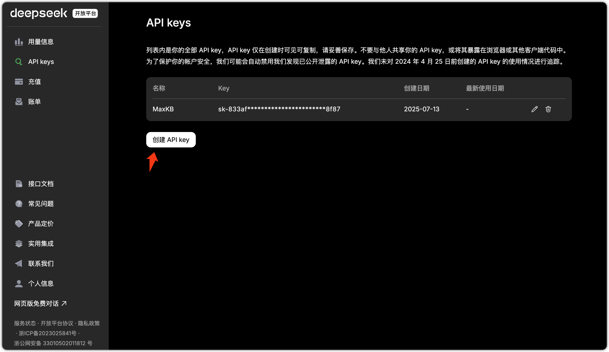
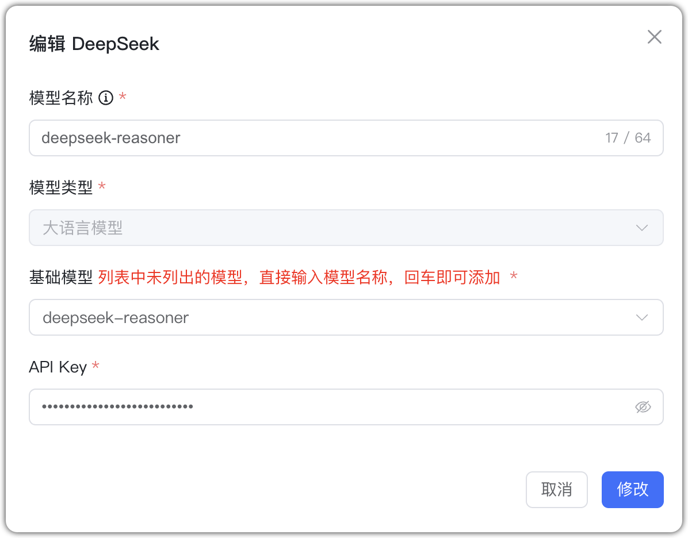

## 1 Добавление модели

Перед добавлением модели DeepSeek создайте API Key на [платформе DeepSeek](https://platform.deepseek.com/).

Выберите провайдера `DeepSeek` и заполните параметры:

* Имя модели: произвольное имя в MaxKB.   
* Тип модели: LLM.   
* Базовая модель: имя модели (можно ввести своё).  
* API Key: создаётся и просматривается на платформе DeepSeek.

## 2 Пример конфигурации

DeepSeek — пример LLM:

{ width="500px" }