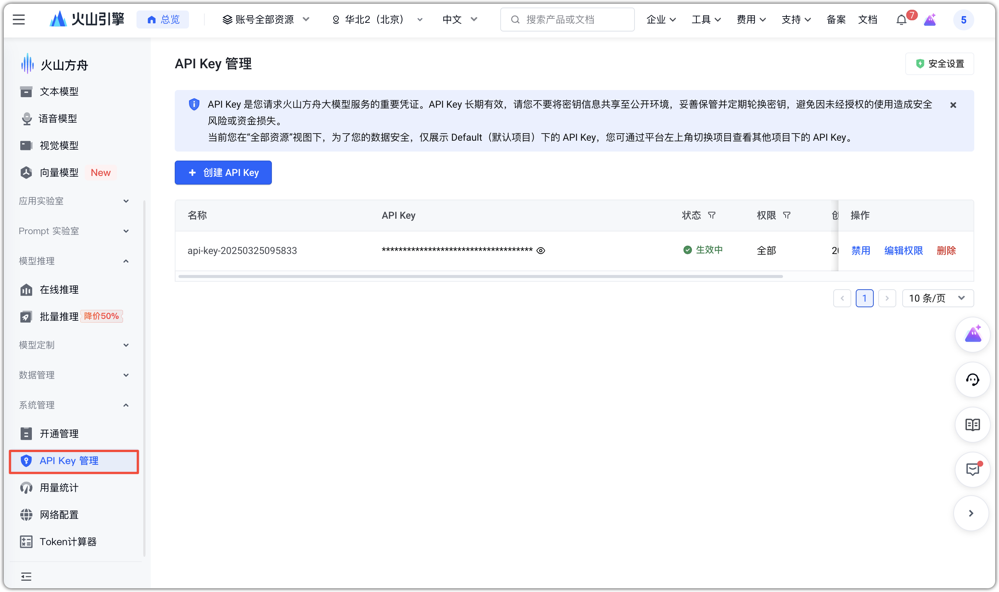
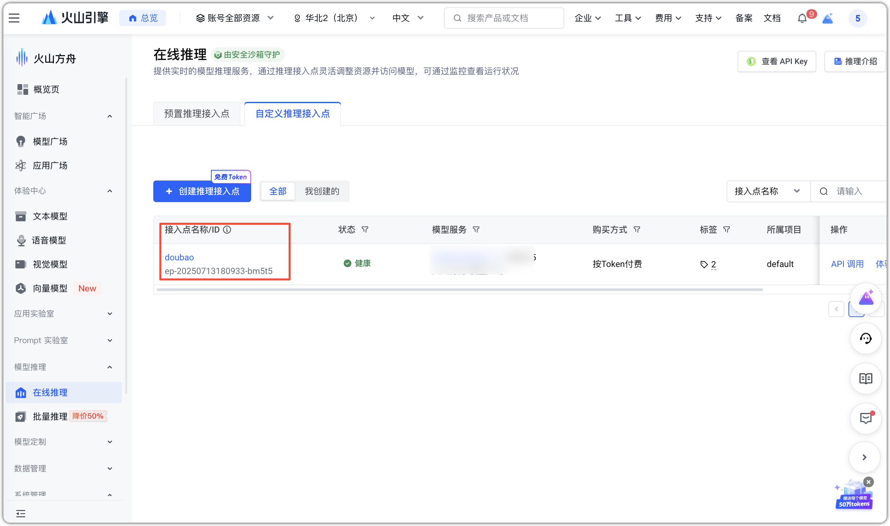
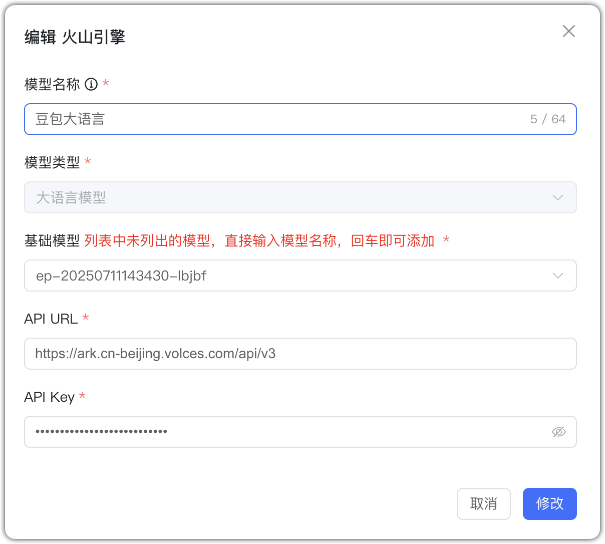
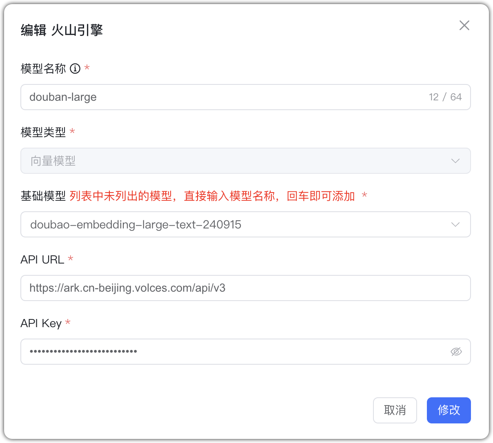
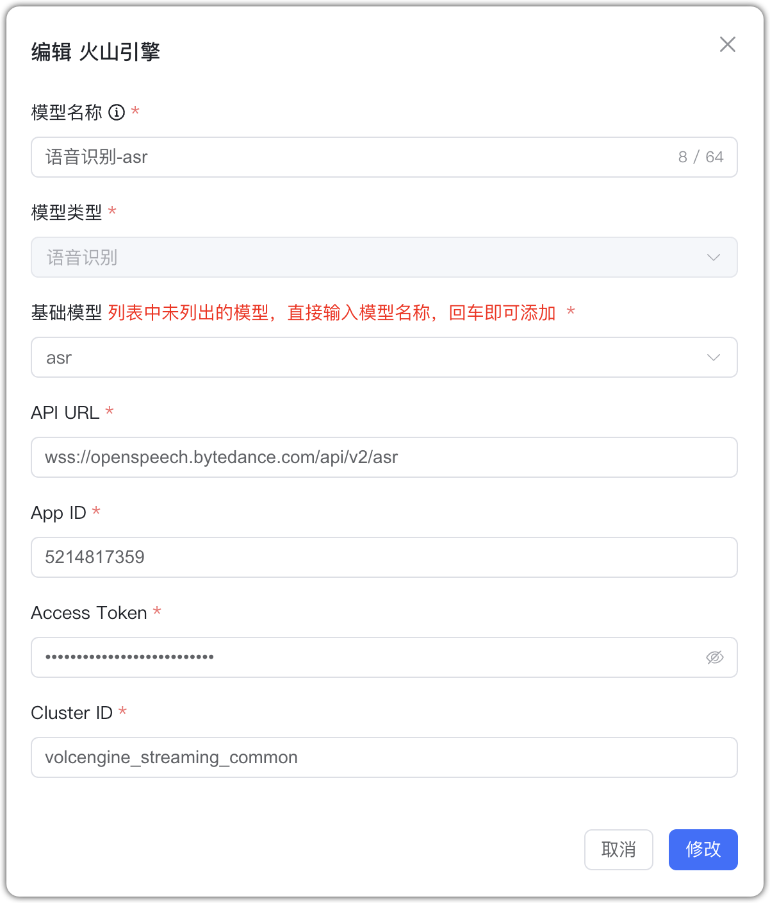
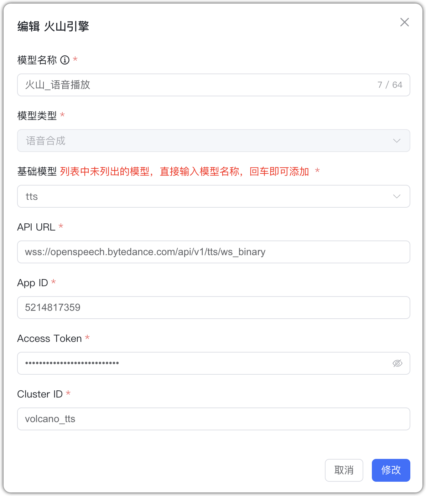
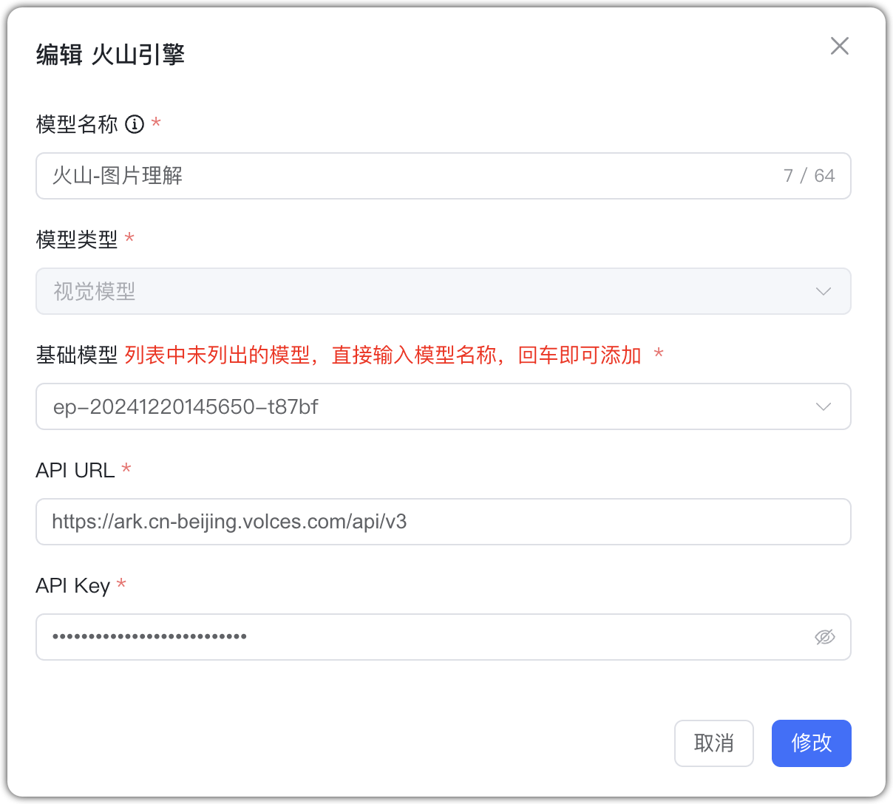
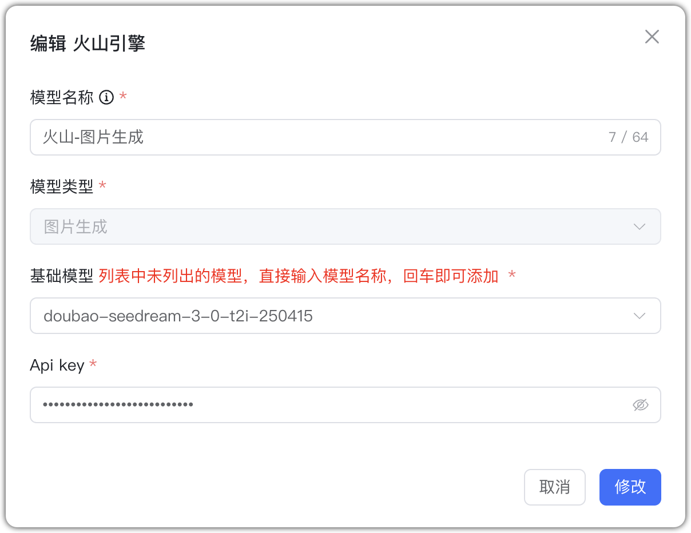
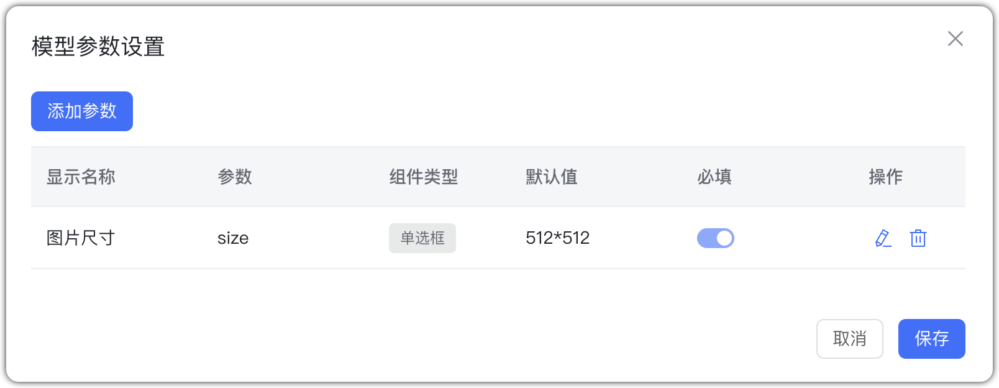

## 1 Добавление модели

Выберите провайдера `Volcengine (Doubao)` и укажите параметры:

* Имя модели: произвольное имя в MaxKB.     
* Тип модели: LLM/эмбеддинги/ASR/TTS/визуальная/генерация изображений.

Дополнительные параметры подключения Doubao LLM:

* Базовая модель: ID эндпоинта онлайн‑инференса.        
* Домен API: https://ark.cn-beijing.volces.com/api/v3
* API Key: Эндпоинт → Вызов API → Авторизация API Key → выбрать и скопировать ключ.

Для ASR/TTS укажите App ID, Access Token, Cluster ID:

* Домен App: для ASR — `wss://openspeech.bytedance.com/api/v2/asr`, для TTS — `wss://openspeech.bytedance.com/api/v1/tts/ws_binary`
* App ID: ID приложения в Volcengine. 
* Access Token: учётные данные для приложения. 
* Cluster ID: сервисная информация приложения.

## 2 Примеры конфигурации

Volcengine — пример LLM:
{ width="500px" }

Volcengine — пример эмбеддингов:
{ width="500px" }

Volcengine — пример ASR:
{ width="500px" }

Volcengine — пример TTS:
{ width="500px" }

Volcengine — пример визуальной модели:
{ width="500px" }

Volcengine — генерация изображений: создайте ключ в консоли Volcengine (Access Control → API Access Keys). Пример:
{ width="500px" }

{ width="500px" }

