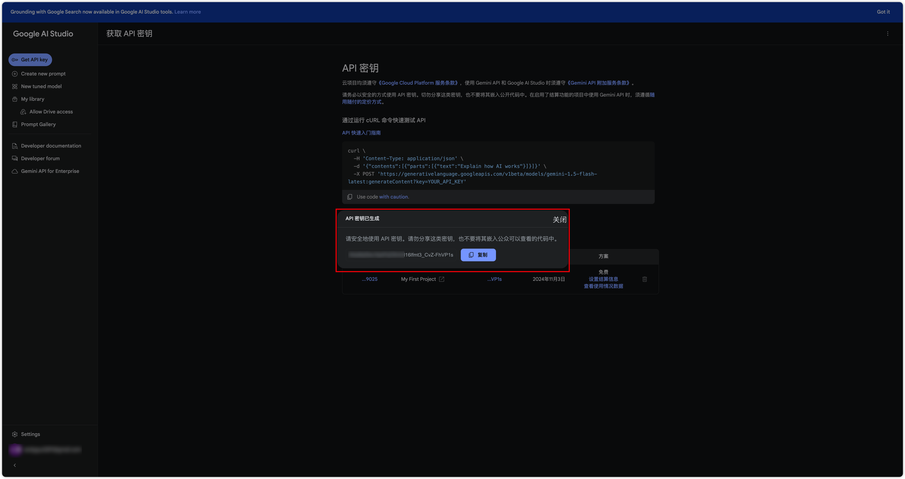
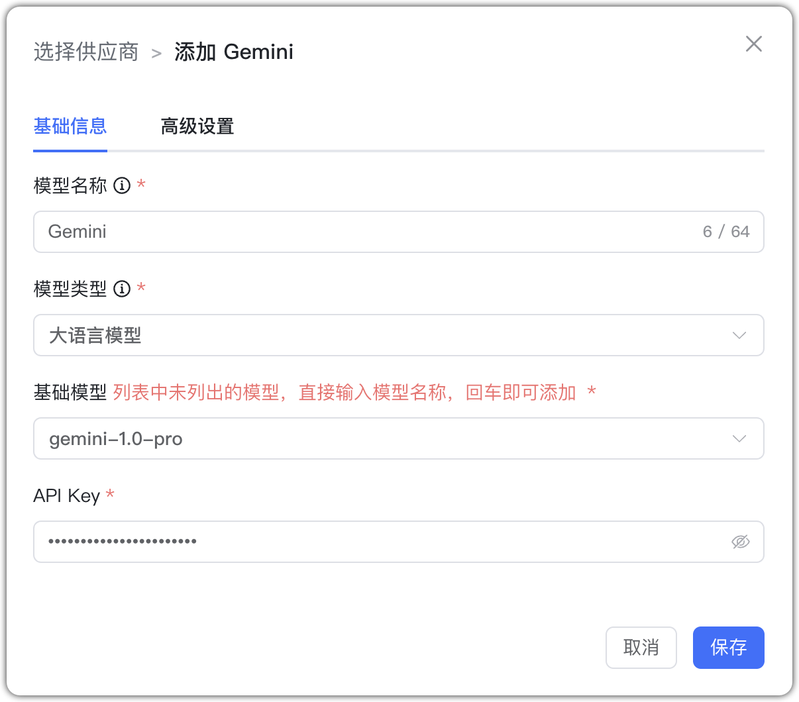

## 1 Добавление модели

Перед добавлением модели Gemini создайте API Key в [Google AI Studio](https://aistudio.google.com/).

Выберите провайдера `Gemini` и заполните параметры:

* Имя модели: произвольное имя в MaxKB.     
* Тип модели: LLM/эмбеддинги/ASR/визуальная.   
* Базовая модель: имя модели для выбранного типа (можно ввести своё).
* API Key: ваш ключ API.

**Важно:** сервер должен находиться в [поддерживаемом регионе Gemini API](https://ai.google.dev/gemini-api/docs/available-regions?hl=zh-cn), иначе вызовы API и доступ к Google AI Studio будут недоступны.

## 2 Пример конфигурации

Gemini — пример LLM:

{ width="500px" }