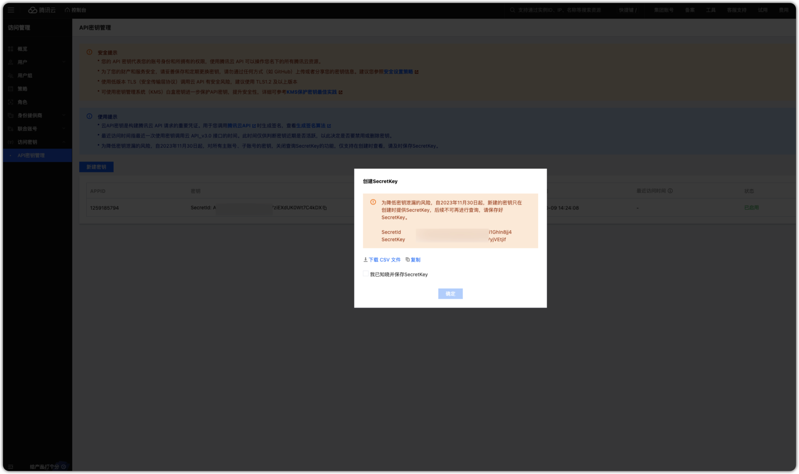
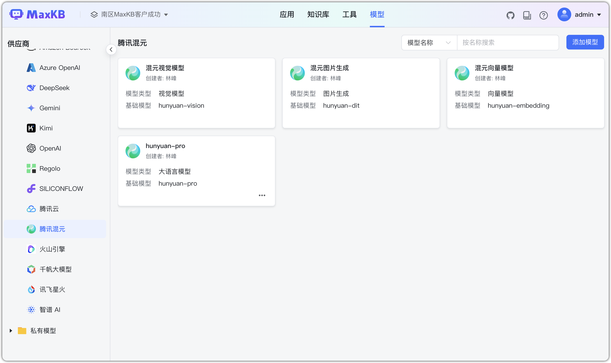
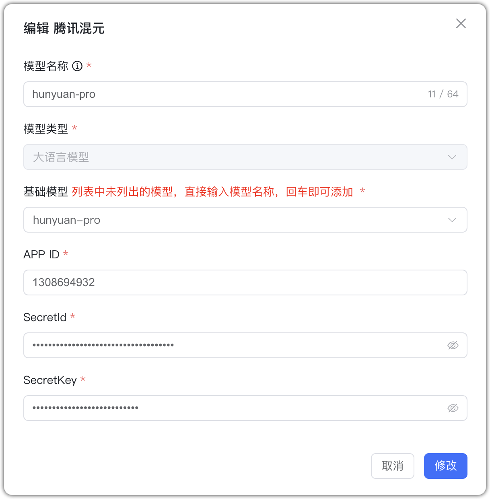
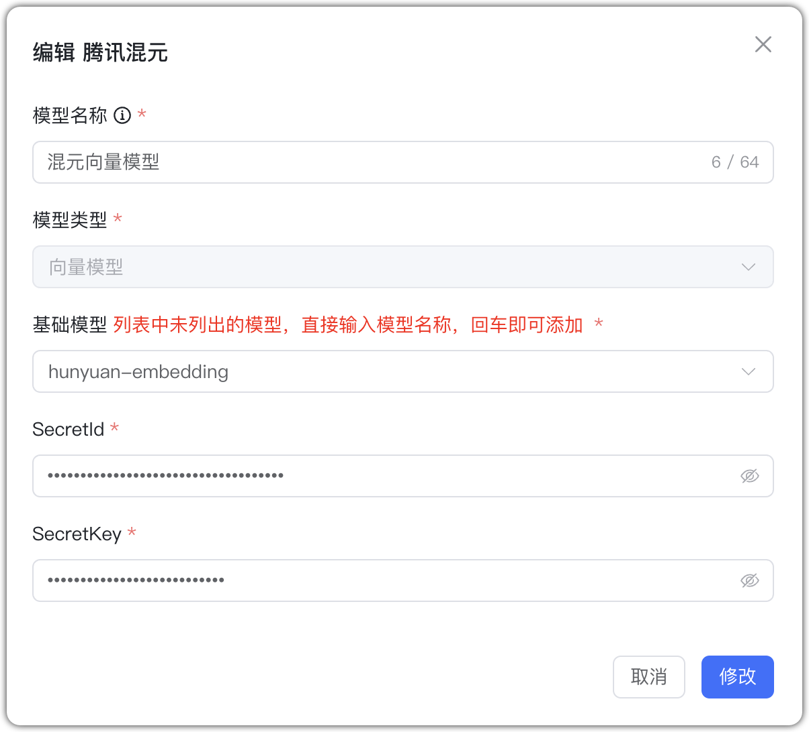
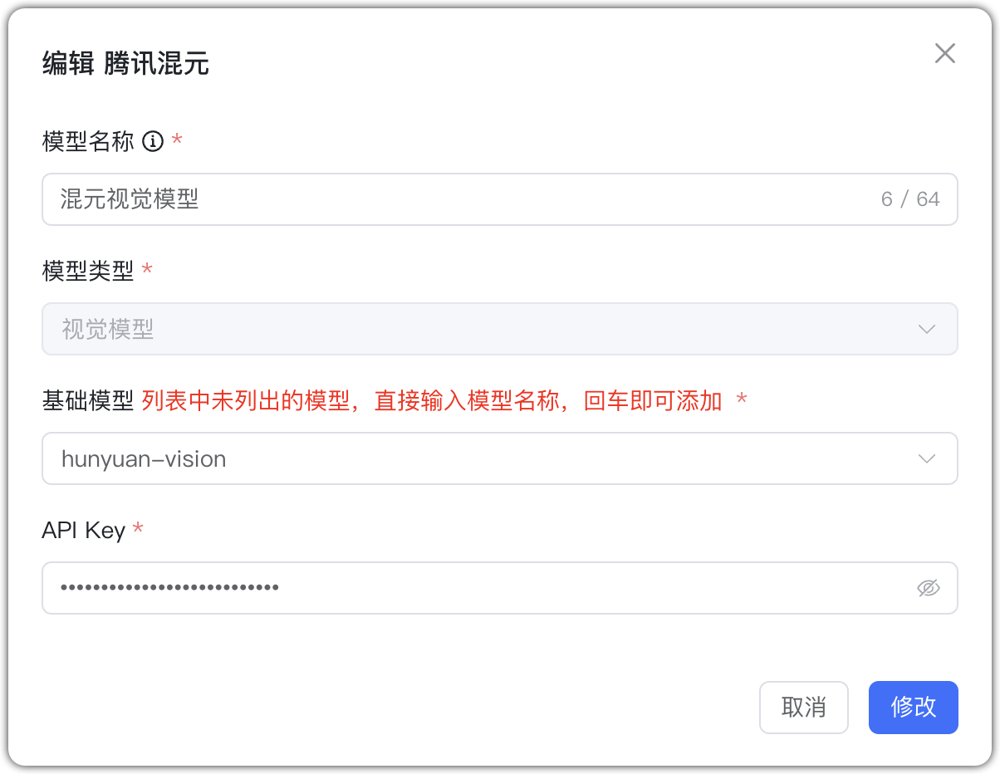
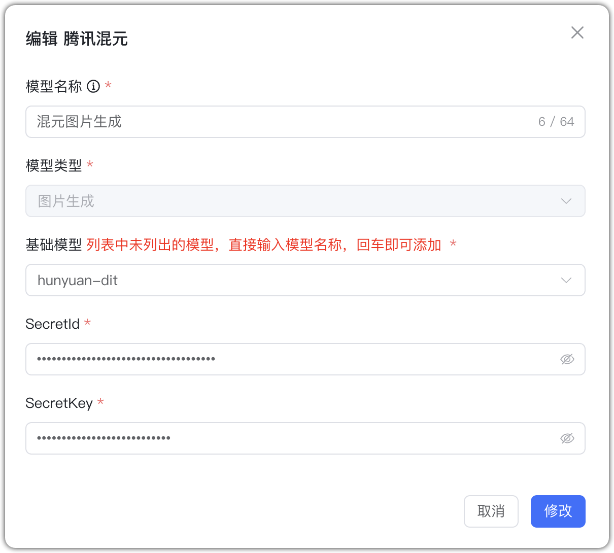
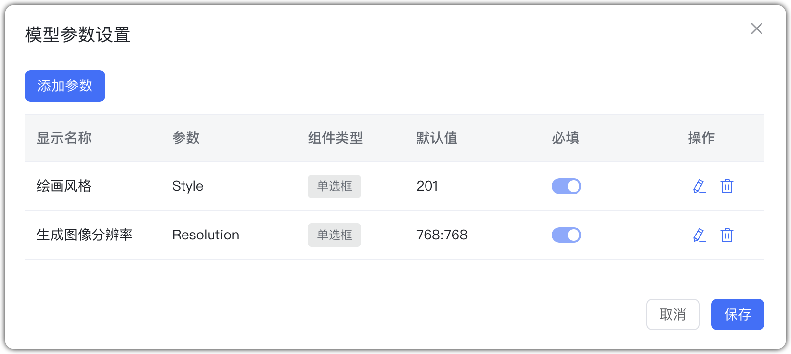

## 1 Добавление модели

Перед добавлением модели Tencent Hunyuan подключите сервис Hunyuan в Tencent Cloud и создайте ключи доступа.

Выберите провайдера `Tencent Hunyuan` и заполните параметры:

* Имя модели: произвольное имя в MaxKB.     
* Тип модели: LLM/эмбеддинги/визуальная/генерация изображений.   
* Базовая модель: имя модели (можно ввести своё).         
* APPID: в консоли Tencent Cloud → Управление доступом → Управление ключами API. 
* SecretId: там же.
* SecretKey: скачайте при создании ключа в консоли. 

## 2 Примеры конфигурации

Hunyuan — пример LLM:

{ width="500px" }

Hunyuan — пример эмбеддингов:
{ width="500px" }

Hunyuan — пример визуальной модели:
{ width="500px" }

Hunyuan — генерация изображений: по умолчанию 768×768, 1 изображение, стиль 201 (аниме). Пример:
{ width="500px" }

{ width="500px" }
