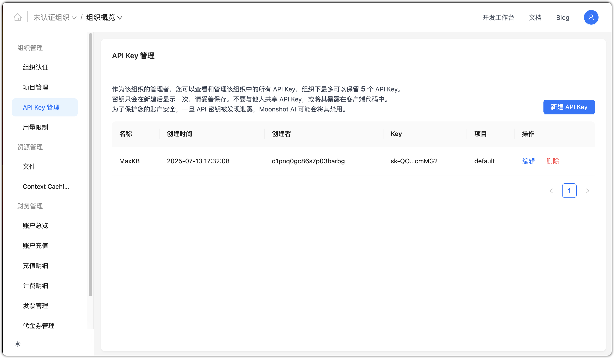
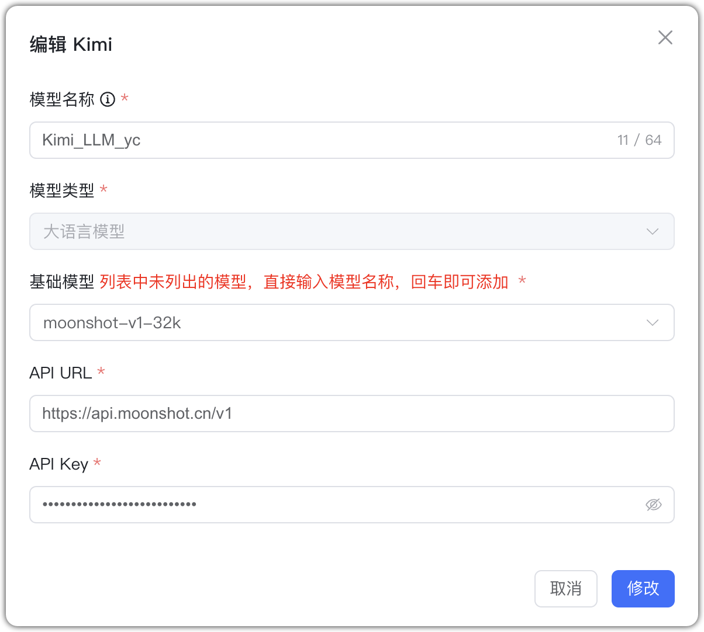

## 1 Добавление модели

!!! Abstract ""
    Перед добавлением модели Kimi зарегистрируйтесь и создайте API Key на [Moonshot AI](https://platform.moonshot.cn/console/account).

    Выберите провайдера `Kimi` и заполните параметры:

    * Имя модели: произвольное имя в MaxKB.
    * Тип модели: LLM.   
    * Базовая модель: имя модели (можно ввести своё).   
    * Домен API: https://api.moonshot.cn/v1  
    * API Key: создаётся и просматривается в кабинете Kimi.

## 2 Пример конфигурации

!!! Abstract ""
    Kimi — пример LLM:

{ width="500px" }