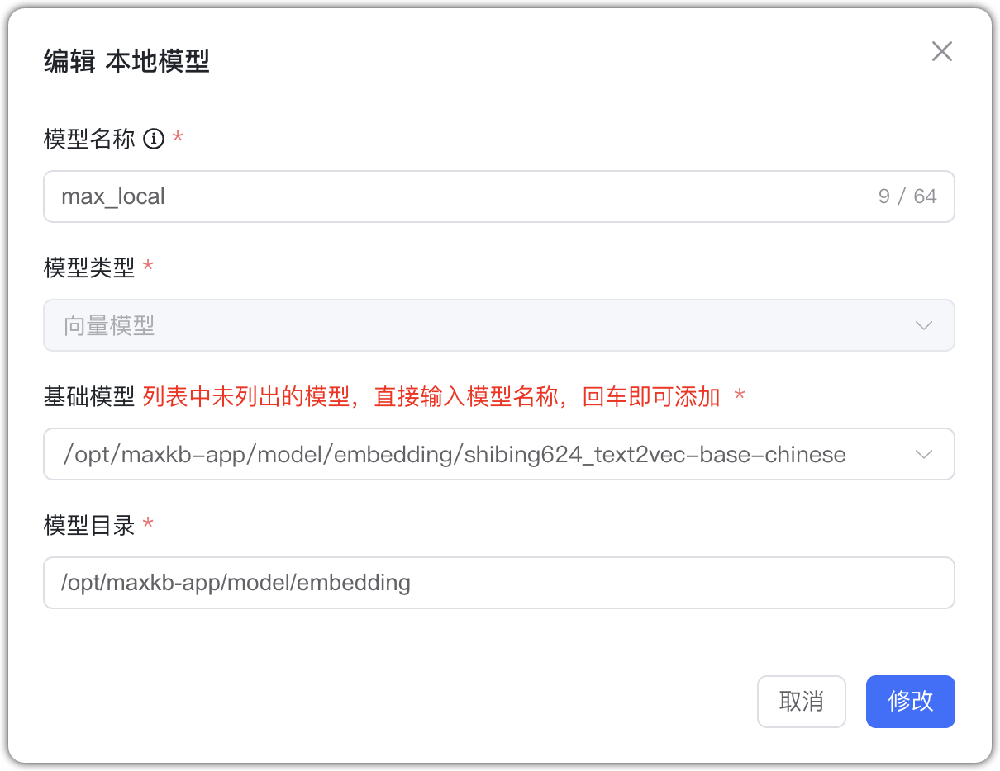

## 1 Загрузка модели

**Предварительные условия:** скачайте модель на сервер и примонтируйте её в контейнер MaxKB. На примере эмбеддинг‑модели:

- Скачайте эмбеддинг‑модель на локальный сервер.
```
# Рекомендованные модели
https://huggingface.co/models?other=text-embedding
# Сохраните по пути /opt/maxkb/model/local_embedding
```
- Смонтируйте путь модели хоста внутрь контейнера MaxKB через -v.
```
-v /opt/maxkb/model/local_embedding:/opt/maxkb/model/local_embedding
# Примечание: слева — каталог на хосте; справа — в контейнере MaxKB
```
## 2 Добавление модели

В управлении моделями выберите провайдера «Локальная модель» и заполните форму.  

* Имя модели: произвольное имя в MaxKB.     
* Тип модели: эмбеддинги/rerank.   
* Базовая модель: абсолютный путь к модели в контейнере MaxKB.     
* Каталог модели: каталог с моделью (если «Базовая модель» — имя, а не абсолютный путь; рекомендуем указывать одинаково).

## 3 Пример конфигурации

Локальная модель — пример эмбеддингов:
{ width="500px" }

