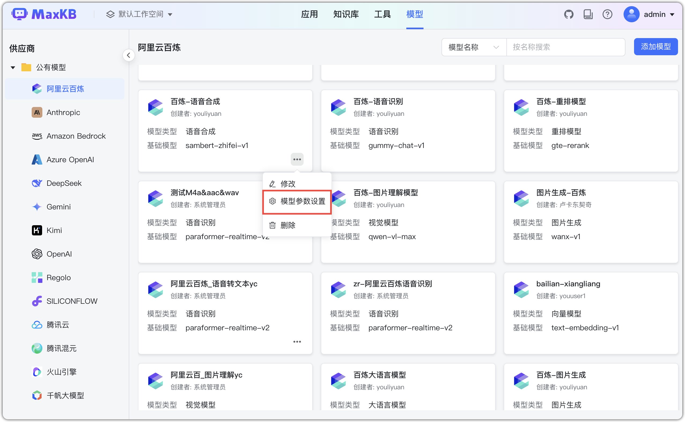
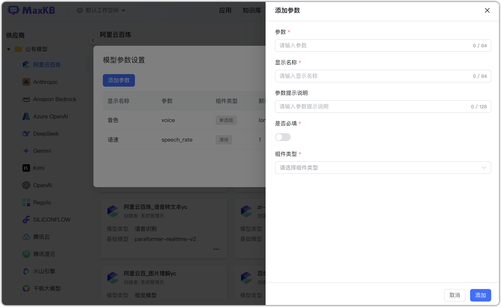
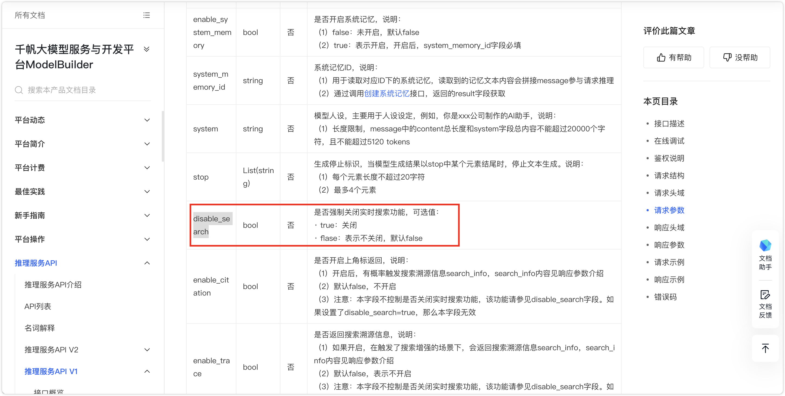
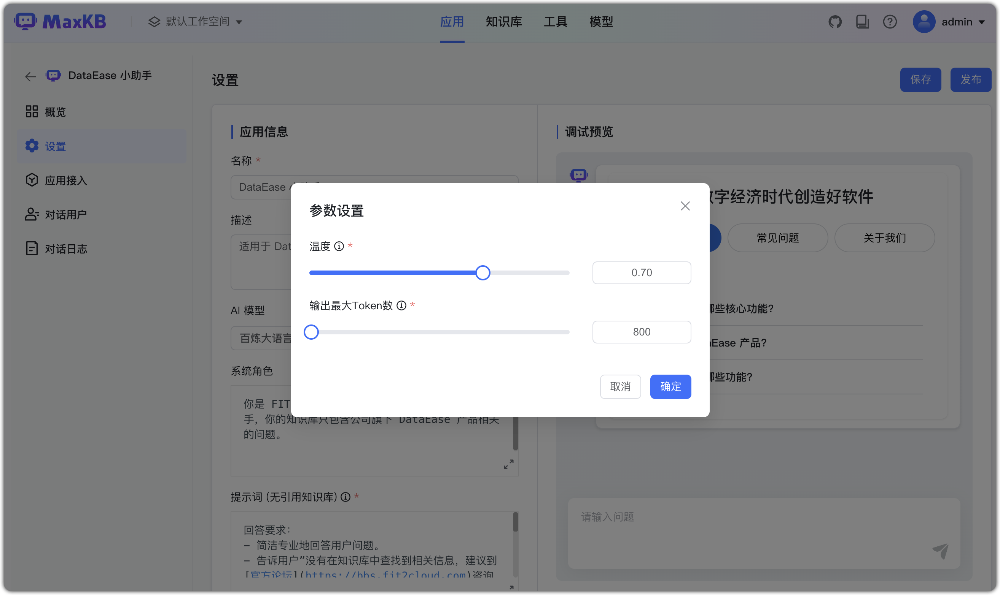

!!! Abstract ""
    В меню модели (справа сверху) выберите «Параметры модели», чтобы настроить дополнительные параметры, поддерживаемые провайдером.

!!! Abstract ""
    Например, параметр онлайн‑поиска: найдите в официальной документации API вашего провайдера нужные параметры. Для ERNIE‑4.0‑8K (Qianfan) параметр — disable_search. Откройте параметры модели ERNIE‑4.0‑8K и добавьте отключение онлайн‑поиска.
    **Важно:** параметры отличаются у разных моделей. Ориентируйтесь на официальную документацию.

!!! Abstract ""
    Затем в настройках AI‑модели приложения включите/отключите соответствующий параметр (например, онлайн‑поиск).

