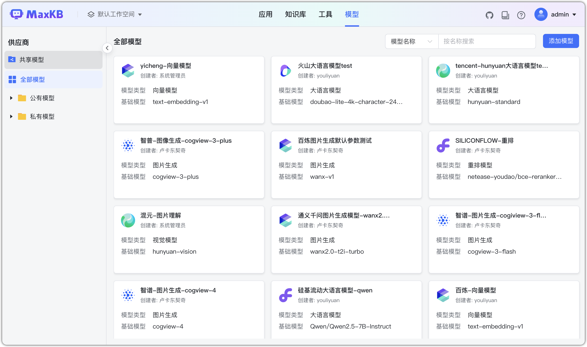

# Обзор моделей

## 1 Обзор возможностей

MaxKB интегрируется с моделями множества провайдеров и поддерживает подключение популярных LLM. Это включает локально развёрнутые приватные модели (Llama 3, Qwen 2), китайские публичные сервисы (DeepSeek, SILICONFLOW, Kimi, 智谱 AI, 百度千帆) и международные провайдеры (OpenAI, Azure OpenAI, Anthropic, Gemini). Поддерживаются типы: генерация текста, эмбеддинги, rerank, ASR, TTS, CV и генерация изображений — для разных сценариев.

«Модели» используются для управления провайдерами и экземплярами моделей, которые далее применяются в БЗ и приложениях;

 - Общие модели: администратор создаёт общий ресурс в «Общих ресурсах» и назначает доступ рабочим пространствам.
 - Все модели: пользователь может создать модель; другие смогут просматривать/использовать/поддерживать после [**назначения прав**](../../user_manual/X-Pack/authorization_resources.md).
   
 **Важно**: общие ресурсы — функция X‑Pack (enterprise).

## 2 Управление моделями

Выберите «Все модели» слева, затем провайдера и нажмите «Добавить модель».

Доступны редактирование, настройка параметров модели и удаление.

Фильтры: имя модели, тип, создатель.

При удалении требуется подтверждение; после подтверждения модель будет удалена.

## 3 Поддерживаемые провайдеры и типы моделей

Поддерживаемые типы по провайдерам (по алфавиту):

|                 | 大语言模型 |  向量模型  |  重排模型  | 语音识别 | 语音合成 |  视觉模型  | 图片生成  | 
|-----------------|:--------:|:---------:|:----------:|:----------:|:----------:|:----------:|:----------:|
|阿里云百炼         |  &#10004 |  &#10004  | &#10004    |  &#10004   | &#10004   |  &#10004   |  &#10004  |
|Anthropic        |  &#10004 |           |            |            |           |   &#10004  |           |
|Amazon Bedrock   |  &#10004 |  &#10004  |            |            |           |            |         |
|Azure OpenAI     |  &#10004 |  &#10004  |            |  &#10004   | &#10004   |  &#10004  | &#10004 |
|DeepSeek         |  &#10004 |           |            |            |           |           |         | 
|Gemini           |  &#10004 |  &#10004  |            |  &#10004   |           | &#10004   |          |
|kimi             |  &#10004 |           |            |            |           |           |          |
|OpenAI           |  &#10004 |  &#10004  |            | &#10004    |  &#10004  | &#10004 | &#10004 |
|SILICONFLOW      | &#10004  |  &#10004  |   &#10004  |  &#10004   |          |           | &#10004 |
|腾讯云            |  &#10004 |           |            |            |         |            |            |
|腾讯混元          |  &#10004 |  &#10004  |            |            |           | &#10004 | &#10004 |
|火山引擎          |  &#10004 |  &#10004 |            |  &#10004   |  &#10004  | &#10004 | &#10004 |
|千帆大模型         | &#10004 |  &#10004  |            |            |           |        |        |
|讯飞星火          | &#10004 |  &#10004   |            | &#10004    |  &#10004  |        |         |
|智谱 AI           | &#10004 |            |            |            |           | &#10004 | &#10004 |
|本地模型          |          |  &#10004  | &#10004    |            |           |        |        |
|Ollama           |  &#10004 |  &#10004  | &#10004 |            |           | &#10004 |          |
|vLLM             |  &#10004 |  &#10004  |            |            |           | &#10004 |          |
|Xorbits Inference| &#10004 |  &#10004   | &#10004    | &#10004   |   &#10004  | &#10004 | &#10004 |

