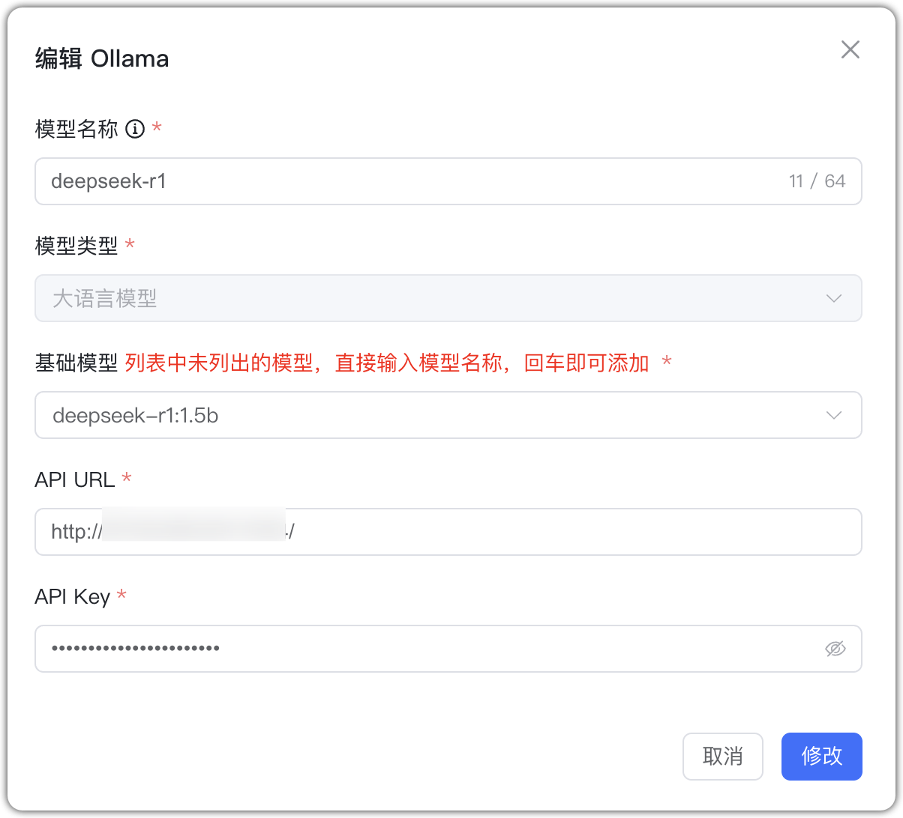
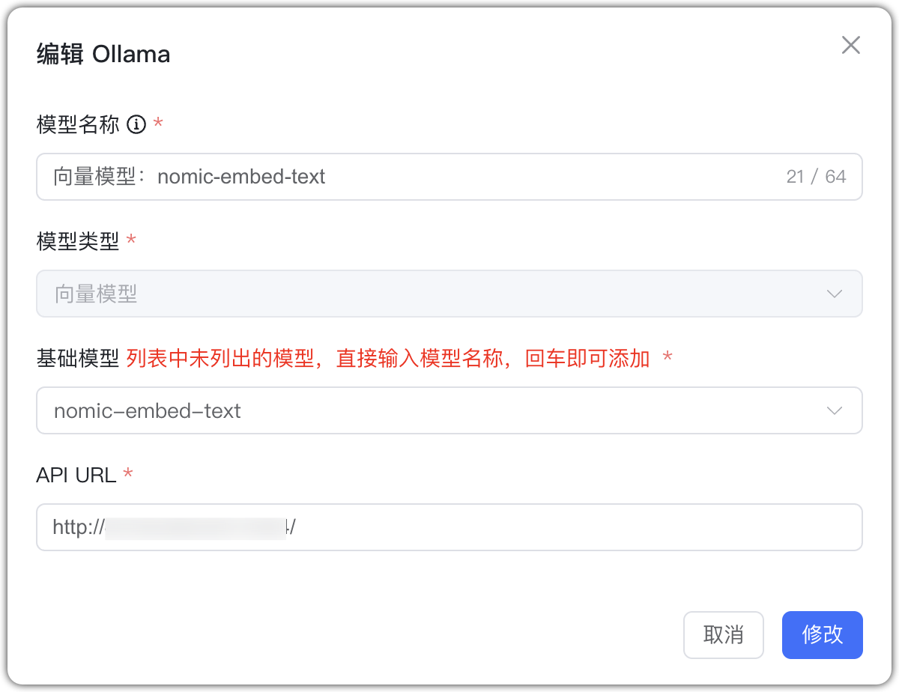
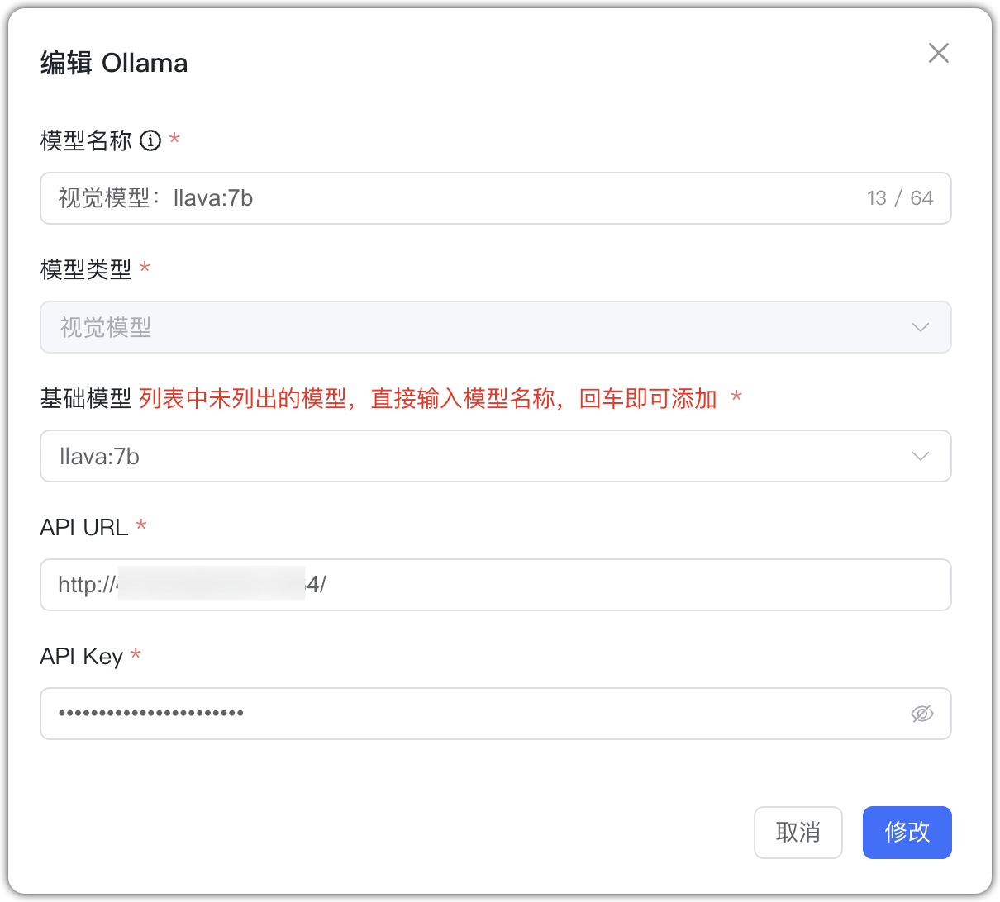
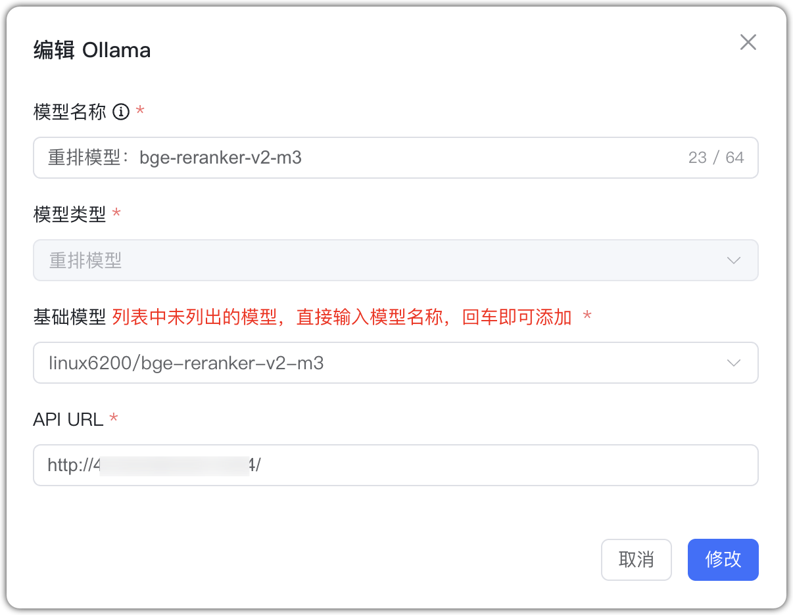

## 1 Добавление модели

**Справка:** Ollama позволяет запускать и развёртывать LLM локально. Перед добавлением модели Ollama установите и запустите Ollama и саму модель.

См. также: [Оффлайн‑развёртывание LLM в Ollama](../../faq/Offline_install_OllamaModel.md).

Выберите провайдера `Ollama` и укажите параметры:

* Имя модели: произвольное имя в MaxKB.    
* Тип модели: LLM/эмбеддинги/визуальная/ rerank.    
* Базовая модель: имя модели для выбранного типа; можно ввести своё, но оно должно соответствовать именам, поддерживаемым Ollama. Если модели нет локально — будет скачана автоматически. 

Для LLM также укажите домен API и API Key; для эмбеддингов — домен API.

* Домен API: адрес сервиса Ollama, например: http://42.92.198.53:11434.     
* API Key: если ключ не настроен, можно указать произвольное значение.

Нажмите «Добавить». После успешной проверки модель появится в списке AI‑моделей приложения.

## 2 Примеры конфигураций

Ollama — пример LLM:

{ width="500px" }

Ollama — пример эмбеддингов:

{ width="500px" }

Ollama — пример визуальной модели:

{ width="500px" }

Ollama — пример rerank:

{ width="500px" }