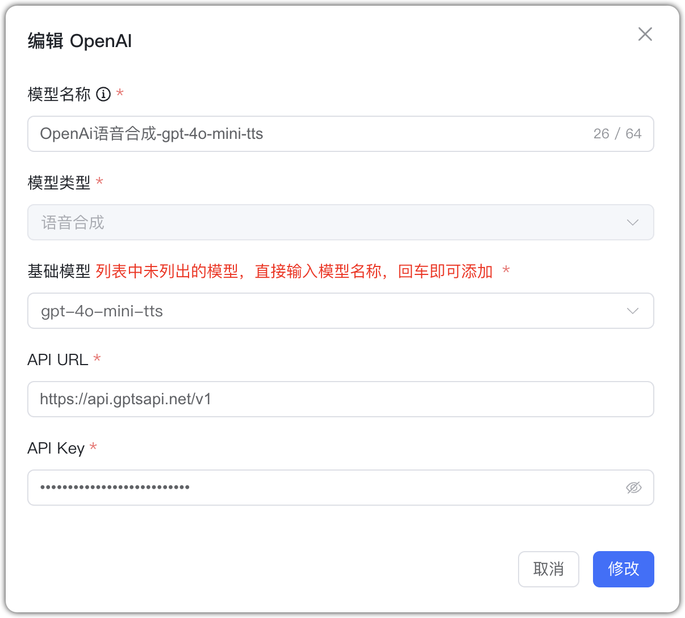

## 1 Добавление модели

Выберите провайдера `OpenAI` и введите необходимые параметры:

* Имя модели: произвольное имя в MaxKB.    
* Тип модели: LLM/эмбеддинги/ASR/TTS/визуальная модель/генерация изображений.   
* Базовая модель: имя модели для выбранного типа; можно ввести своё, но оно должно соответствовать поддерживаемым OpenAI именам.
* Домен API: для глобального OpenAI — `https://api.openai.com/v1`; для прокси в КНР — `proxy_base/v1`.
* API Key: ключ доступа OpenAI.

## 2 Примеры конфигураций

OpenAI — пример LLM:
{ width="500px" }

OpenAI — пример эмбеддингов:
{ width="500px" }

OpenAI — пример ASR:
{ width="500px" }

OpenAI — пример TTS:
{ width="500px" }

OpenAI — пример визуальной модели:
{ width="500px" }

OpenAI — пример генерации изображений:
{ width="500px" }