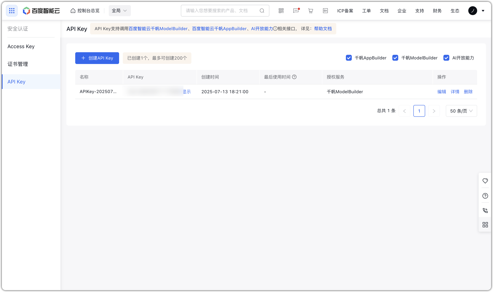
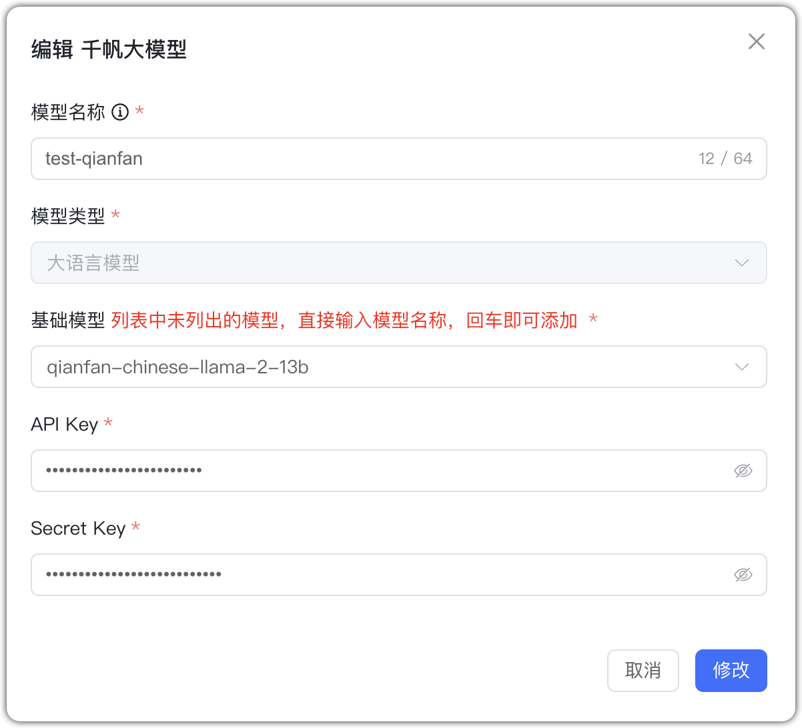
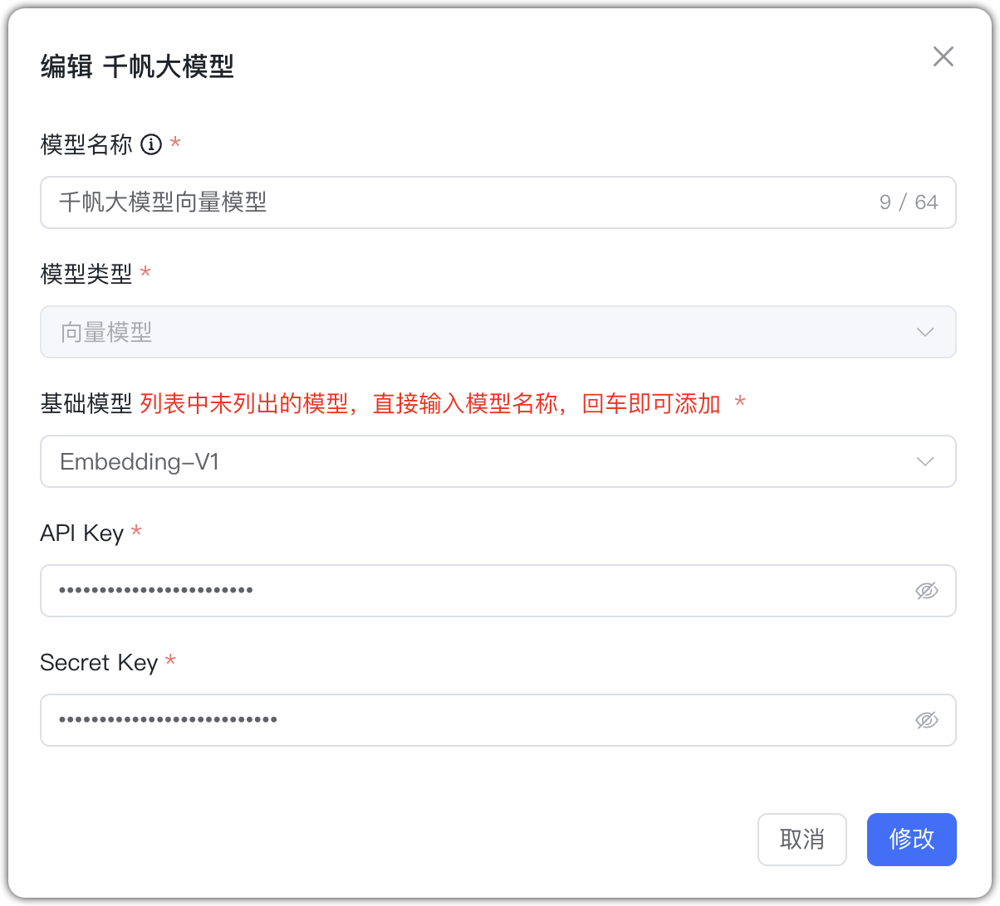

## 1 Добавление модели

!!! Abstract ""
    Перед добавлением модели Qianfan зарегистрируйтесь и войдите на [платформу Baidu Qianfan](https://qianfan.cloud.baidu.com/). В консоли «Модельные сервисы → Безопасность» создайте приложение — будут сгенерированы API Key и Secret Key.

    Выберите провайдера `Qianfan` и заполните параметры:

    * Имя модели: произвольное имя в MaxKB.
    * Тип модели: LLM/эмбеддинги.    
    * Базовая модель: имя LLM, поддерживаемое Qianfan (можно ввести своё; должно соответствовать поддерживаемым именам).    
    * API Key и Secret Key: ключи приложения Qianfan.

## 2 Примеры конфигурации

!!! Abstract ""
    Qianfan — пример LLM:

{ width="500px" }

!!! Abstract ""
    Qianfan — пример эмбеддингов:
{ width="500px" }

