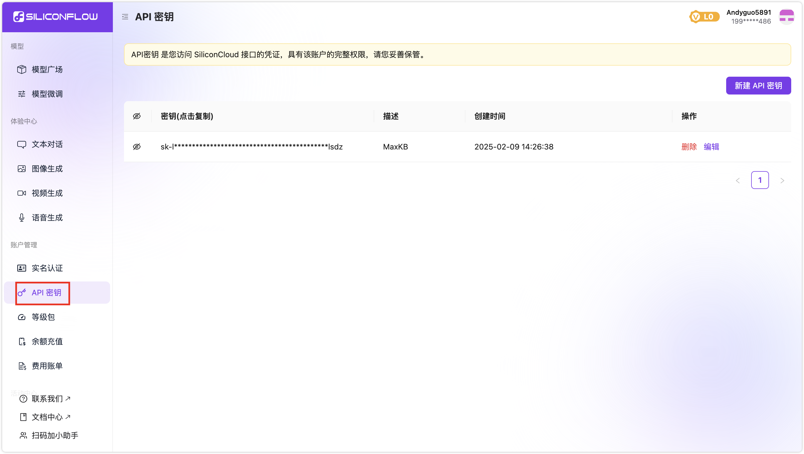
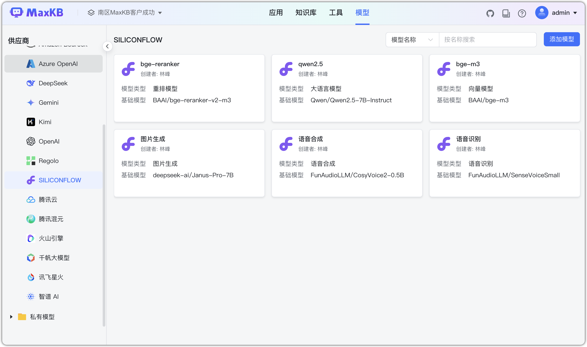
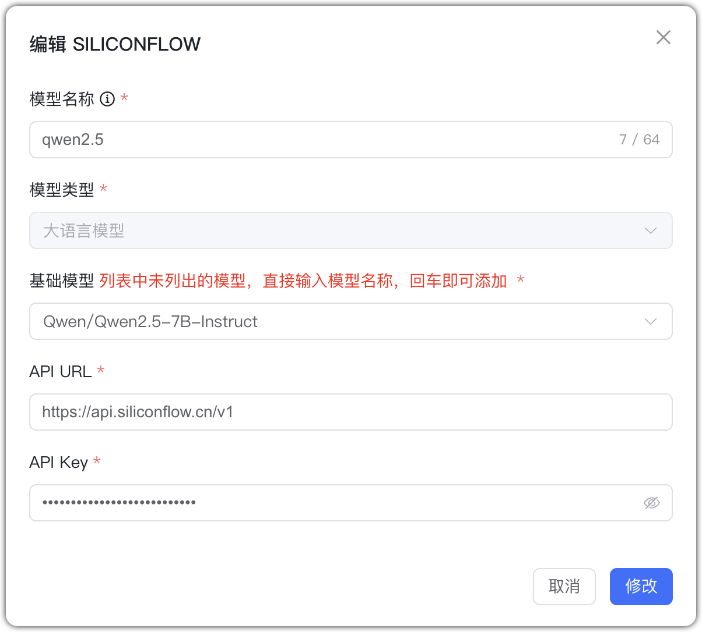
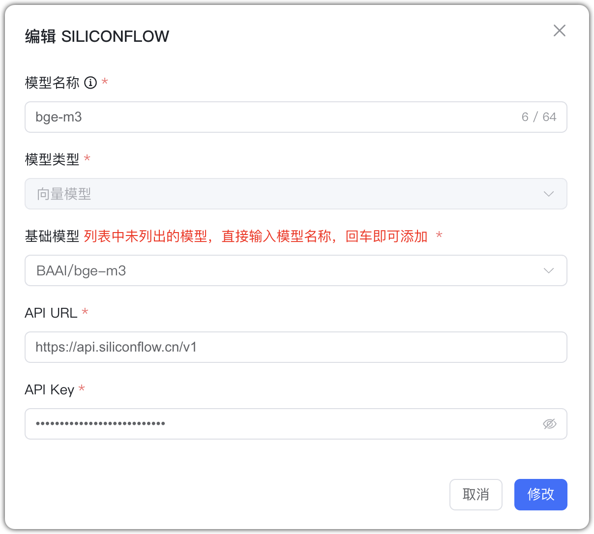
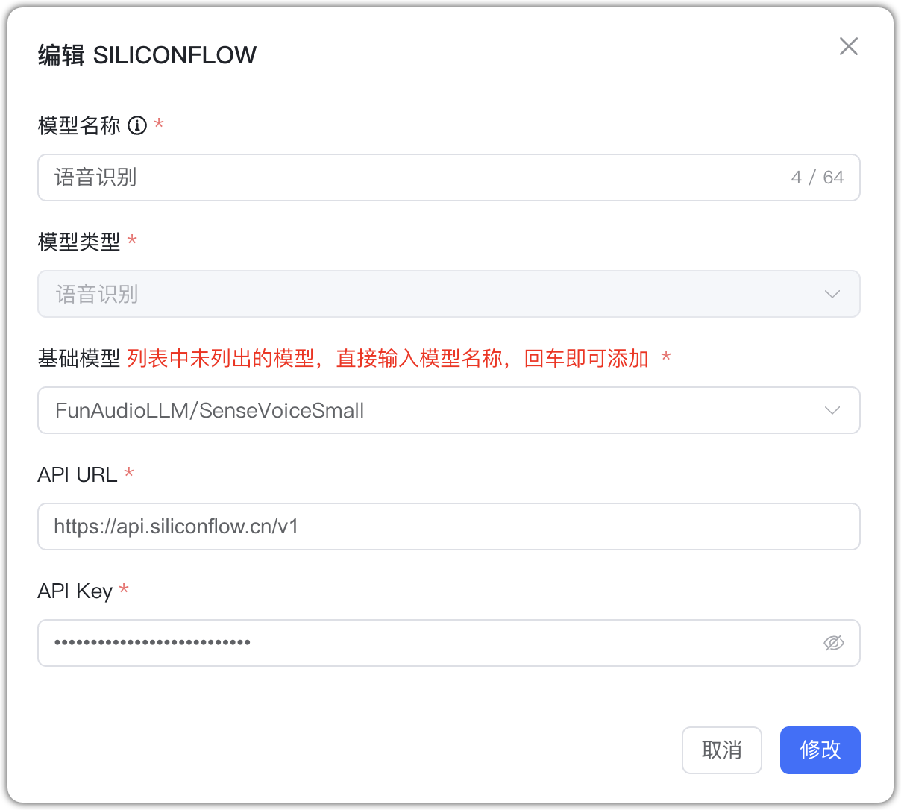
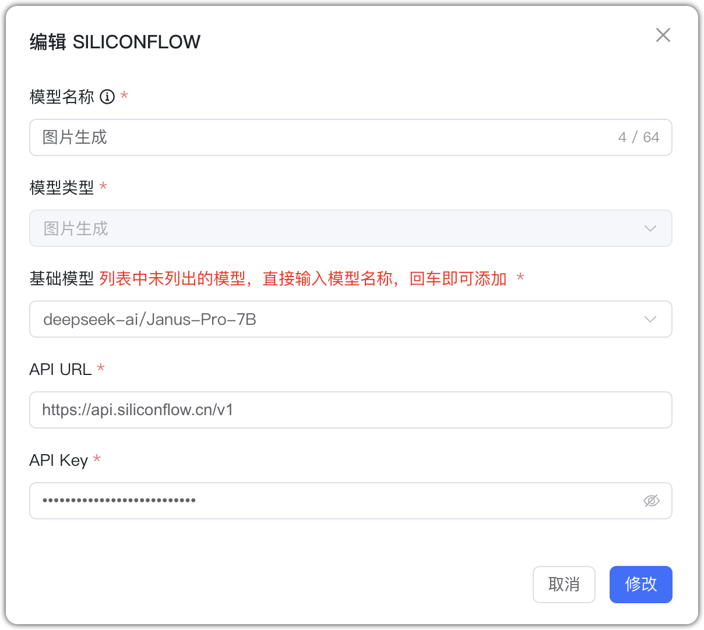
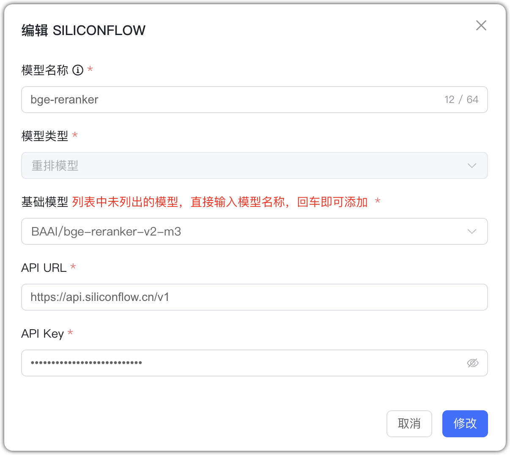

## 1 Добавление модели

Перед добавлением модели SILICONFLOW зарегистрируйтесь и войдите на [SILICONFLOW](https://siliconflow.cn/). В консоли (Управление аккаунтом → API‑ключи) создайте ключ.

Выберите провайдера `SILICONFLOW` и заполните параметры:

* Имя модели: произвольное имя в MaxKB.    
* Тип модели: LLM/эмбеддинги/ASR/генерация изображений/rerank.    
* Базовая модель: имя модели (можно ввести своё; должно соответствовать поддерживаемым именам).    
* API URL: https://api.siliconflow.cn/v1
* API Key: созданный ключ.

## 2 Примеры конфигурации

SILICONFLOW — пример LLM:

{ width="500px" }

SILICONFLOW — пример эмбеддингов:
{ width="500px" }

SILICONFLOW — пример ASR:
{ width="500px" }

SILICONFLOW — пример генерации изображений:
{ width="500px" }

SILICONFLOW — пример rerank:
{ width="500px" }
