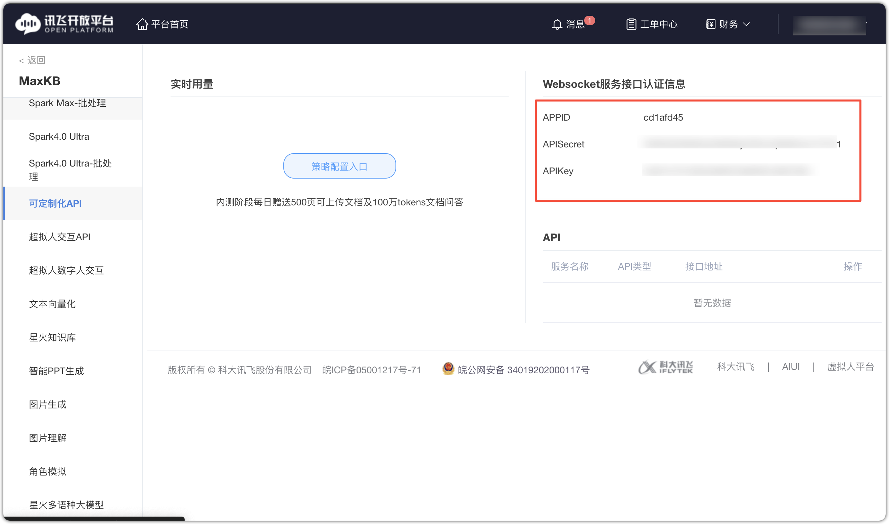
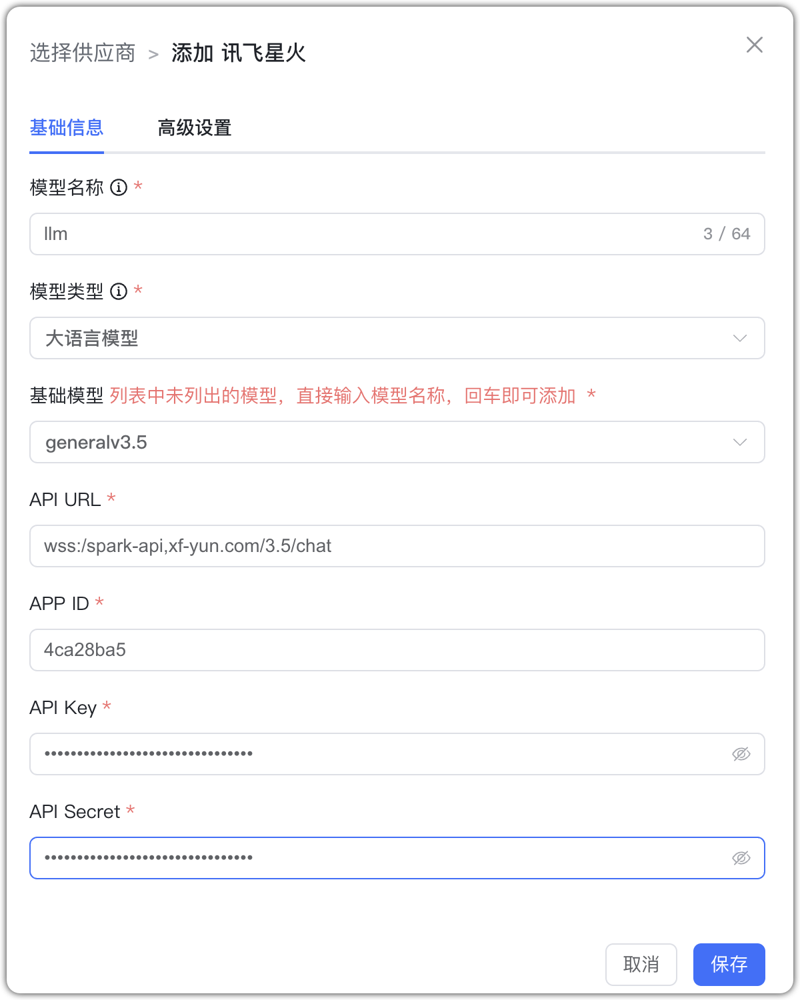
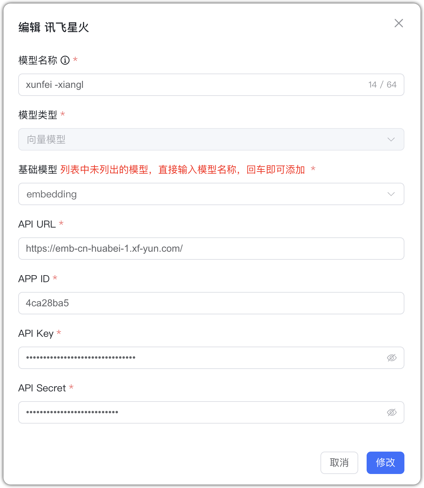
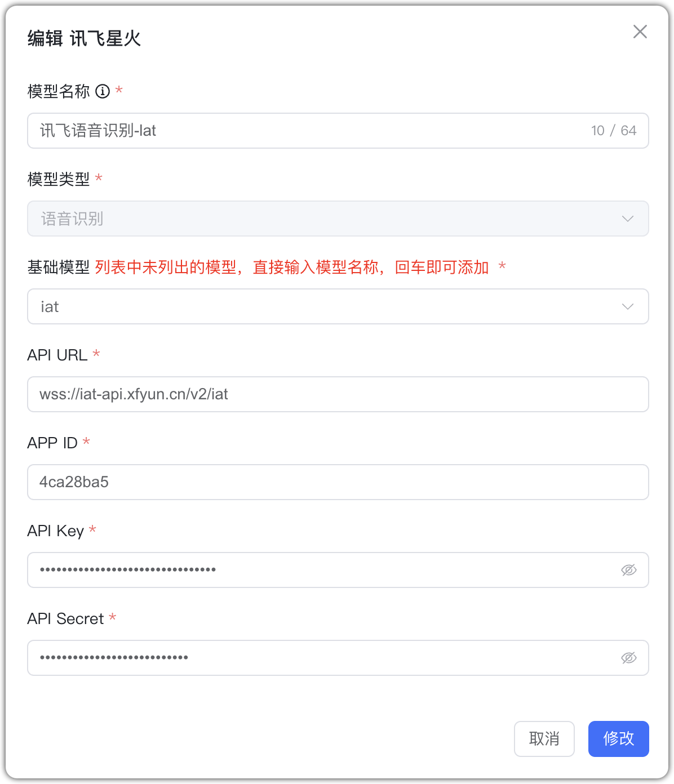
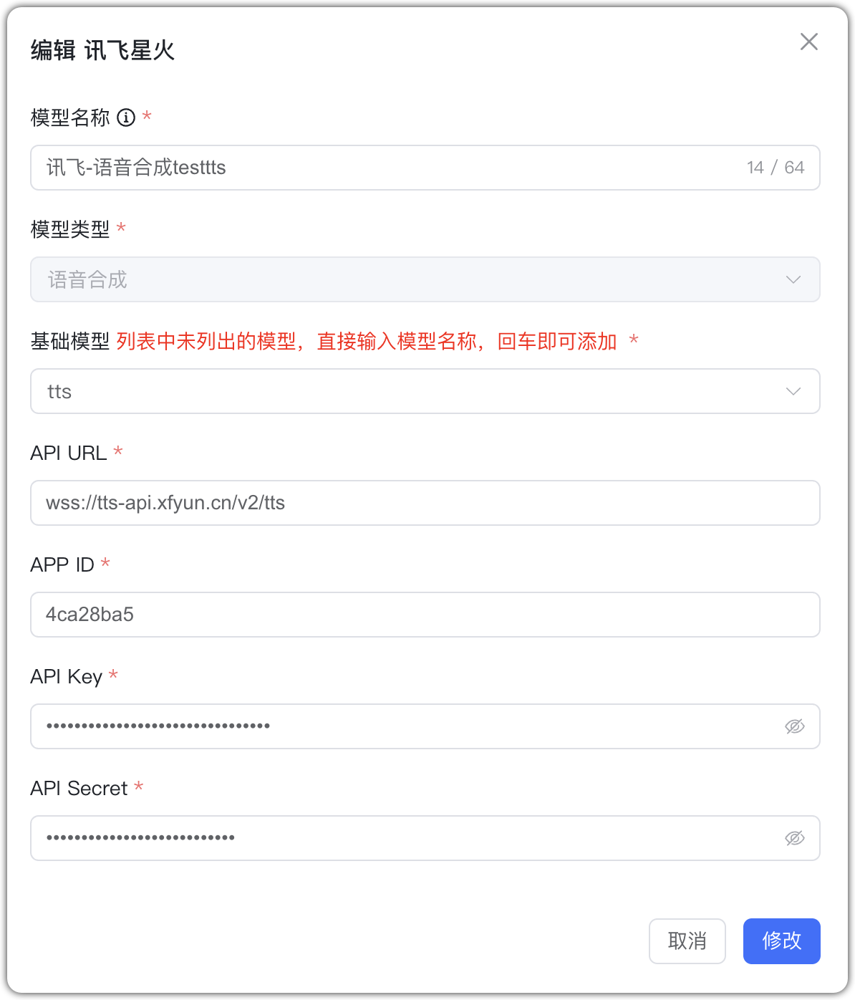

## 1 Добавление модели

Перед добавлением модели iFLYTEK Spark зарегистрируйтесь на [платформе iFLYTEK](https://www.xfyun.cn/) и создайте приложения для нужных типов моделей. Платформа сгенерирует APPID, API Secret, API Key.

Выберите провайдера `iFLYTEK Spark` и заполните параметры:

* Имя модели: произвольное имя в MaxKB.  
* Тип модели: LLM/эмбеддинги/ASR/TTS.   
* Базовая модель: domain из документации API (можно ввести своё).    
* Домен API: для каждой модели свой; см. [документацию iFLYTEK](https://www.xfyun.cn/doc/).
* APP ID: идентификатор приложения.
* API Key: ключ доступа приложения.
* API Secret: секрет приложения.

## 2 Примеры конфигурации

iFLYTEK Spark — пример LLM:

{ width="500px" }

iFLYTEK Spark — пример эмбеддингов:

{ width="500px" }

iFLYTEK Spark — пример ASR:

{ width="500px" }

iFLYTEK Spark — пример TTS:

{ width="500px" }