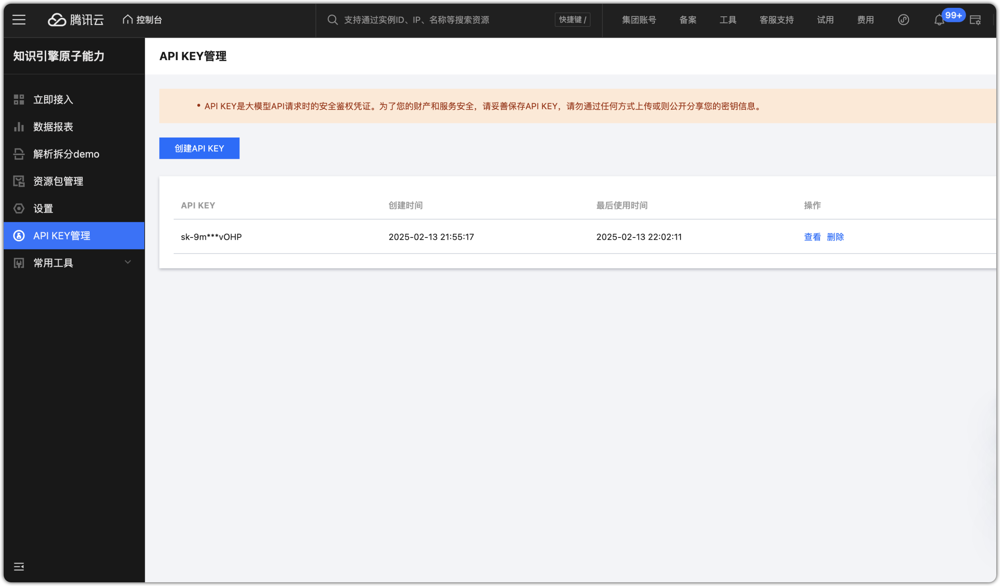
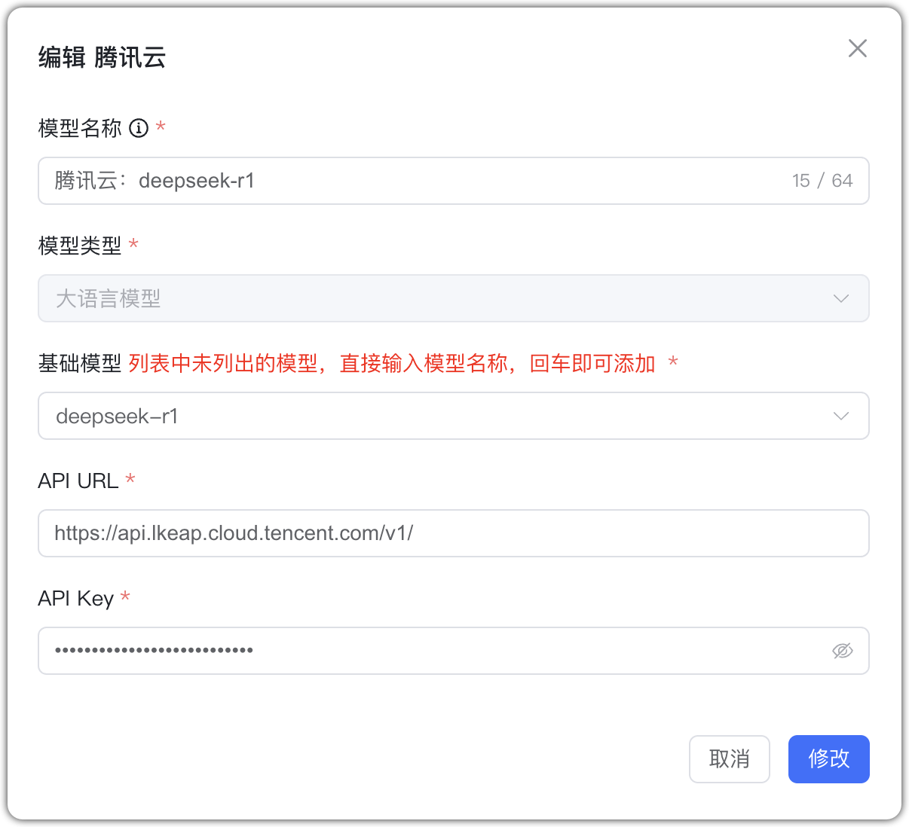

## 1 Добавление модели

Перед добавлением «атомарных возможностей» движка знаний Tencent откройте соответствующий сервис в Tencent Cloud и создайте API Key.

Выберите провайдера `Tencent Cloud` и заполните параметры:

* Имя модели: произвольное имя в MaxKB.     
* Тип модели: LLM.   
* Базовая модель: имя модели (можно ввести своё).
* API URL: https://api.lkeap.cloud.tencent.com/v1/chat/completions
* API Key: OpenAI‑совместимый ключ, созданный в консоли. 

## 2 Пример конфигурации

Tencent Cloud (Knowledge Engine Atomic) — пример LLM:
{ width="500px" }