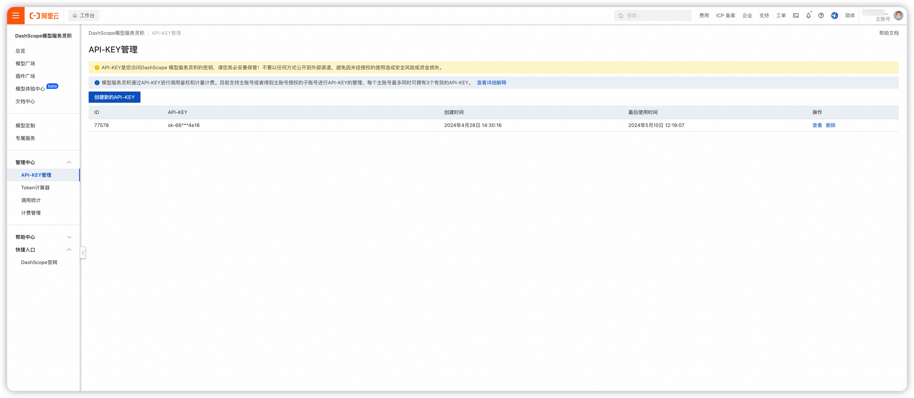
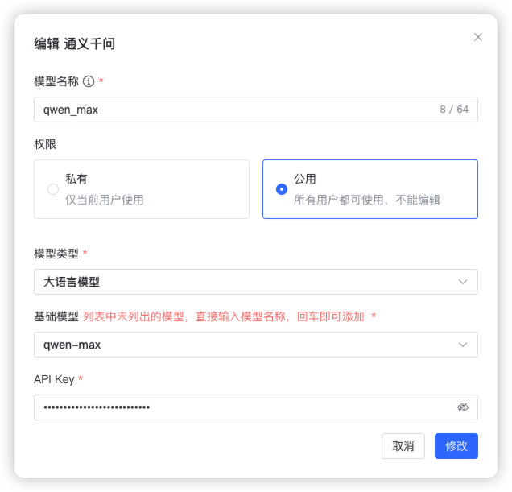
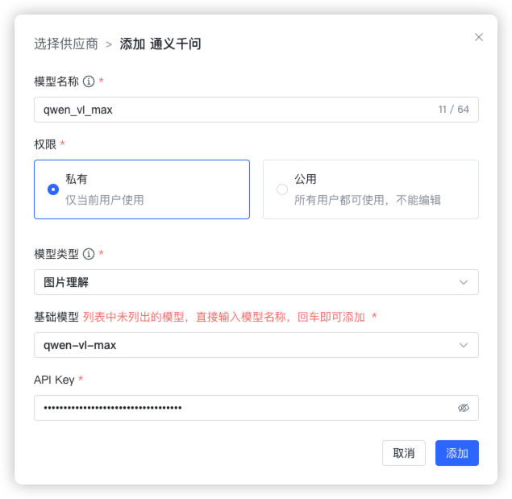
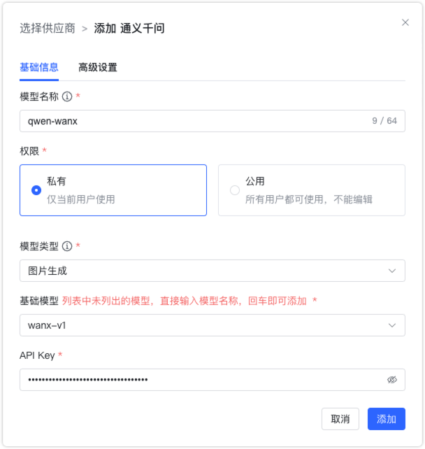
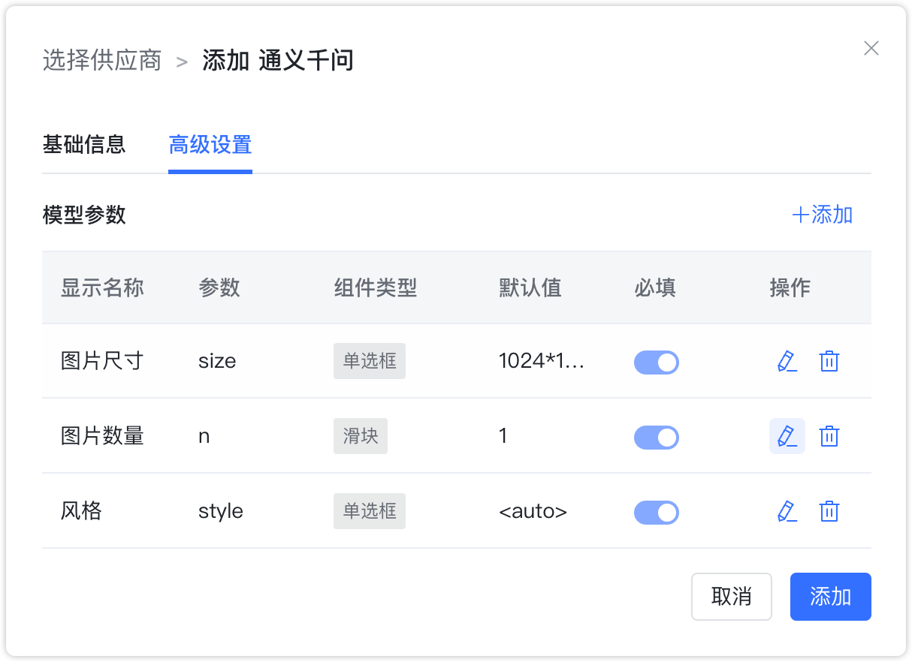

## 1 Добавление модели

Перед добавлением модели Tongyi Qianwen создайте API‑Key в консоли Alibaba Cloud DashScope.

Выберите провайдера `Tongyi Qianwen` и заполните параметры:

* Имя модели: произвольное имя в MaxKB.  
* Права: приватная или общая.   
* Тип модели: LLM/визуальная/генерация изображений.   
* Базовая модель: имя модели (можно ввести своё).        
* API Key: создаётся и просматривается в DashScope.

## 2 Примеры конфигурации

Tongyi Qianwen — пример LLM:
{ width="500px" }

Tongyi Qianwen — пример визуальной модели:
{ width="500px" }

Tongyi Qianwen — генерация изображений: по умолчанию 1024×1024, 1 изображение, стиль <auto> (случайный). Пример:
{ width="500px" } 

{ width="500px" }
